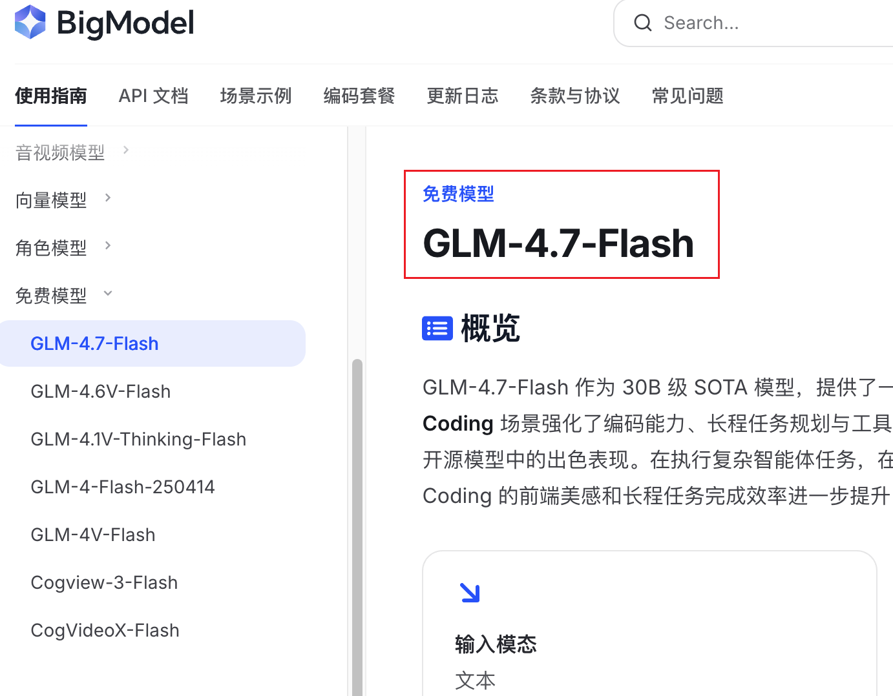
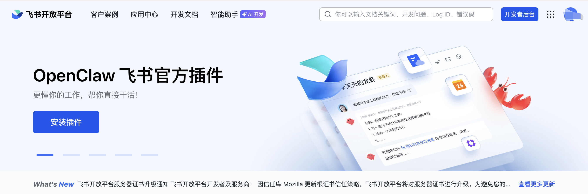
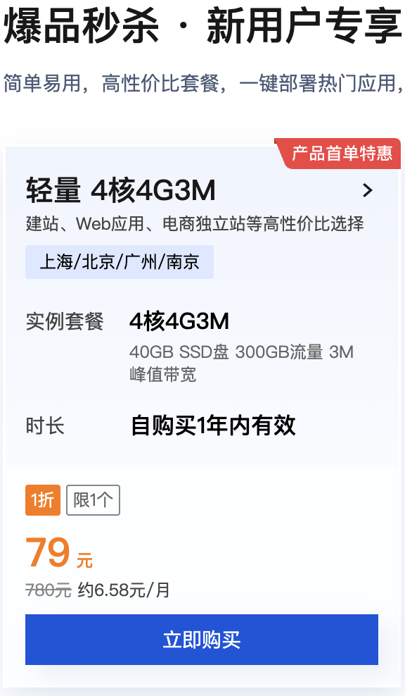
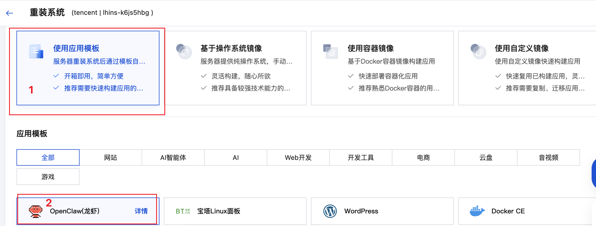
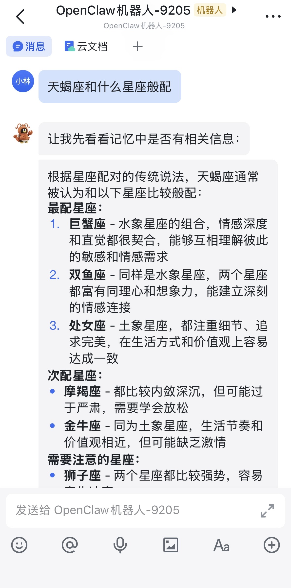
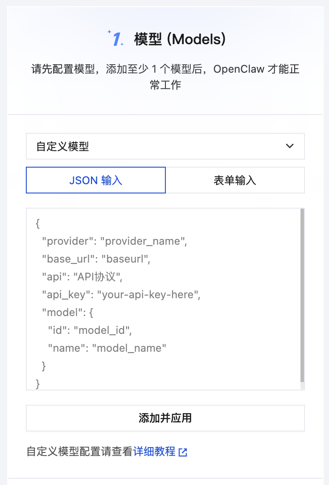

# 精打细算玩 AI，半小时搞定 OpenClaw 自动化

最近一周，AI 界最新产品 OpenClaw 出圈，继 ChatGPT、DeepSeek 之后的第三个爆点。OpenClaw 的出现在 AI 发展进程上是必然的，在 MCP、skills、rules 等理论和技术土壤之上的一次**综合性工程实践**：让 AI 接管操作系统。

OpenClaw 这个名字本身也很有深意——“Claw”（爪子）。它不是要取代人类的双手，而是作为人类双手的延伸和增强，去抓取那些人类无暇顾及或者不愿意做的繁琐任务，把时间和创造力还给人类。

本文旨在让不懂编程的新手，使用**腾讯云服务器**快速低成本“养虾”。

## OpenClaw 安装三要素

**宿主机**：一台笔记本电脑或云服务器，只要可以运行通用操作系统即可，最好是 Linux或 macOS，在 Windows 上安装或许要踩更多的坑。OpenClaw 最初广泛部署在 Mac Mini 上。

**大语言模型**：OpenClaw 的大脑，负责接收用户的自然语言，并转换为指令驱动操作系统运行。

**通信渠道**：一般是即时通信软件 APP，用户输入控制命令和接收返回结果。


OpenClaw 是安装在宿主机上的代理。 

通信渠道 <-> OpenClaw（AI Gateway） <---> 宿主机
               |
              LLM

**快速选择：腾讯云服务器 + 智谱 AI + 飞书**

## 宿主机选型：云服务器 vs 本地部署

### 方案一：云服务器（推荐）

云服务器的核心优势：24 小时在线，成本低。在使用上，云化资源可以随便造，系统搞坏了直接重装即可。购买一台最便宜的 2 核心 2GB 内存的足够，一年费用 100 元以内。

推荐腾讯云或阿里云，国内先进云服务厂商，具备一键安装 OpenClaw 镜像，并简化配置。

【腾讯云】轻量新用户上云福利，4核4G3M新用户首年仅需79元/年！
https://cloud.tencent.com/act/cps/redirect?redirect=1079&cps_key=aaaf112808363649bce6cd8e70ae6fbd&from=console

【阿里云】https://www.aliyun.com/minisite/goods?userCode=d1pmxxar

### 方案二：本地部署

自己有一台闲置的电脑，不想再花钱购买云服务器，另外想要控制一些外设，比如摄像头、打印机等。

怕折腾的人谨慎选择，因为安装把操作系统搞坏了就需要重装系统，很麻烦。另外，直接让 OpenClaw 接管当做生产力工具接管电脑，存在越权风险。

## 模型选型：智谱 AI

大模型使用的本质依然是：Prompt 提示词工程。然而，因为工程技术的发展，Context 上下文工程在当下的 AI 发展中更为准确。好的一面，AI 的工程能力得到了增强；不好的一面，简单几句话背后加载了大量补充数据，Token 消耗量惊人。

因此，对于体验 OpenClaw 能力这个用途场景，最好还是用免费模型的，毕竟燃烧人民币的速度让人心疼。

现在大模型厂商非常多，我发现智谱网页中有**免费模型**，这太好了，可以拿来使用。



## 通信渠道：飞书

国内通信聊天 APP 在开放能力上对 OpenClaw 进行适配的有：飞书、企业微信、钉钉和 QQ。微信没有原生支持，因为微信是一个保持简单，对开发能力克制的产品。

大学生普遍都有 QQ，可直接使用。对于职场打工人，“先进团队用飞书”，字节跳动出品的办公软件飞书用户体验和口碑是最好的。



## 半小时安装实战

### 1. 购买腾讯云轻量应用服务器

【腾讯云】轻量新用户上云福利，4核4G3M新用户首年仅需79元/年！
https://cloud.tencent.com/act/cps/redirect?redirect=1079&cps_key=aaaf112808363649bce6cd8e70ae6fbd&from=console

复制链接根据指引购买即可。腾讯云的这款产品性价比非常高，4核4G。



### 2. 一键安装 OpenClaw

云服务器可以随时进行重装系统，1分钟完成。

在控制台中选择购买的云服务器，使用应用模板重装系统，选择 OpenClaw。



腾讯云提供了全面和详尽的玩转 OpenClaw 文档，可跳转查看。


好的产品不需要说明书，我在安装过程中完全没有看文档。

### 3. 应用管理

安装了 OpenClaw 应用镜像后，在上方可看到“应用管理”的 tab，两步完成配置：模型、通道，技能是可选的。

起步的配置直接根据指引完成即可，快速将龙虾启动。




## 切换智谱免费模型

腾讯云服务器在模型支持上是有限的，快速配置仅包含收费模型，可以选择自定义模型来应用免费模型。

在官方教程文档中，没有介绍 GLM 的模型配置，本文补充。



在智谱官网登录个人账户，并复制 API Key，默认使用 GLM V4.7 Flash 模型：

```json
{
    "provider": "ZhipuAI",
    "base_url": "https://open.bigmodel.cn/api/paas/v4",
    "api": "openai-completions",
    "api_key": "your-api-here",
    "model": {
        "id": "glm-4.7-flash",
        "name": "GLM-4.7-Flash"
    }
}
```

添加并应用，即可切换到 GLM-4.7-Flash 免费模型。然后就可以在飞书中指示 OpenClaw 工作了。

## 参考

- [🔥玩转OpenClaw｜云上OpenClaw快速接入飞书指南](https://cloud.tencent.com/developer/article/2626151)
- [🔥🔥🔥玩转OpenClaw｜云上OpenClaw最全教程合辑](https://cloud.tencent.com/developer/article/2624973)
- [玩转OpenClaw｜OpenClaw(Clawdbot)接入自定义大模型教程](https://cloud.tencent.com/developer/article/2625144)
- [OpenClaw GitHub 仓库](https://github.com/OpenClaw/OpenClaw)
- [智谱 AI 开放平台](https://open.bigmodel.cn/)
- [飞书机器人开发文档](https://open.feishu.cn/document/ukTMzUjL4YjMxMzNzADMyMjUzMTIy)


**最后唠叨一句：**

技术这东西，说白了就是拿来用的。与其纠结"要不要学"，不如先花半小时搭个环境试试。最坏的结果不就是浪费半小时嘛，但万一打开了新世界的大门呢？

再说了，AI 时代已经来了，早点学会让机器给你打工，怎么算都不亏。
