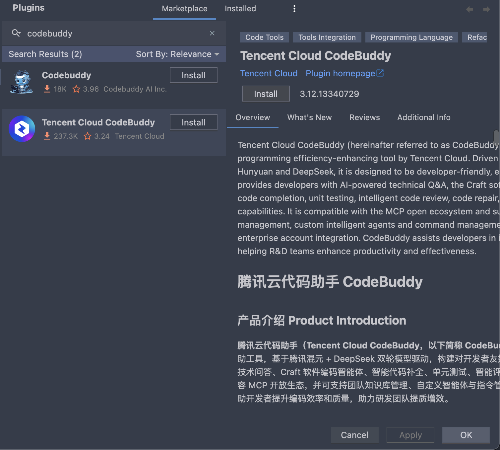
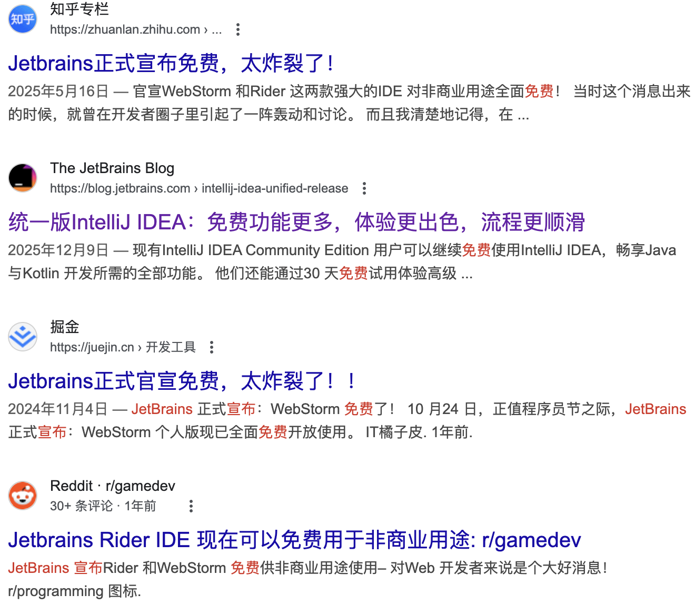
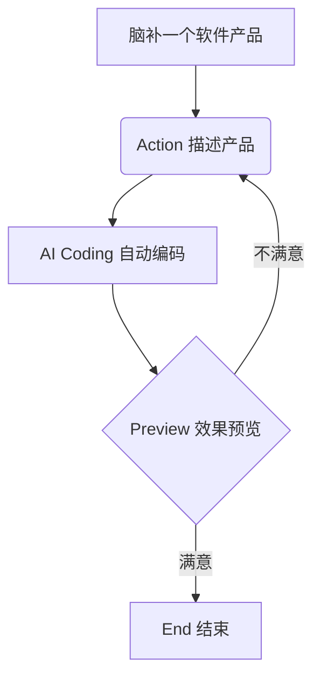
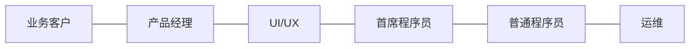
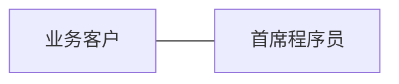

# AI Coding，技术演进与思考

## 前言

自从 ChatGPT 发布以来，「大模型」、「AI」、「人工智能」等概念技术成为各行各业津津乐道的话题，所有公司、所有行业都在探索如何应用大模型技术为业务赋能。能分得技术红利的一杯羹是追求目标，但是紧跟时代步伐不落后是下限。允许用不好新技术，但是不允许排斥新技术。

当全社会 AI+ 热度很高的时候，产业泡沫也必然很大，吹概念讲故事拉融资做项目比比皆是。在 AI 领域应用中，AI Coding 是最炙手可热、发展最快的，且已明确为巨大的蓝海。

## 技术演进

踏进 AI Coding 领域的主要是大型互联网公司，其在人才储备和资金投入上具有决定性优势。该技术发展日新月异，简单梳理里程碑式的产品和技术突破。

**2021-2023，IDE 插件，代码补全**

这一阶段的特征是将 AI 作为 IDE（如 VS Code）的一个**附属插件**，核心能力是“续写”。比较具有代表性的产品是微软的 Copilot，它确立了“结对编程（Pair Programming）”的产品形态，让开发者习惯了 Tab 键补全代码的节奏。

在 Jetbrains 和 VSCode 的插件中可下载多种免费使用的 AI 插件，如

- 字节跳动 MarsCode，早期是豆包的衍生产品，现在已演变为 Trae AI
- 腾讯 CodeBuddy
- 阿里云 Lingma

此阶段，AI Coding 的工作范畴是文件、代码块级别的，首次让人见识到了大模型的强大能力。

早期我非常喜欢 Jetbrains 产品中的 Tab 代码补全插件 **Tabnine**，基于机器学习的强大代码补全插件。一直以来，该产品是 IDE 插件中的明星产品，大模型这种新技术的到来直接将该产品拍在了沙滩上。它的宿主 JetBrains 公司也面临同样的窘境。

**2024至今，AI 原生 IDE**

AI 插件是副驾，原有的 IDE 产品仍然在代码开发的核心，这限制了 AI 的发挥。**AI 原生 IDE** 强势来袭，它们不再满足于补全，而是能够**自主操作文件和终端**。具有里程碑意义的产品是 Cursor，大模型技术是 Claude 3.5 Sonnet。

Cursor 是基于 VScode 开发的独立 IDE，将 AI 编程的能力域从单个文件或代码块，延伸到多个文件或需求，甚至整个项目。大模型接管了更多的权限，可以修改文件、创建文件、执行终端命令等，已经可以完整实现用户需求，让程序员甩手掌柜，只负责提需求和挑毛病。早期在实践中发现，比较小的示例项目，尤其是简单的 H5 项目，可以脱手完成，但是面对较复杂的项目时，AI 的能力却让人心烦，因为反反复复地出错，浪费时间让人恼火。

紧接着，Claude 3.5 Sonnet 的到来再一次颠覆了我对 AI Coding 的看法，尤其是 AI 编写前端项目的能力已经远远超过我的预期，达到令人惊讶的水平。好比于宁德时代三元锂电池之于新能源汽车，是否支持 Claude 3.5 Sonnet 或 Claude 3.7 Sonnet 成为当时 AI IDE 最重要的卖点。

至今，AI IDE 已经进入了百家争鸣的局面：

- Claude Code
- Amazon Kiro
- OpenAI CodeX
- Google AI Studio
- Trae AI（SOLO）
- Qoder
- CodeBuddy

## 编程范式

在产品和技术发展的同时，编程理念也在创新，最流行是为：Vibe Coding 和 Spec Coding。

**Vibe Coding 氛围编程**

氛围编程面向的用户是产品经理或甲方客户等非技术人员，本质是一种**高频率、低成本的试错反馈环**。用户通过对话的方式，让 AI 来实现产品并预览效果，通过持续迭代，最终达到用户期望的目标形态。

氛围编程让无数产品人欢呼雀跃，因为自己的产品脑洞，不再需要专业的程序员来实现，AI 可以为自己打工，这也掀起了 One Person Company 一人公司的热潮，可以在各大社交平台上看到各式各样由 AI 开发实现的软件产品。

**Spec Coding 规范驱动开发**

Vibe Coding 最大的敌人是**代码熵增**，当项目从“一个小工具”变成“一个带数据库、带权限校验、带支付流的系统”时，AI 随机生成的代码会开始自我冲突。没有编程背景的用户此时会陷入“越修越坏”的死循环，这就是“Vibe 的终点”。另外，Vibe Coding是一种黑盒编程范式，根据墨菲定律：**凡事只要有可能出错，那就一定会出错**。将 Vibe Coding 产出的软件项目，没有 Code Review 而部署于生产环境，犹如君子立于危墙之下。而 Code Review 需要专业的编程技术，与 Vibe Coding 的理念存在逻辑悖论。

因此，让广大程序员更为肯定的编程范式是 Spec Coding，它是契约式开发的一种升级。

软件开发是一项非常复杂的工程，几十年来软件开发思想也在不断演进，但总体上还是遵循契约式开发的理念，从软件开发模型上看，有瀑布模型、迭代模型、螺旋模型、V模型、敏捷模型等；从开发过程上看，包括需求分析、设计、编码、测试、部署和维护六大部分；从角色分工上，包括产品、UI/UX、算法、前端、后端、运维等。团队分工合作必然需要一套先进的沟通和管理模式。

Spec Coding 继承了但又打破了传统的软件开发范式，它将原有的开发过程缩短和紧凑，以程序员为中心，设计文档和规范定好了，剩下的交给 AI。另外，AI 也作为专业的技术咨询，与架构师共同讨论项目的架构设计。

## 思考

Vibe Coding 让产品经理雀跃，Spec Coding 让高级程序员兴奋。在 AI Coding 的浪潮在，一人公司很有搞头，我也跃跃欲试。

在实际的生产环境中，最顶尖的开发者往往在**交替使用**这两种范式：

1. **用 Vibe Coding 快速探索 UI/UX**：在前端开发初期，通过不断的“Vibe”来寻找最佳的交互感觉。
2. **用 Spec Coding 固化核心逻辑**：一旦功能确定，立即编写 Spec 或测试用例，将 AI 产生的混乱“固化”成结构化的生产力。

AI 并没有让高级程序员失业，反而让他们通过 Spec Coding 变成了“拥有 100 个初级程序员的 CTO”；而 AI 让非技术人员拥有了从零创造的能力，但他们依然需要架构师来帮他们突破“复杂性之墙”。

目前来看，AI Coding 发展最大的受益者是高级程序员。

传统开发模式：

AI Coding 演进方向：

Chief Programmer Team 中的 Team 将不复存在，Chief Programmer 会直接与业务客户合作，充分利用 AI Coding 能力，负责项目的架构设计、技术选型、代码实现等。

## AI 未来

通过 AI Coding 的实践，我体会到 AI 的能力强的可怕，甚至让人恐惧。你的努力，在 AI 面前，可能显得一文不值，毫无意义。

AI 技术带来的生产力爆炸，必将掀起一场“革命”，让很多普通工人饭碗不保，失业下岗。AI Coding 是 AI 浪潮下最快商业化、渗透率最高的场景。掀起这场 AI 狂欢的计算机科学家与工程师，最先革命的对象竟是“近亲”与同行，**本是同根生，相煎何太急**。AI Coding 能快速成为 AI 应用实验田的原因有

1. 语料的“高质量”与“结构化”：编程语言本身具有高度结构化特点，GitHub上拥有无数高质量代码仓库。
2. 验证成本极低（反馈闭环短）
3. 生产力的极致杠杆（ROI 极高）：全球开发者的薪资水平极高，哪怕 AI 只能提升 20% 的效率，转化成企业的金钱收益也是巨大的。
4. 开发者即“造物主”：设计出大模型、AI Coding工具的人，本身就是编程界中一顶一的高手，本身对软件开发这个业务场景非常熟悉。

另外，计算机领域的从业人员，无论是科学家还是普通程序员，对新事物的接纳程度远远高于其他行业，这也为该领域提供了丰厚的废料。相比于其他行业在面对 AI 到来时的茫然或排斥，计算机领域的从业者显得更加从容与积极。

无一幸免，AI 未来将席卷并颠覆所有行业～
