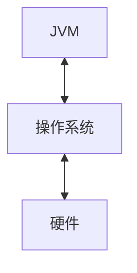

# OOM｜Java服务端开发中的内存泄露

Java资源泄漏一直是Java程序员需要面对的问题。由于资源泄露短时间内不会造成系统故障，所以程序员无法有效预防。一般表现为：随着程序运行时间的加长，系统资源泄露累积，响应时间加长，直至系统崩溃。

本篇梳理一下Java程序中的资源泄露基本知识。

- [ ]  图片，JVM在系统架构中的位置

## 什么是内存泄露

在Java服务中，Java虚拟机（Java Virtual Machine，JVM）是在操作系统上抽象的一层，负责管理Java程序的内存分配和回收，提供了内存管理、垃圾回收、安全性和跨平台运行等特性。

对于C/C++程序员来说，要对操作系统（Linux）有很深的理解，而Java程序员则重点关注JVM。



在Java程序的运行环境中，根据程序的业务逻辑，JVM不断进行资源分配和资源回收，每一份分配出去的资源，都由JVM来管理，耗费CPU资源；资源是有限的，当可用资源不足时，JVM会通过调度手段来缓解，严重时将导致内存溢出（Out of Memory，OOM）。

资源泄露对系统稳定性造成的影响

1. 应用程序长时间持续运行时性能严重下降，请求响应时间增加
2. 自发和奇怪的应用程序崩溃
3. 应用程序偶发耗尽连接对象

资源泄露主要是程序员不安全地编码造成的。

## 资源泄露场景

在Java程序中，发生内存泄露的场景很多，在本文中我们讨论最常见的。

### 静态字段引用


**如何预防？**

预防手段

### 连接资源访问未关闭

连接泄露通常指的是程序在使用完如文件流、数据库连接流、网络流等资源后，没有正确关闭这些资源，导致资源无法被回收。


```java
// 示例代码：正确关闭资源的try-with-resources语句
try (InputStream inputStream = new FileInputStream("file.txt");
     Connection connection = DriverManager.getConnection(url, username, password);
     Socket socket = new Socket(host, port)) {
    // 使用资源
} catch (IOException | SQLException e) {
    // 处理异常
}
```


数据库连接泄露

Redis lettuce连接池

WebSocket

HttpServeltRequest

### 不正确的equals()和hashCode()方法实现

内存泄露指的是程序中存在不再使用的对象，但由于这些对象仍然被其他对象引用，导致垃圾回收器无法回收他们，从而造成内存占用不断增加。

## 内存资源泄露应急方案

OOM不一定会导致JVM退出

系统发生OOM时如何快速规避以避免长时间对系统造成影响。

长时间运行服务定期内存巡检


## 参考

1. 未关闭的流会引起内存泄露么？ https://droidyue.com/blog/2019/06/09/will-unclosed-stream-objects-cause-memory-leaks/
2. 为什么流不关闭会导致内存泄露 https://www.sharkchili.com/pages/b69661/
3. Understanding Memory Leaks in Java https://www.baeldung.com/java-memory-leaks
