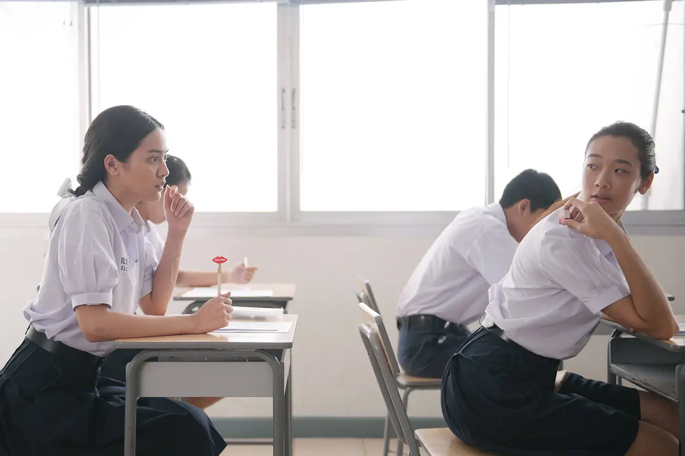
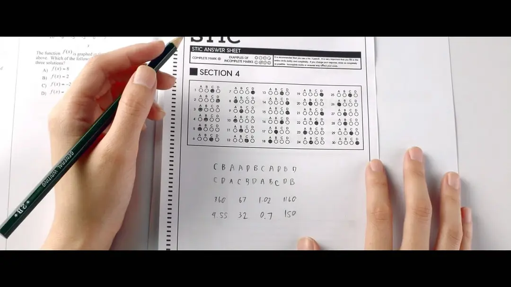
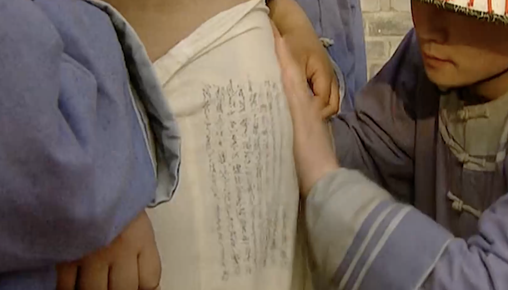
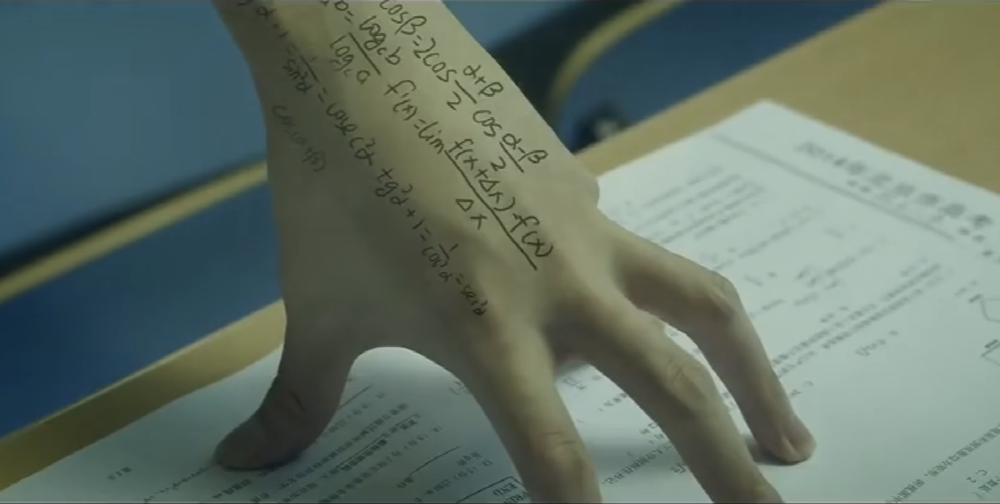
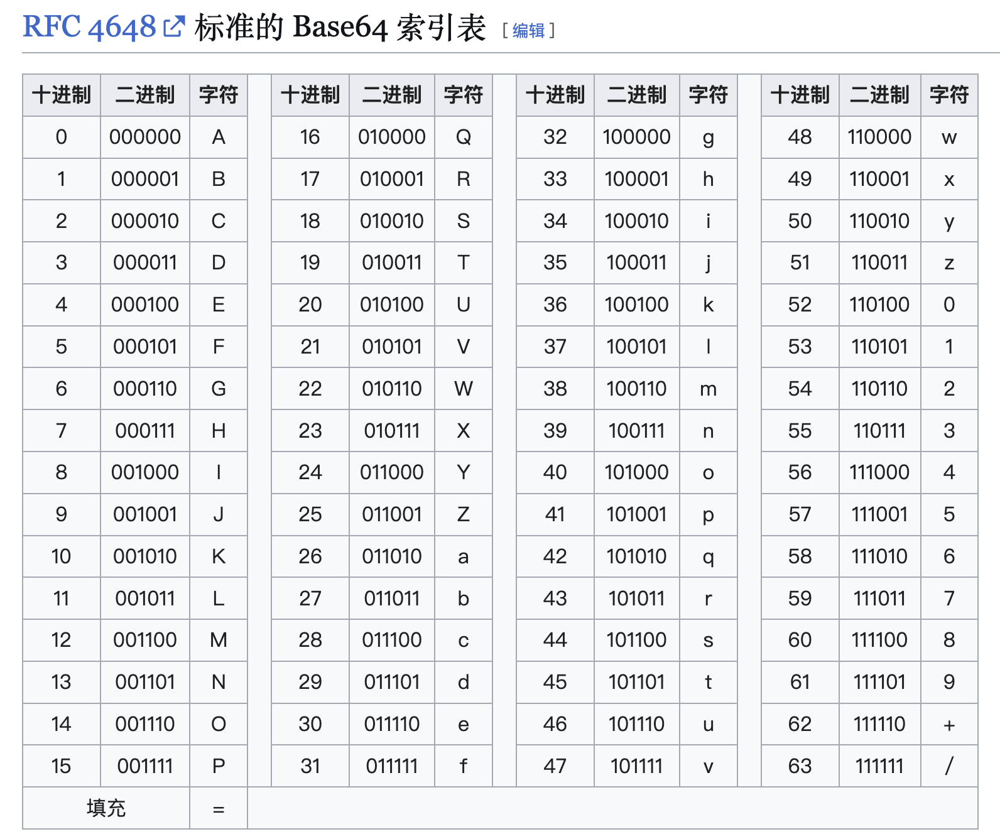
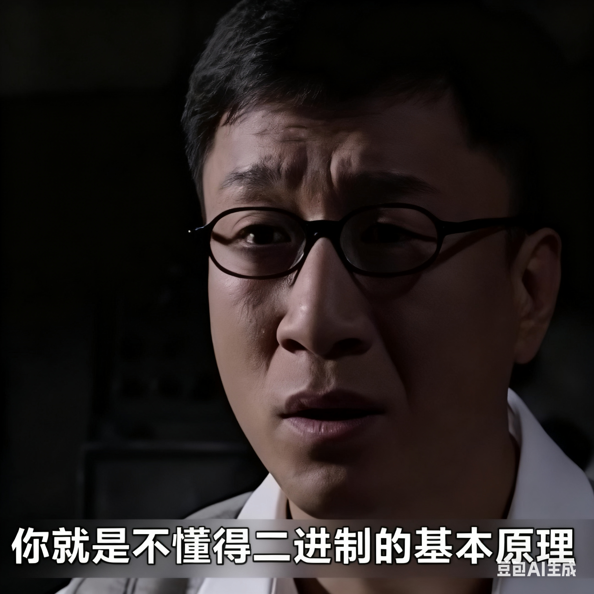

# 答案快速记忆，你就是不懂得二进制的基本原理

## 影视剧「作弊」剧情

泰剧《天才枪手》中，女主小琳在考试中通过在橡皮擦上写答案帮助女同学在考试中作弊。

随后该女同学将其介绍给富豪男友，表示提供考试协助可获得高额报酬。小琳使用弹钢琴手法定义4个答案字符：A、B、C、D，并在考场上实时传递“信号”。

在国际英语考试中发现时区差异，在澳大利亚快速完成考试，并将考试答案提前传送到泰国。

在电视剧《雍正王朝》中，三皇子弘时和张廷璐泄题案，李卫去考场抓作弊，发现作弊考生将答案写在肚皮上。

网剧《万万没想到》中制霸铃兰一集中，父王张本煜在考场中实现粉末感知小抄，太夸张了～

---

从小考试到大的学生，多多少少多有小抄或「对答案」的经历。是否有哪些作弊小技巧呢？

非正式地，从经验教训中总结出的作弊三大范式：

1. 把答案记在脑子里，而不是客观物体上
2. 简化记忆与信息传递，快速背会
3. 密文而不是明文

假如小抄目标为单选题、判断题，本文从二进制编码角度介绍作弊一个小技巧。

PS：考试中 copy 物理、数学大题其实难度挺高的，并且也没必要。

## 二进制

> 阿基米德名言：给我一个支点，我能撬动地球。

计算机科学中的组成原理：给我0、1两个字符，我能编码任意实体。

计算机的数学基础是二进制，当今计算机的标准位宽是64位。IPv6拥有128位，可以表示2的128次方个IP地址，足以给全球上的每一粒沙子分配唯一的IP地址。

使用二进制的编码思想，可以约定：

- 单选题：A、B、C、D 分别由00、01、10、11表示
- 判断题：错误和正确分别由0、1表示

在计算机设计中基于硬件完成逻辑运算，而在手动计算中，使用**除法**和**求余**运算。

> 01数字串后缀b，标识为二进制数

一个二进制数可以表示为$(d_{n-1}d_{n-2}...d_{1}d_{0})_{2}$，其中 $d_{i}$ 是二进制数位（0或1）。要将其转换为十进制，需要将每个数位 $d_{i}$ 乘以 $2^{i}$ 的幂，然后将所有结果相加。公式：

$$
(d_{n-1}d_{n-2}...d_{1}d_{0})_{2}=d_{n-1}\times 2^{n-1}+d_{n-2}\times 2^{n-2}+...+d_{1}\times 2^{1}+d_{0}\times 2^{0}
$$

2进制与10进制转换：

- 00110100b = 32+16+4 = 52
- 11010010b = 128+32+16+2 = 210

## 记忆优化，数据无损压缩

数据压缩是指通过特定的算法，减少数据存储容量或网络传输带宽，从而实现数据“瘦身”的过程。其核心目标是平衡**压缩效率**（数据体积减少比例）、**压缩 / 解压速度**和**信息完整性**，以适配不同场景（如存储、传输、实时流媒体等）的需求。

数据无损压缩指的是，数据压缩后不会有任何信息丢失，可完全恢复原始数据。

假设原始数据为 $RawData$，使用无损压缩算法 $G(\cdot)$：

$$
CmpData = G(RawData)
$$

压缩后的数据为 $CmpData$。存在一个逆函数 $G^{-1}(\cdot)$，可以将压缩后的数据恢复为原始数据。

$$
RawData = G^{-1}(CmpData)
$$

借助二进制编码和数据无损压缩思想，可在选择题和判断题中快速记忆答案。

## 单选

单选题的答案有4个选项，可以用**2位2进制**表示。

> 高考英语的选择题共60道，听力理解、阅读理解、完形填空各20道。

英语全国卷甲的选择题均为单选题，每道题有4个选项 A、B、C、D，正确答案为其中一个选项（字符）。

假设某年的前30道标准答案为： ADBAC、DABCB、CABAD、BCADC、BCCBA、DCBAB

标准答案由30个字符组成：每5个字符一组，共6组，需记忆30个字符。

### 16进制压缩

$64 = log_4(16) = 2$，使用16进制：[0-9,A,B,C,D,E,F]，1个字符可以表示2个答案，总共需要记忆15个字符，数据压缩率为50%。

例如，对于前10个标准答案：AD,BA,CD,AB,CB，使用2进制转16进制算法 $G_{2to16}(\cdot)$：

- AD -> 0011b -> 3
- BA -> 0100b -> 4
- CD -> 1011b -> B
- AB -> 0001b -> 1
- CB -> 1001b -> 9

压缩后的标准答案为 34B19，是否比上面的10个字符要容易记忆？

在考场上使用 $G_{2to16}(\cdot)$ 的逆运算 $G_{16to2}(\cdot)$ 可以将压缩后的标准答案恢复为原始的10个字符。

### 64进制压缩

> 16进制的压缩效率为50%，能否更进一步压缩？

$64 = log_4(64) = 3$，使用64进制，1个字符可以表示3个答案，总共只需记忆10个字符。

如何定义64进制呢？Base64编码使用了常用的64个字符：[A-Z,a-z,0-9,+,/]。

> 字母 I O o 与数字0 1 相近，在手写时注意分辨。下图摘自维基百科：

对前9个标准答案：ADB,ACD,ABC，使用64进制编码：

- ADB -> 001101b -> 13 -> N
- ACD -> 001011b -> 11 -> L
- ABC -> 000110b -> 6 -> G

压缩后的标准答案为 NLG。

此外，数据压缩中，也蕴含了数据加密的作用，即使 NLG 被监考老师或同学截获了，也不至于非常明显地作弊。

---

解码是上述过程的逆运算，对于字符 c

> 26 个大写字符，然后第2个字符（从0开始计数）。此密码本是提前约定的、方便记忆的。

c -> 26 + 2 = 28 -> 011100

计算过程为除以2，取余。

1. 28/2 = 14,0
2. 14/2 = 7, 0
3. 7/2 = 3,1
4. 3/2 = 1,1
5. 1/2 = 0,1

共6位，不足则前补0，得到011100，再得到 BDA，即 c -> BDA

## 判断

判断题仅有对和错2个答案，使用**1位2进制**表示。

100道选择题共100个字符。

使用64进制，1个字符可以表示6个答案，只需记忆17个字符即可。

✓✗✗✓✗✗ -> 100100 -> k

逆运算不在赘述。

## 数据压缩理论延伸

### 谍战影视剧：密码本

影视剧中的传递情报时使用的基本原理，与本文中的相关描述思想相同。

**约定密文**

| 明文       | 密文 |
| ---------- | ---- |
| 土豆炖牛肉 | 进攻 |
| 锅包肉     | 撤退 |

余则成 -> 翠萍 ：晚上别等我了，我在外边吃了锅包肉。

触发关键词：撤退。

**位移**

密码本《藤野先生》，密文：10,321,123,423,267

该密码表示《藤野先生》这篇文章中，第10,321...汉字拼接起来。

### 极致效率：有损压缩

对于100道选择题，即使使用64进制编码，仍然需要记忆34个字符，其实也挺难背的。

是否更进一步压缩，愿意牺牲一定的精度？比如记忆20个字符，实现100道题答对80道，精确度为80%，此时引入了**数据有损压缩**问题。

最典型的例子，图像压缩中：

- png 无损压缩，压缩率常规值 2:1
- jpeg 有损压缩，压缩率常规值 10:1

有损压缩以可接受的数据损失，取得了很高的压缩率，存储效率和传输效率显著提高，具有重要意义。

对于34个字符，可将其写成$6\times6$的矩阵：

$$
\begin{pmatrix}
a_{11} & a_{12} & a_{13} & a_{14} & a_{15} & a_{16} \\
a_{21} & a_{22} & a_{23} & a_{24} & a_{25} & a_{26} \\
a_{31} & a_{32} & a_{33} & a_{34} & a_{35} & a_{36} \\
a_{41} & a_{42} & a_{43} & a_{44} & a_{45} & a_{46} \\
a_{51} & a_{52} & a_{53} & a_{54} & a_{55} & a_{56} \\
a_{61} & a_{62} & a_{63} & a_{64} & a_{65} & a_{66}
\end{pmatrix}
$$

转化为矩阵压缩问题，这触发到了一个广阔的数学、计算机科学研究领域。

深度学习领域的降维升维思想也相近，对于一个大矩阵$N \times N$，可以构建中间矩阵，通过矩阵乘法降维再升维

$$
[N, N] \equiv [N, C] \times [C, N]
$$

关键词：低秩近似 奇异值分解 稀疏表述

## 总结

在考试时，实时传输答案，可以「弹钢琴」，在不少影视剧中都展现了摩斯密码传递信号，如国产谍战剧《风声》、韩国电影《寄生虫》。

如果你有5秒钟的时间瞟一眼答案，可基于二进制编码原理使用16进制或64进制来快速记忆，用更少的字符代表更多的信息。

考试作弊是要受处分的，好好学习，诚信考试。

