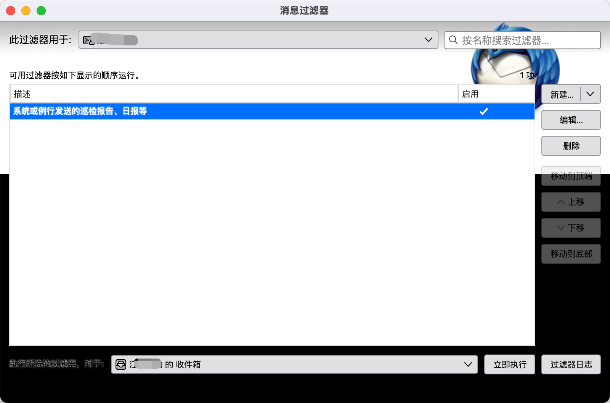
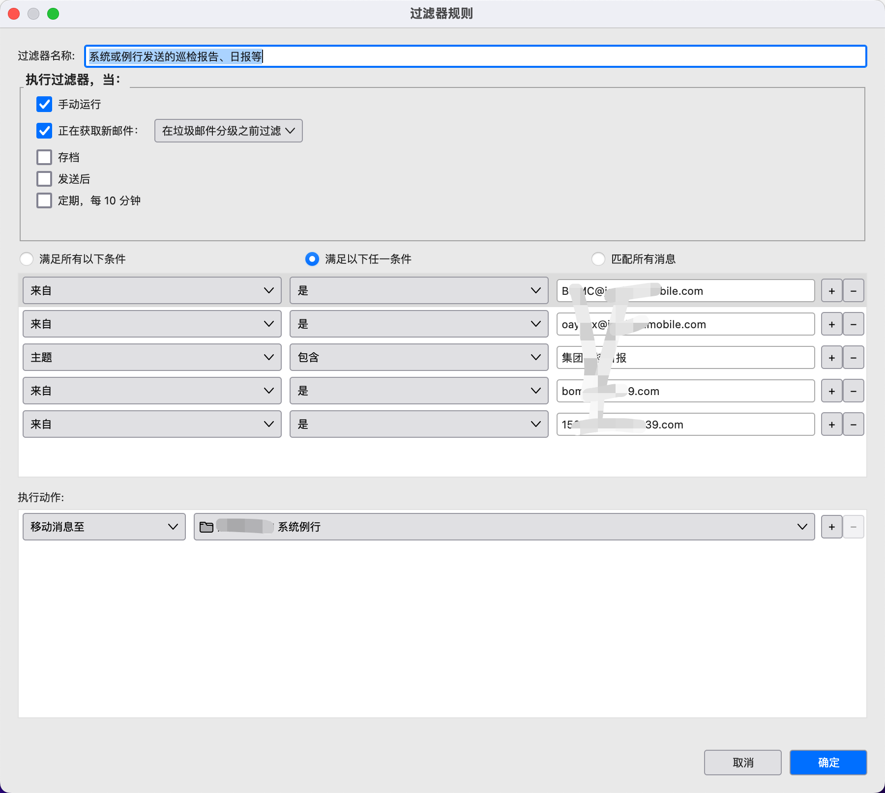
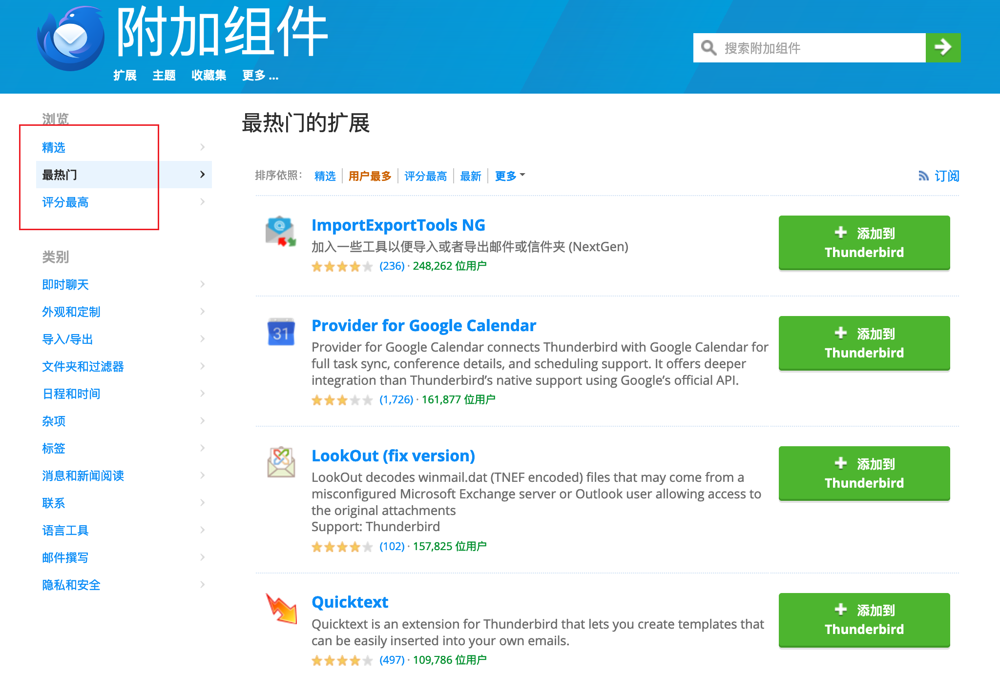
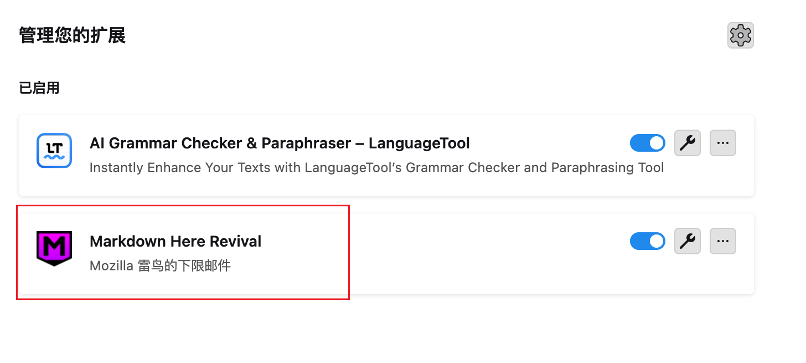
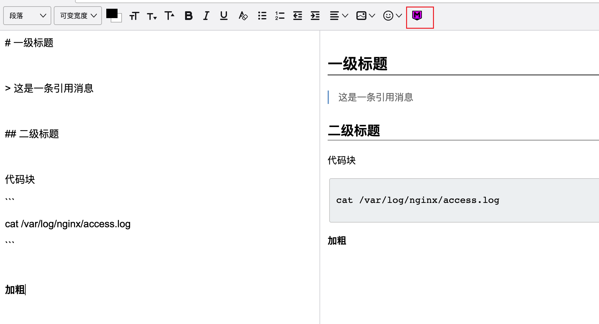
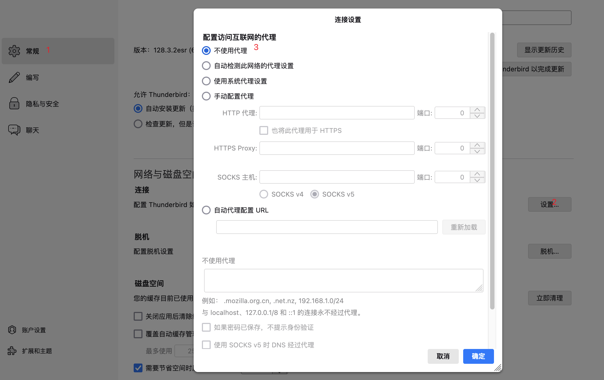

# Thunderbird 解放收件箱

> 遇见Thunderbird：一个给你充分自由的邮件、日历和联系人管理应用。

邮箱轻度用户在 Web 网页使用账户/密码（或手机号/验证码）登录邮箱，包括 QQ 邮箱、139邮箱、网易邮箱等。如果邮箱连接保持时间较短，那频繁登录邮箱的动作可能令人厌烦。此外，用户往往不止一个邮箱，在不同邮箱之间切换也着实让人心累。如果你觉得邮箱特别不好用，那可能是打开方式不对，你需要「邮箱客户端」。

在个人 PC 上下载邮箱客户端，使用 imap 协议邮箱绑定有效解决上述问题。

即使在断网条件下，也可以编辑、浏览邮件。支持实时提醒、手机短信绑定，使您避免错过重要邮件。邮箱客户端提供统一平台，可以将你的 QQ 邮箱、公司邮箱、学校邮箱整合起来，实现一站式管理。

当今市面上比较流行的邮箱客户端有：微软的 Outlook、腾讯的 Foxmail，本文推荐一个更好用的邮箱客户端 Thunderbird。

*本文档流程截图以 MacOS 版本作为演示。*

## 快速浏览

### 优雅外观、清爽简洁

### 全平台支持

支持主流操作系统，让你在不同平台也能畅快切换：

- Windows
- MacOS
- Linux

### 开源免费，长期维护

Thunderbird 由用户自愿捐助，无需收费。人人都可以是项目贡献者，任何需求和改进都可以反馈到官方。「持续更新」保证了 Thunderbird 长久生命力。

### 隐私安全

不会收集个人信息，不会在邮箱中插入广告，也不会盗用隐私对话内容。如果你注重个人隐私，推荐使用 Thunderbird。

### 插件扩展

Thunderbird 已经足以满足用户的绝大多数需求，像Chrome浏览器一样，它支持插件扩展，功能更加丰富。

## 马上开始

### 下载安装

无需「科学上网」，可直接在[官网](https://www.thunderbird.net/zh-CN/thunderbird/all/)下载，根据操作安装指引完成。

### 邮箱配置

> 只需要动手做，你可以完全不了解邮箱协议。

推荐使用 imap 协议：邮箱客户端支持**imap**和 pop3，它们的主要区别是 pop3 仅支持单向电子邮件同步，仅允许用户将电子邮件从服务器下载到客户端。

绑定邮箱客户端步骤：

1. Web登录邮箱，获取 imap/pop3 授权码；
2. Thunderbird 客户端配置。

邮箱授权码获取一般在「设置」中寻找，具体位置不尽相同，以下展示了一些主流邮箱获取授权码方式。

#### 获取 Imap/Pop3 授权码

**QQ 邮箱**

**139邮箱**

#### 绑定 Thunderbird 邮箱

Thunderbird 无需手动协议，输入授权码则可自动协议匹配👍

## 最佳实践

本章节介绍 Thunderbird 基本使用，助您快速上手提高生产力。

### 通信录

可以在通信录中区分邮箱联系人，你无需手动添加，在邮件中点击邮箱账户快速添加和编辑。

在发送邮件时，也无需可以从通信录中选择「收件人」和「抄送人」，Thunderbird 客户端支持关键字匹配，自动弹出通信录中匹配的用户。

### 消息过滤器

在工作中，一天最高接收超百封邮件，邮件淹没、邮件堆积是很多人直接面临的问题。虽然邮件系统支持文件夹和标签功能，但手动归类也实在是一件琐事。

**消息过滤器**是一种用于筛选和管理邮件、信息或其他通信内容的工具。它根据预设的规则（如发件人、关键词、主题等）自动对消息进行分类、标记、删除或存档，帮助用户高效管理信息，避免被无关内容干扰，提升工作效率和信息处理的准确性。

简单来说，设定规则自动化归类整理。

依据消息过滤器，可以做到：

1. 邮件发送人是领导，第一优先级处理，归类到文件夹 A
2. 工作职责相关邮件自动归类到文件夹 B
3. 例行日报、系统自动发送的邮件自动归类到文件夹 C
4. 作为抄送人的知会类邮件，归类到文件夹 D

在邮箱客户端的「设置-工具-消息过滤器」中新建过滤器，并配置。

手动执行或者收到邮件时，执行过滤器，满足条件（逻辑或）的邮件移动到系统例行文件夹。

举一反三，您可以自行定义各类消息过滤器，类似于 `if-else` 逻辑。

### 签名

在发送邮箱时，附带介绍个人信息的专属签名，可以提升你邮箱的商务属性。在 Thunderbird 中「一劳永逸」设置自己的专属签名。

配置签名，包含以下步骤：

1. 定义签名模板（HTML 格式）
2. 邮箱签名配置

#### 邮箱签名模板

推荐一个邮箱模板生成器[标小智](https://www.logosc.cn/email-signature-generator#templates)，根据自己的偏好设计专属签名模板。

根据网站提示定义模板，生成签名 HTML 文件，可以使用「文本编辑器」打开，并全选复制。

#### 设置模板

签名模板是以邮箱为单位的，QQ 邮箱和网易邮箱（个人邮箱和上午邮箱）可以设置不同的模板。

右键点击想要设置签名的邮箱：

选择「签名文字」，勾选「使用 HTML」，将上一步骤生成的 HTML 粘贴到编辑框内，无需保存自动生效。

新建邮件时，会自动在邮件末尾生成个人专属签名。

## 插件与功能拓展

像 Chrome 浏览器一样，Thunderbird 支持扩展插件，可以去插件市场上查看推荐插件、精选插件。

如定时发送、外观主题、语法检查、翻译等。

特别地，在富文本编辑框中使用 Markdown 编辑：

> 该插件存在一个不足，消息无法自适应编辑框大小，可以适用体验下。去社区提个 issue 或者自己开发个插件！

## 其他配置

如果你使用的是国内邮箱，如 QQ 邮箱、139邮箱、网易邮箱，同时你通过某种手段访问国际互联网，建议关闭系统代理，以避免某些安全审查不通过。

设置-常规-网络与磁盘空间-连接-设置...

## 参考

1. Thunderbird 中文官网 https://www.thunderbird.net/zh-CN/
2. 标小智，邮箱签名生成 https://www.logosc.cn/email-signature-generator#templates

## 关注微信公众号，联系作者

微信搜索关注公众号：**持续运维**

如果您有需要技术咨询，或者有想法使本文档变得更好。

联系作者：xing.xiaolin@foxmail.com
