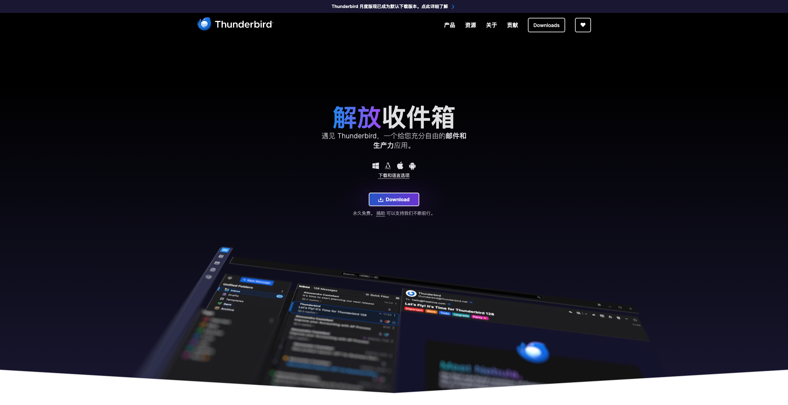

# 轻松办公

使用最先进的职场工作方法与技术工具，提升工作效率，轻松胜任。

## 火狐出品，ThunderBird 解放收件箱

遇见 Thunderbird，一个给您充分自由的邮件和生产力应用。

## 文编编辑 Markdown，专注于内容而非样式

Markdown 是一种轻量级标记语言，用简单的符号（如 `#`、`*`、`>`）即可实现标题、列表、代码块等结构化排版，让纯文本也能拥有清晰的格式。
它比 TXT 更易读，比 Word 更轻便，兼容 HTML/PDF 等多种格式，尤其适合技术文档、博客写作和高效笔记，是开发者、写作者和知识管理者的首选工具。

---

更多内容，持续更新中...
