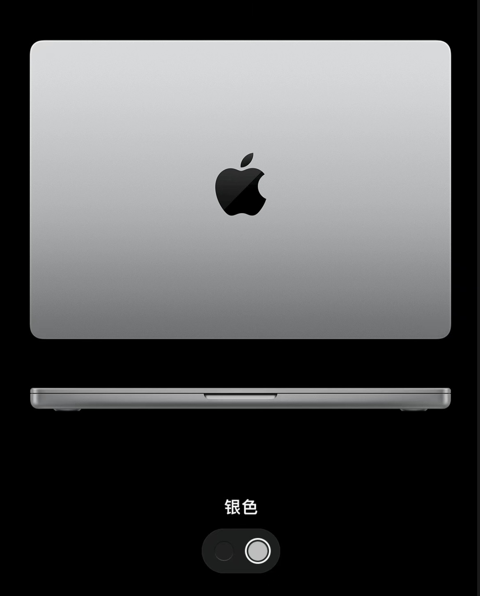
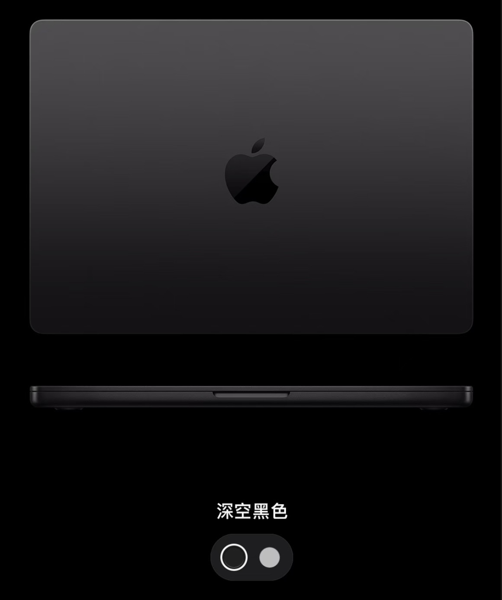

# Mac办公体验：始于颜值，终于实力

作为4年MacBook Pro用户，近期因为工作软件兼容性问题，自费购买了Windows电脑作为主力办公电脑，但学习、写代码等仍然使用MacBook Pro，在此聊聊这些年用MacBook Pro的感受。说实话，刚开始是被它的颜值吸引的——谁不喜欢一个轻薄漂亮、屏幕又好的笔记本呢？但真正让我留下来的，是它那套让人"用了就回不去"的系统体验以及轻装上阵，无需携带充电器、鼠标。

## MacBook Pro 体验

作为一个程序员，macOS给我的第一感觉就是"回家"了。Unix内核意味着什么？意味着我不用再折腾各种环境配置，命令行工具都是原生的，开发环境搭建起来特别顺畅。在终端中使用Homebrew，那种"一键安装所有开发工具"的方式与使用Ubuntu的体验高度一致。

### 苹果系统生态

苹果公司构建了一个封闭完善的生态，手机是iPhone，耳机是AirPods，MacBook Pro带来的协同体验真的会上瘾，出不去了。

- **文件传输**：用AirDrop传文件，比微信传文件还快，而且不用担心文件大小限制
- **剪贴板同步**：手机上复制一段文字，电脑上直接粘贴，这种无缝体验用过就戒不掉
- **接电话**：正在电脑前码代码，手机来电直接在Mac上接听，不用到处找手机
- **AirPods自动切换**：戴着耳机听歌，打开MacBook，音乐就自动切换到电脑上播放

### 不止是macOS，硬件也是杠杠的

苹果笔记本电脑的续航能力是非常优秀的，M芯片系列续航真的让人感动，带它可以实现轻度办公一整天，除非重度使用，否则基本没有续航焦虑。

除了性能，MacBook Pro在外观、便携性上也表现得非常出色。 必须单独夸一下这个触控板，手势操作丰富到让我几乎忘了鼠标的存在，三指拖拽、四指切换桌面，操作起来行云流水。屏幕素质也是遥遥领先，1500尼特的亮度、高精度色彩，做设计或者看代码都很舒服。

性能、外观、便携性、屏幕素质、续航，苹果电脑没有短板。

## macOS 并不完美

Office兼容性差是macOS最大的痛点，特别是和同事协作的时候，偶尔会出现格式错乱的问题，虽然不常见，但一旦遇到就很头疼。 另外，有些专业软件在macOS上要么没有，要么功能不全。比如一些行业专用的CAD软件、财务软件等。如果工作行业对特定软件有依赖，买Mac之前一定要先确认软件兼容性。

最为重要的是，MacBook Pro的价格确实比同配置的Windows笔记本贵不少，而且配件也贵，原装配套鼠标、触控板、键盘真的贵，一个雷电接口的扩展坞就要好几百，官方维修更是"天价"。可以从使用频率角度来度量购买建议，电脑重度使用者：推荐购买。

我们第一次接触电脑往往是Windows操作系统，学习里面的教学课程也是Windows系统，这也占据了用户心智。从Windows这个舒适圈里跨越到macOS，刚开始会很不习惯。UI风格、快捷键不一样，文件管理逻辑也不同。

不过适应一段时间后，一定会发现macOS的操作逻辑其实更符合直觉，操作系统也更干净整洁（没有乱七八糟的广告、弹窗和恶意软件）。

## 要不要买

购买苹果电脑最初的动机主要有2个：

- 好奇心，想要尝鲜，体验Mac系统，毕竟Windows、Linux都用过了，同时很多同学朋友都推荐Mac
- 好看好看好看，苹果电脑简约大方，端个苹果电脑在自习室、星巴克、图书馆办公，既方便又有美感

不过，因为macOS的系统兼容性问题，以及一些专业软件的限制，我个人还是比较推荐购买Windows笔记本的，尤其是你在一家比较传统的企业或单位，Windows始终是基准。

对于轻度办公，MacBook Air是一个不错的选择，价格亲民，更轻薄便携，性能也足够，5k 左右就可以搞定，这个价格直接爆锤Windows。只是想要体验macOS系统，有精力的话装个黑苹果，零成本体验，或者购买 Mac mini，只需3k左右。

对于专业办公，如程序员、平面设计、视频剪辑等用户，或者富哥富姐，购买MacBook Pro是一个明智的选择。
