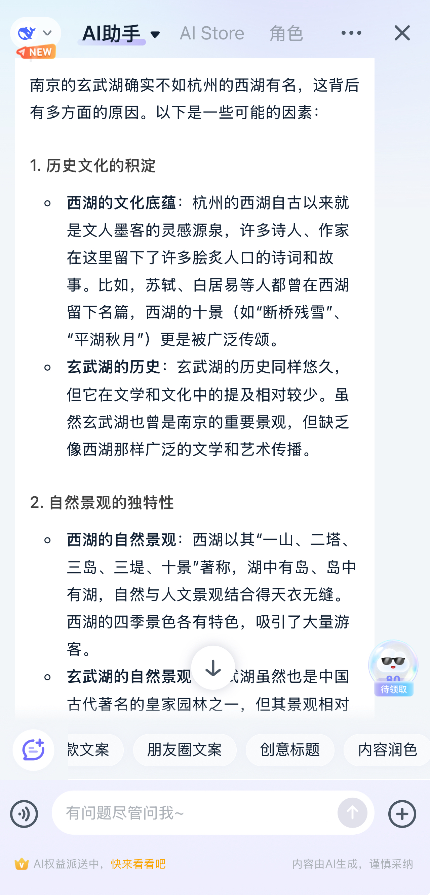
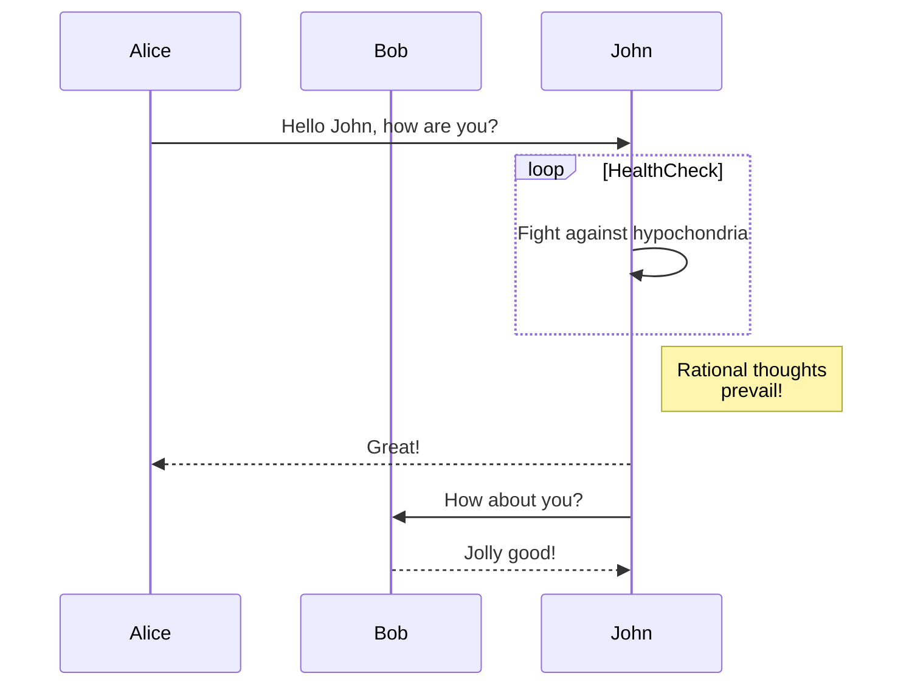
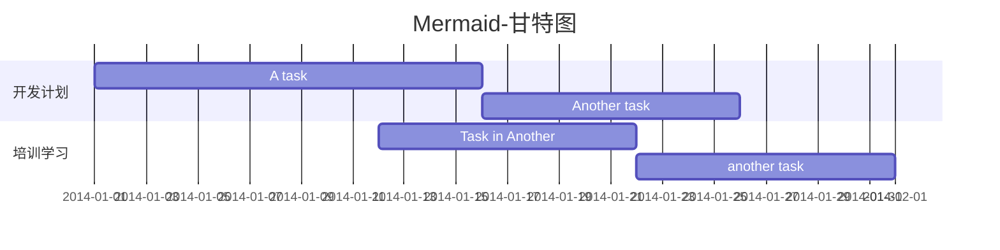

# Markdown 文本编辑，专注于内容而非样式

## 前言

> 笔者在大二时，同学使用 Markdown 来完成数学作业，被其简约清爽表达所吸引。
> 老师或助教批阅电子版作业时，也会轻松愉悦，于是我开始使用 Markdown 完成作业。

在信息爆炸的时代，我们每天都在处理和生成大量文本数据。从日常笔记、工作汇报到技术文档，从博客文章到用户手册，有效的信息传递变得至关重要。

目前最普遍和流行的文本编辑方式为 Txt 和 Word。

Txt 方便快速笔记，但结构性差，不方便阅读；Word 功能丰富但操作繁杂，且格式调整和多平台兼容性问题常常让人头疼。
这时一种轻量但功能丰富的标记语言 Markdown，兼具 Txt 和 Word 的优点而脱颖而出，成为了众多写作者和开发者的首选。

笔者认为 Markdown 完全可以替代 Txt 和 Word，为文本编辑和阅读带来便利。本文将探讨为什么推荐你使用 Markdown？


| 文本编辑工具 | Txt | Word | Markdown | Latex |
|--------| -- | ---- | -------- | --- |
| 编辑     | 👍 | ❎   | 👍       | ❎   |
| 阅读     | ❎ | 👍   | 👍       | 👍  |
| 学习成本   | 👍  | ❎   | 👍       | ❎  |
| 功能丰富   | ❎ | 👍   | 👍       | 👍  |
| 版本控制   | 👍 | ❎   | 👍       | 👍  |
| 轻量性    | 👍 | ❎   | 👍       | 👍  |
| 兼容性    | 👍 | ❎   | 👍       | ❎   |
| 代码友好   | ❎ | ❎ | 👍       |  👍   |
| 用户基础   | 👍 | 👍👍 | 👍       | ❎   |

## 一、Markdown 简介

Markdown 由约翰·格鲁伯（John Gruber）和亚伦·斯沃茨（Aaron Swartz）共同创建，它首次在 2004 年发布。Markdown 的设计目标是**实现文档「易读易写」，快速创建并编辑文档，减少格式化工作，专注于内容创造**。自2004年发布以来，Markdown 迅速获得了技术写作社区的青睐。它的简洁性和易用性使得它成为编写文档、博客和笔记的首选格式。

在程序员和科研工作者中，Markdown 受到了广泛的欢迎和应用。此外，Markdown 被广泛用于各种在线平台，如飞书文档、钉钉文档、腾讯文档、GitHub、Stack Overflow等。Markdown 的流行也催生了许多静态站点生成器，如 Jekyll、Hugo、Hexo 和 VitePress，它们允许用户使用 Markdown 编写文档，并生成静态网站。

Markdown 的基础功能非常简单：以`#`开头作为段落，其数量表示层次级别。无需关注字体、段落、对齐方式等在 Word 中让人困扰的问题，你可以由此开启 Markdown 编辑方式。

```markdown
# 一级标题
## 二级标题
### 三级标题
*字体加粗*
=字体高亮=
$段内数学公式$
$$段落数学公式$$
> 引用
[超链接](https://baidu.com/)
```

## 二、推荐使用 Markdown

Markdown 以易读、易写、易扩展&功能丰富三大优点赢得了广泛的用户基础。

首先，Markdown 的视觉体验简洁直观，阅读和理解几乎不需要任何学习曲线。它的文本文件即使在没有格式转换的情况下也能保持清晰和可读，这对于快速编辑文档和浏览来说是一个巨大的优势。

Markdown 的易写性体现在它的语法简单，无需复杂的操作即可添加标题、列表、链接和格式化文本，即使是新手也能在 5 分钟内快速上手。然而，这并不意味着 Markdown 功能简单，Markdown 支持非常丰富的功能，如常用的图片插入、目录生成、链接引用、字体高亮、数学公式、代码块等。

易扩展性是 Markdown 的另一个显著特点。Markdown 是结构化语言，编程语言如 Python、Java、JavaScript 等可以方便读取其结构，很轻松地进行格式转换，如 Markdown 转 PDF、Markdown 转 Word、Markdown 转智能图形、Markdown 转知识树等，支持各种插件和扩展以增强其功能。它适应场景广泛，从技术文档到学术论文，Markdown 都能轻松应对。此外，随着大模型时代的到来，Markdown 成为一种「标准格式」。




**Markdown功能快览：**

---

编程语言代码块：

```java
// 支持代码注释，
// 支持几乎所有编程语言的语法高亮
public class HelloWorld {
    public static void main(String[] args) {
        System.out.println("Hello, World");
    }
}
```

---

编辑 Mermaid 时序图：



---

Latex 数学公式：

段内数学公式：$y = 2^x \cdot f(x)$

段落数学公式：

$$
\bar{s}_N \triangleq \frac{N p}{\mathbb{E}\left\{T_{\text {end }}\right\}}=\frac{\mathbb{E}\left\{\sum_{k=1}^{K_N} \sum_{m=1}^M a_m\left(t_k\right) p\right\}}{\mathbb{E}\left\{T_{\text {end }}\right\}}
$$

---

任务待办标签：

* [X]  周三前完成财务报账
* [ ]  开组会，制定本周内的工作安排
* [ ]  上周故障分析汇报

---

综上所述，Markdown 的易读、易写、易扩展和功能丰富这三大优点，使其成为了编写和分享文本内容的理想选择。

### 2.1 易读

> 您正在阅读的本篇文章，使用 Markdown 编辑
>
> Markdown 编辑的文本在分发时往往转换为 PDF 格式

Markdown 的易读主要体现在三点，一是结构清晰，二是视觉简洁，三是兼容性强。

文章层次分明，一级标题、二级标题、三级标题等配合目录，即使在页数非常多的文档中，也可以快速跳转和按需阅读。

分级标题是 Markdown 最基本的语法，所有的 Markdown 文本都是具有清晰的标题结构，Markdown 转化为 PDF 或 Word 后，支持段落结构。此外，图片、代码块、数学公式、表格也非常优雅，阅读体验非常好。

插入表格：


| A | B | C | D | E |
| - | - | - | - | - |
| a | b | c | d | e |
| 1 | 2 | 3 | 4 | 5 |

Markdown 需要专门的编辑器进行格式渲染，然而本质上仍然是文本文件，无格式渲染情况下也可以轻松阅读。此外，使用 Word 时遇到的版本和兼容性问题，Markdown 不会遇到。

即使没有 Markdown 编辑器，纯文本方式打开也**无障碍阅读**，同时文本格式也意味着 Markdown 非常易于**复制粘贴**。


### 2.2 易写

Markdown 的设计哲学是让文本编辑回归简单，减少干扰。

Markdown 的易写性主要体现在其**简洁直观的语法设计**上，即使是初学者也能迅速掌握并开始撰写文档。它的语法简单，如使用星号(*)表示斜体，双星号(**)表示粗体，井号(#)表示标题。

相对于 Word 繁杂的段落、字体、间距、标签、布局等选项和功能，使用 Markdown 编辑时不需要纠结这些，Markdown 让作者能够**专注于内容**而非格式。

Markdown 文件的**纯文本格式**确保了在任何文本编辑器中的兼容性，无需特定软件即可编辑，提高了写作的灵活性。与 Txt 一样，Markdown 轻量，轻松支持 [Git](https://git-scm.com/) 版本跟踪。

此外，Markdown 鼓励作者以键盘操作为主，支持撤销和重做等基本编辑功能，使得写作过程更加高效。它的多平台支持特性，让用户可以在不同的操作系统和设备上进行写作，不受环境限制。许多 Markdown 编辑器提供了即时预览功能，让作者在编写的同时就能看到格式化后的内容，这不仅提高了写作的准确性，也增强了写作的愉悦感。

### 2.3 易扩展&功能丰富

Markdown作为轻量级的标记语言，很容易实现编程扩展

1. [markmap](https://markmap.js.org/) Markdown 和思维导图之间轻松转换。


2. [aippt](https://www.aippt.cn) 基于 Markdown 文本大纲格式快速生成PPT。


3. [mermaid](https://mermaid.nodejs.cn/) 基于 JavaScript 的图标工具，支持流程图、时序图、类图、状态图、实体关系图、甘特图等。



4. [VitePress](https://vitepress.dev/) 使用 Markdown 快速创建优雅的文档，本网站由 **VitePress** 搭建。

## 三、快速体验

### 3.1 在线体验

无需任何下载和安装，用户可以在 Web 网页在线编辑 Markdown，并实时渲染

[Arya-在线Markdown编辑器](https://markdown.lovejade.cn/)

[Editor.md 开源在线Markdown编辑器](https://pandao.github.io/editor.md/)

[在线工具-Markdown编辑器](https://tool.lu/markdown/)

[Markdown中文官网编辑器](https://markdown.com.cn/editor/)

[字节跳动协同办公软件-飞书文档](https://www.feishu.cn/product/docs)

### 3.2 Markdown 编辑器

下载本地 Markdown 编辑器，主题优雅，支持多种文档导出方式，带来更舒适的体验。对于新手，笔者更推荐`Notable`，使用源代码格式编辑，轻松学习 Markdown 语法

[MarkText](https://www.marktext.cc/) 简单且优雅的 Markdown 编辑器，聚焦于速度和可用性

[Notable](https://notable.app/) 支持分屏编辑，更适合新手。

[Typora 收费软件](https://typoraio.cn/) 一款 Markdown 编辑器和阅读器，现已收费，不推荐。

## 四、Markdown 学习教程

分享 Markdown 学习和快速入门网站，本文不作详细语法介绍。

快速上手，推荐从分屏编辑模板开始：[快速开始](https://markdown.lovejade.cn/)

[Markdown 官方教程](https://markdown.com.cn/)：域名契合，自称为**官方教程**

[Markdown 菜鸟教程](https://www.runoob.com/markdown/md-tutorial.html)：知名程序员百宝箱网站

[Markdown Guide](https://www.markdownguide.org/getting-started/)：国外的 Markdown 指引网站

## 参考

1. markmap, https://markmap.js.org/
2. git, https://git-scm.com/
3. aippt, https://www.aippt.cn
4. mermaid, https://mermaid.nodejs.cn/
5. vitepress, https://vitepress.dev/
6. Arya 在线 Markdown 编辑器, https://markdown.lovejade.cn/
7. Editor.md, https://pandao.github.io/editor.md/
8. 在线工具 HTML2MD, https://tool.lu/markdown/
9. Markdown edictor, https://markdown.com.cn/editor/
10. 飞书文档, https://www.feishu.cn/product/docs
11. MarkText, https://www.marktext.cc/
12. Notable, https://notable.app/
13. Typora, https://typoraio.cn/
14. 菜鸟编程，Markdown 教程, https://www.runoob.com/markdown/md-tutorial.html
15. Markdown Guide, https://www.markdownguide.org/getting-started/

## 联系作者

如果您有需要技术咨询，或者有想法使本文档变得更好。

联系作者：xing.xiaolin@foxmail.com
