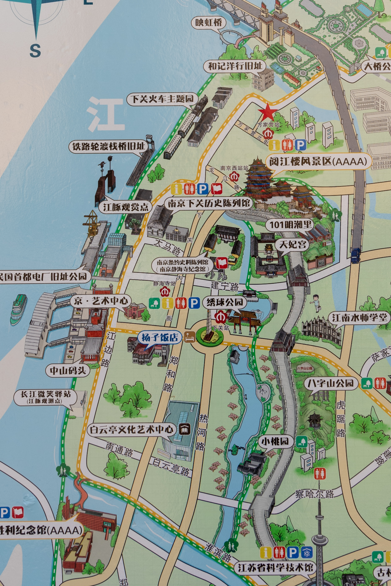
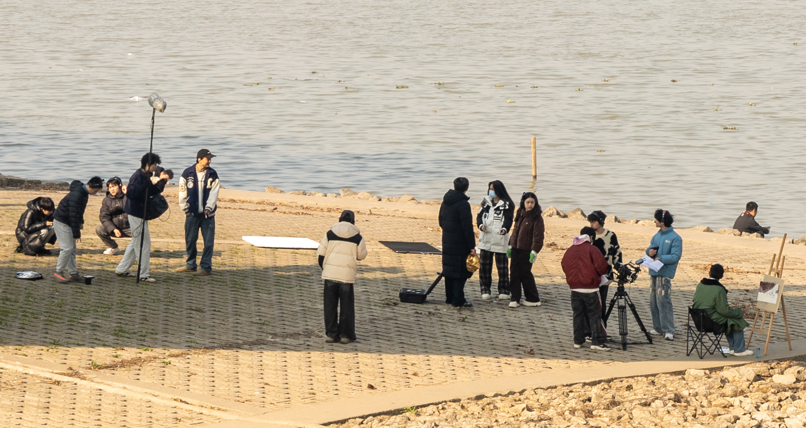

# 鼓楼滨江步行道

南京鼓楼滨江位于南京市鼓楼区西北部，紧邻长江南岸，是南京近代化的重要发源地之一。

鼓楼区是老城区，江苏省政府机关驻地，拥有众多央国企、学校，老破小非常多。21年之前，房地产发展如火如荼的时候，滨江作为鼓楼少有的未开发片区，开始发展中高端房地产，将鼓楼+江景作为卖点。现在来看，这片区域房地产没有成功发展起来，但确实做了不少基础设施建设，非常适合跑步、游玩散步（南京另外一个人少环境好的地方江心洲），2025年南京马拉松赛道就在这一片。

沿途散步，从玻璃栈道到中山码头，进行随笔总结。地铁站坐到5号线末端——方家营，从2号口出。

出地铁站，可看到景区总揽。

长江大桥下有一个玻璃栈道——映红桥，是个网红打卡点，曾经在小红书看到一群老艺术家在这里打卡。晚上是有灯光的，可在映红桥上欣赏到长江大桥的夜景。

顺着小路远看映红桥，可以看到南京长江大桥了。

南京长江大桥入口

享受年轻与活力的青年人，可能是一群本科大学生在拍摄《思想品德》的课堂作业。

望江亭，这个有多少年了，产出了多少古诗词可以搜一下。

奶爸带娃

或许是看剧多了，在这种无人走的路径，我会联想到抛尸的剧情，好可怕，所以一般少走野道。

鼓楼滨江一带在民国时代有过火车站，因此沿途有一个火车主题公园。从南京到北京，我是从北京到南京。

历史的痕迹

火车道遗迹，向远方看，放佛能穿越到宫崎骏的动漫世界。

使用豆包AI，生成宫崎骏动漫风格的图片。

中山码头招牌的右手边，有一个入口，左右两边各有一家咖啡厅，当然不止卖咖啡，还有一些餐食，是个约会闲聊的好地方。

