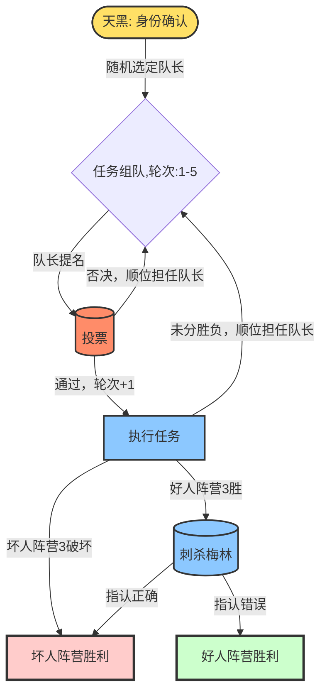

# 阿瓦隆 Avalon

阿瓦隆是一款身份推理类桌游，适合 5-10 人参与，核心围绕 “好人阵营（蓝方）” 与 “坏人阵营（红方）” 的对抗展开。玩家进行**逻辑推理**与**演讲**，通过**投票表决**、**任务执行**、**技能使用**实现阵营目标，兼具策略性与互动性，无玩家中途淘汰机制。

## 阵营与身份

游戏开局前所有玩家随机抽取身份，身份决定阵营归属与特殊技能，划分如下：

| 阵营         | 核心目标                            | 角色     | 技能         |
| ------------ | ----------------------------------- | -------- |------------|
| **好人阵营** | 3个“任务成功”                     | 梅林     | 查验所有邪恶方身份  |
|              |                                     | 派西维尔 | 查验梅林和莫甘娜身份 |
|              |                                     | 忠臣     |            |
| **坏人阵营** | 3个“任务失败”，或成功刺杀**梅林** | 莫甘娜   |            |
|              |                                     | 刺客     | 执行“刺杀”任务   |
|              |                                     | 爪牙     |            |
|              |                                     | 奥伯伦   | 无法与同阵营成员互认 |
|              |                                     | 莫德雷德 | 梅林无法查验身份   |

## 任务

游戏中双方阵营共同完成5轮任务，当一方累积获得3轮胜利，触发游戏结束条件。

任务由【队长】提议发起，提议此轮任务数量玩家作为【任务成员】参与任务，并在【投票】通过后执行。任务执行类似于投票，执行任务的成员选择【任务成功】或【任务失败】参与任务。

角色的职责：

- 队长：提议并选定成员执行任务
- 所有玩家：演讲表达观点，对任务成员提议投票表决
- 任务成员：执行任务，任务成功或破坏任务

## 游戏配置

阵营与角色分配、每轮任务参与人数与游戏参与人数相关。

| 游戏人数 | 好人阵容               | 坏人阵容            | 任务人数   |
| -------- | -------------------- |-----------------| ---------- |
| 5        | 梅林、派西维尔、忠臣   | 莫甘娜、刺客          | 2 3 2 3 3  |
| 6        | 梅林、派西维尔、忠臣*2 | 莫甘娜、刺客          | 2 3 4 3 4  |
| 7        | 梅林、派西维尔、忠臣*2 | 莫甘娜、刺客、奥伯伦      | 2 3 3 4* 4 |
| 8        | 梅林、派西维尔、忠臣*3 | 莫甘娜、刺客、爪牙       | 3 4 4 5* 5 |
| 9        | 梅林、派西维尔、忠臣*4 | 莫甘娜、刺客、莫德雷德     | 3 4 4 5* 5 |
| 10       | 梅林、派西维尔、忠臣*4 | 莫甘娜、刺客、莫德雷德、奥伯伦 | 3 4 4 5* 5 |

**保护轮**：标有*的任务为保护轮，需要2个以上任务失败票才能判定为任务失败。

## 游戏开始

### 赛前阶段

所有玩家环形而坐，以逆时针为默认方向。

三次身份互认：

1. 梅林：查验坏人阵营身份
2. 派西维尔：查验梅林和莫甘娜身份
3. 坏人阵营：阵营成员互认（奥伯伦除外）

---

天黑请闭眼，请所有玩家握住拳头并放在桌前；

梅林请睁眼，坏人阵营请竖起大拇指...梅林确认身份...坏人阵营放下大拇指...梅林请闭眼；

派西维尔请睁眼，梅林和莫甘娜竖起大拇指...派西维尔确认身份...梅林和莫甘娜放下大拇指...派西维尔请闭眼；

所有坏人阵营成员请睁眼，互相确认身份...坏人阵营请闭眼。

所有玩家请睁眼，天亮了...

---

游戏共5轮，每轮任务包含以下阶段。

### 1. 任务组队

由【队长】发起任务组队，队长选定方式：

- 第1轮：随机指派
- 第2轮至第5轮：上一轮队长的顺位玩家

> 参与任务人数由游戏配置和轮数决定

队长首先发言，【提议】参与任务的人选，然后所有玩家按顺序依次发表【演讲】，演讲过程中，其他玩家不允许打断和交流。

所有人演讲结束后，【队长】确认提议的最终人选，进入【2.投票】环节。

### 2. 投票

所有成员对队长确定的人选进行表决，投票【赞成】或【反对】，所有成员投票完毕后揭晓：

- 超过半数玩家【赞成】则组队成功，进入【3.做任务】环节。
- 不少于半数玩家【反对】则组队失败，队长顺位流转并进入【1.任务组队环境】。

_当反对车队的次数达到上限5次时，则会进入强制轮，强制轮队长选择的人员将强制出征。_

### 3. 做任务

参与任务的成员进行“黑盒投票”：

- 好人阵营角色只能【任务成功】
- 坏人阵营角色可以【任务成功】或【任务失败】

只要有坏人参与任务，就有机会破坏任务。

每轮任务中，只要存在一张【任务失败】票，任务即失败；特别地，在**保护轮**中，需要两张【任务失败】。

任务失败后，可以看到投票的票型，即几张【任务成功】，几张【任务失败】。

此轮任务结束后，如果已经有阵营获得3次胜利，则进入【4.最终环节】，否则进入【1.任务组队】

### 4. 最终环节

坏人阵营3次任务破坏成功：游戏胜利。

好人阵营3轮任务保护成功，进入刺杀环节：刺客成功刺杀梅林则胜利，否则失败。
