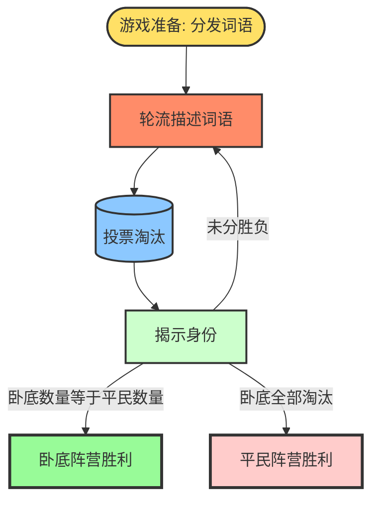
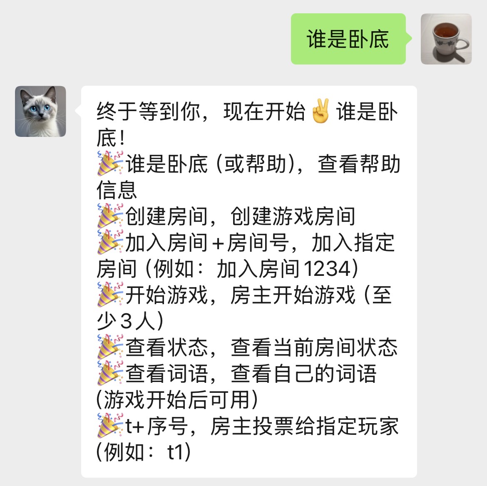

# 谁是卧底

「谁是卧底」是一款多人参与的语言推理类桌游，适合4-8人游玩，最佳游戏人数为5-6人，核心围绕"词语描述"与"逻辑推理"展开。玩家通过描述自己的词语、观察他人描述，投票找出隐藏的"卧底"，兼具趣味性与互动性，游戏节奏明快，适合各类聚会场合。

芒果台（湖南卫视）早期著名综艺节目《快乐大本营》中，快乐家族经常和嘉宾玩此游戏。

## 阵营与身份

> 扩展包中支持三阵营玩法，新增白板阵营

游戏中玩家分为两大阵营：平民和卧底，通过抽取词语确定身份，身份决定阵营归属与游戏目标，具体划分如下：

| 阵营         | 核心目标                           | 词语特征                   |
| ------------ | ---------------------------------- | -------------------------- |
| **平民阵营** | 找出并淘汰所有卧底                 | 与大多数玩家相同的词语     |
| **卧底阵营** | 隐藏身份并淘汰平民，坚持到游戏结束 | 与平民词语相似但不同的词语 |

注：玩家不知道自己拿到的是平民词还是卧底词。

## 游戏配置

根据参与人数，身份分配规则如下：

| 游戏人数 | 卧底数量 |
| -------- | -------- |
| 4-5人    | 1人      |
| 6-8人    | 2人      |

如果人数超过8人，此游戏体验会下降，我不建议或者分成两个队伍。

## 游戏开始

### 赛前阶段

所有玩家围坐成一圈，主持人准备平民词语和卧底词语，将词语卡片分发给每位玩家。玩家查看自己的词语后，需将卡片收起并严格保密。

### 1. 轮流描述词语

游戏正式开始，玩家按顺序依次描述自己的词语。描述应尽可能简洁明了，禁止直接说出词语本身，也不能包含词语中的任何字。

### 2. 投票淘汰

一轮描述结束后，所有玩家进行投票：玩家需指出自己认为是卧底的人，得票数最多的玩家被淘汰。若出现得票数相同的情况，则平票玩家需重新描述，其他玩家再次投票。

若再次投票仍出现平票，可根据主持人要求执行以下规则之一：

- 平票玩家再次描述，全体重新投票
- 平票玩家通过石头剪刀布，失败者出局

### 3. 揭示身份

被淘汰的玩家公开自己的词语，由主持人判定游戏是否继续。

### 4. 胜负判定

游戏持续进行，直到满足以下条件之一：

- **平民胜利**：所有卧底被淘汰
- **卧底胜利**：场上剩余玩家数量与卧底数量相等

## 线上发牌器

「谁是卧底」是一款简单易上手的桌游，非常适合朋友聚会、家庭聚会等**线下**场景，老少皆宜。

微信公众号「持续运维」已上线「谁是卧底」发牌器，发送“谁是卧底”消息即可获取游戏帮助。

### 项目特点

基于微信公众号消息功能实现，玩家无需下载安装任何软件，关注微信公众号后即可进行游戏。无需主持人角色，线上线下结合，保证游戏体验的情况下，最简化用户操作。个人发言和投票在线下进行，房主执行投票结果，系统自动判定游戏结果。

### 演进优化

由于未认证的微信公众号不支持服务端 API 权限，暂时无法实现自定义菜单、查看用户信息、主动发送客服消息等功能，因此游戏交互体验有待优化。当前仅支持请求-响应式的交互，用户需主动发送消息查看游戏进展。

欢迎大家关注支持，早日达到500人订阅，我将申请个人认证，带来更好的交互体验。

微信小程序同步开发中...

## 其他

同学聚会的娱乐方式丰富多样，不只是吃饭喝酒唱歌吹牛，还可以玩一些体育运动、棋牌、桌游等活动：

- 4人可选：麻将、掼蛋、乒乓球、羽毛球、璀璨宝石-宝可梦
- 5-6人推荐：谁是卧底
- 7-10人适合：阿瓦隆

若只有2人，也可以选择双人成行、洗澡、按摩等更活动...
