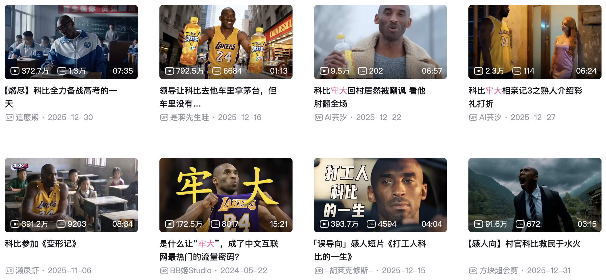

# 无论能否成为网红，都要积极拥抱「数字劳动」——人人都是博主的时代已到来

在B站、小红书上，我发现00后、05后的年轻博主越来越多，已经成为创作者主力，甚至不少高中生都在上传优质视频内容（尤其是深圳，那辨识度极高的深圳校服）。

抖音上最近流行起一种名为「口播」的视频类型，创作者只需拿起手机录制一段话，内容可以是生活琐事、学习心得、工作感悟等，时长不定但通常不超过5分钟。令人意外的是，这类看似「无营养」的视频竟能获得抖音的大量流量推荐，不少素人通过口播分享生活、工作和情感内容，收获了可观的关注与点赞，进而通过抖音赚到额外收入，形成正向激励，不断加大创作投入。

要成为大博主、大网红确实需要一定天赋、坚持和技巧，但作为普通人，只要坚持不懈地创作，也一定能赚到一些「数字体力钱」。

当今时代，人人都可以成为博主。本文将分享我对当下乃至未来数字创作时代的思考与理解。

## 未来海量就业

从某个角度看，中国经济发展大致可分为三个阶段：

- 2015年之前：低端制造业时代。富士康、华硕等电子厂是中国广大年轻打工人的主要就业选择。
- 2015年之后：互联网+时代。实体产业被互联网赋能，外卖、网约车、快递行业承载了海量就业需求。
- 2025年之后：人人都是博主时代。抖音、快手、B站、小红书等平台将容纳海量数字游民。

时代潮流滚滚向前。我们难以想象，或许在2026年，富士康等传统电子厂将逐渐退出中国，进厂打工的就业选择可能不再像现在这样普遍。跑外卖、开网约车是目前准入门槛最低的副业，承载着无数普通家庭的收入来源。我确信，以当今计算机和人工智能技术的发展水平，已经基本具备替代外卖员和网约车司机的能力。之所以尚未大规模普及，除了技术成熟度因素外，更重要的事机时机尚未成熟。

如果未来外卖员和网约车司机真的被AI替代，我们不必过于担忧！取而代之的将是个人视频创作平台。就像我们每天都要吃饭（点外卖）一样，如今我们每一分钟都在刷屏消费视频内容。这种海量、细碎的内容需求，需要无数普通人来扮演「内容配送员」的角色。

现在就可以开始运营抖音、快手、B站、小红书、视频号、微信公众号等平台。这些平台准入门槛极低，只需一部手机即可，且不受年龄和体力限制，非常适合成为数字游民。

## 人人都能当博主

在传统的纸质媒体和电视时代，新闻、影视剧、广告等内容都相对正式，需要像拍戏一样精心筹备。移动互联网发展初期，除了快手上出现的大量土味视频外，多数视频创作者仍偏专业风格，最先加入视频博主队伍的多是传统行业稳扎稳打多年的职场老手或领域专家。这类博主的内容制作精良、技术性较高，制作周期也相对较长，尽管已经比电视剧、电影等传统内容的拍摄周期短很多。

如今的趋势是：不需要导演，不需要精心编导剧本，做饭时可以拍一段，突然想到好点子可以拍一段，路上遇到有趣的事也可以拍一段。最重要的是，不能是纯静态视频，一定要有口语化表达，体现非正式性、亲近感和真诚感。

2025年是AI视频创作元年，AI创作的曼巴系列内容，让科比在中文互联网上获得了「赛博永生」。虽然AI的应用场景尚未完全探索清楚，但教人如何使用AI已经成为一门收益丰厚的生意。GitHub上关于大模型的项目，也能快速获得大量Star。我坚信，AI必将成为新一代技术革命的主角。