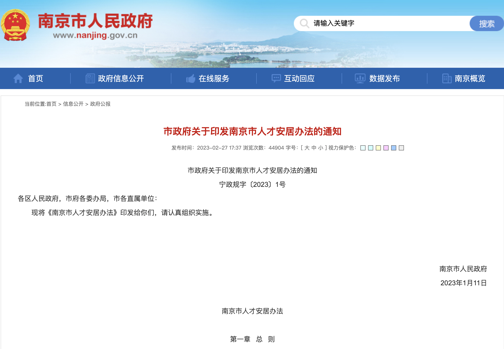
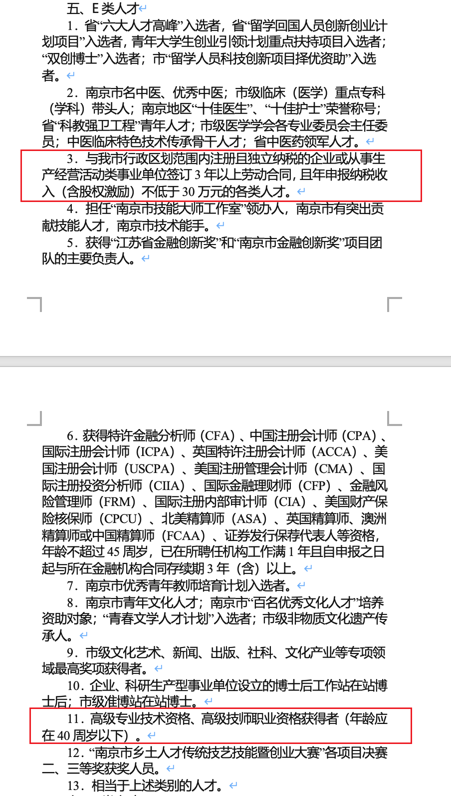
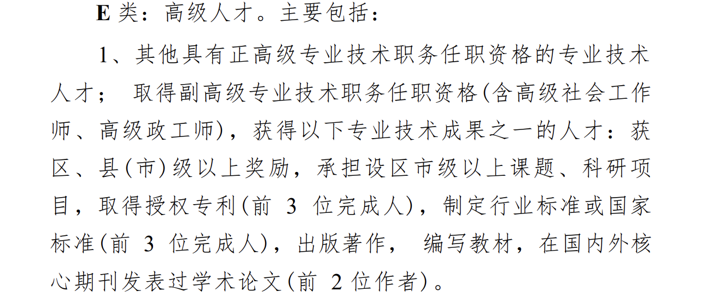
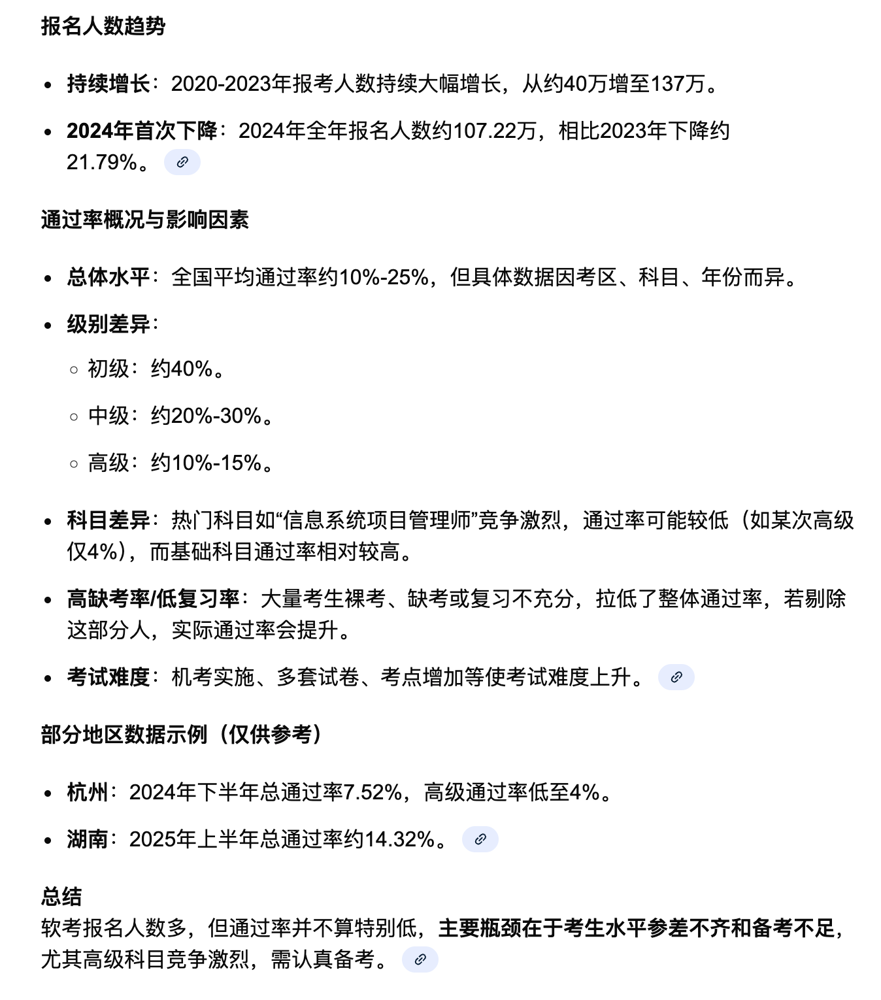
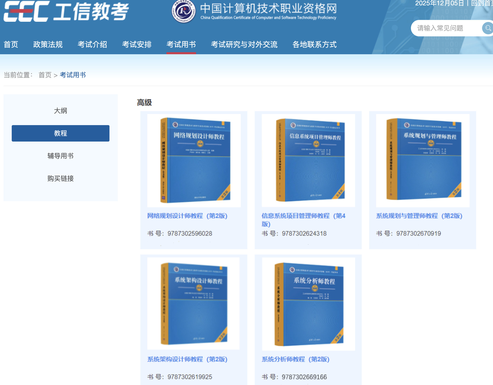
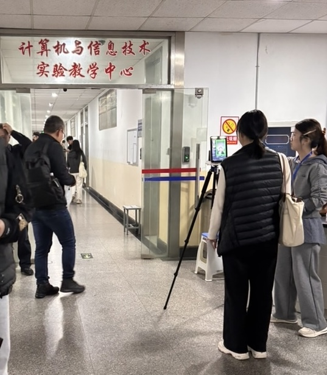
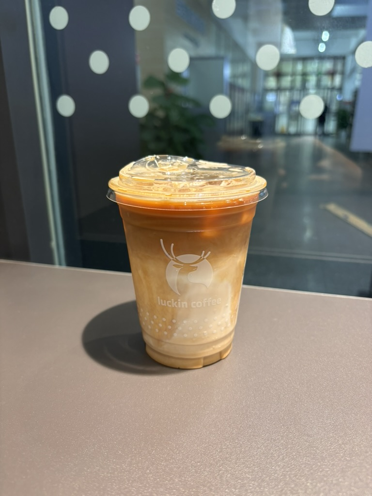
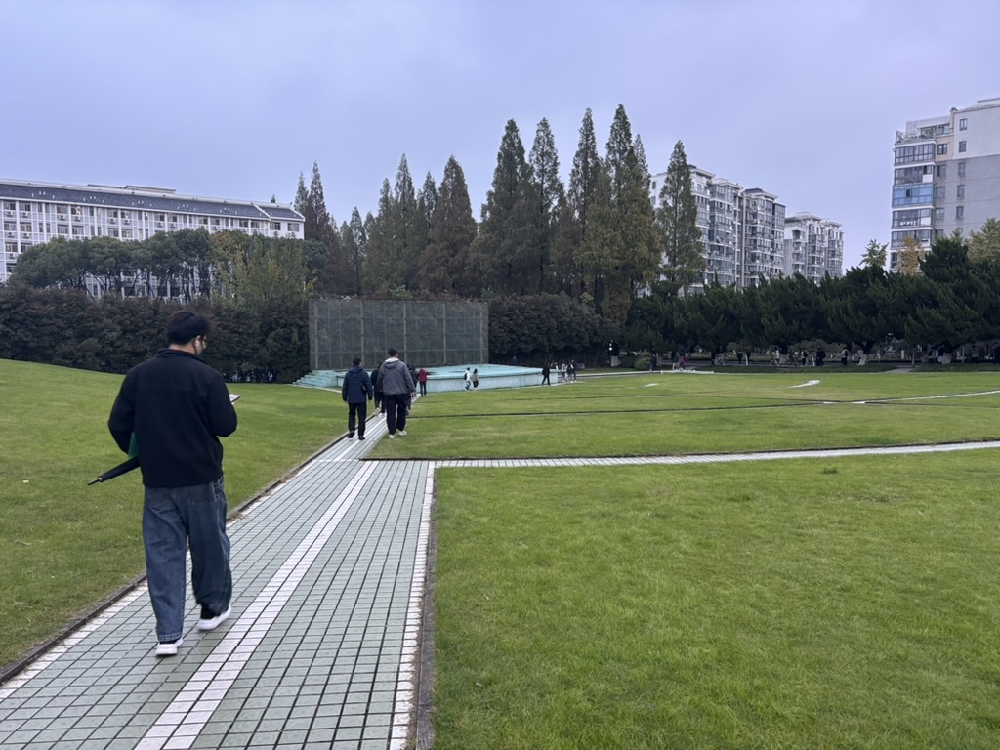
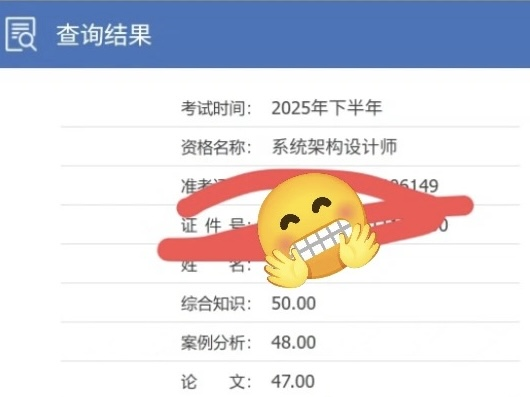

# 软考高级，系统架构设计师通关经验分享

软考全称计算机技术与软件专业技术资格考试，由**人力资源与社会保障部**主办。

## 为什么软考高级

软考高级的价值或预期收益：

1. 评职称：这个不太懂，可咨询公司人力资源部
2. 公司补贴：类似于建筑领域的一级建筑师，企业需要证书挂靠，可获得一定补贴
3. 继续教育：个人所得税App申请退税
4. 上海落户积分：其实我觉得这个必要性也不高，现在上海落户门槛已经很低了，很多应届硕士可以直接落户，不必走这条路

最核心的价值，杭州和南京这两座城市，政府会给予租房/购房补贴，人社局的政策可细致阅读，先打波一波鸡血。请尽量直接阅读政府的发文，减少看营销号提供的资讯。

如果志在必得高级，那么建议直接报考高级，先报考初级或中级没有必要。

### 南京人社

在南京获得软考高级证书后，可公司报备向区人社局申请认定为E类人才，每月可领取2400元的租房补贴，最长可领取5年。



第十四条    E类人才可以选择申请保障性租赁住房和租赁补贴中的一种安居方式。申请保障性租赁住房的，面积为60平方米左右，房源面积以实际供应为准。申请租赁补贴的，租赁补贴金额为每月2400元。

E类人才认定标准：



其中最重要的两条：个人所得税超过30万元；CPA/CFA及软考高级证书。在南京的大中型互联网企业，直接可通过30万来申请，无需软考。工资不够的那就软考吧。

需要注意的两点：

1. 在南京个人名下不能有住房
2. 申请大学生住房补助会与该政策冲突。简单来说，如果2年内评定则续约至5年，每月从800（硕士研究生800，本科生600）升级到2400；如果补贴已发放完毕，则不能享受。

志在必得2400元的补助，就不要申请硕士毕业生每月800元租房补贴。

### 杭州人社

杭州的E类人才认定方式与南京类似，但难度高一些，可获得2500元租房补贴，最长5年。

- 人社局登记企业，个人年纳税额超过50万元
- 高级资格证书+一项成果，软著、专利、论文、政府奖励等



## 科目选择

在 Google 上搜索软考人数与通过率的数据，有很多引用数据，出处不可查了，但基本上是可靠的，可直接参考。软考主要面向职场人，弃考率和通过率较低。



根据软考官网的公开信息，开始工作安排，上半年在5月份，下半年在11月份。


| 考试日期      | 考试资格                         |
| ------------- | -------------------------------- |
| 上半年        | 信息系统项目管理师               |
| 下半年        | 网络规划设计师、系统规划与管理师 |
| 上半年/下半年 | 系统分析师、系统架构设计师       |

高级科目中，报考人数最多的是：高级项目规划设计师、系统架构设计师，其中高项是考试人数最多的，这一点从培训机构的课程中可以看出。


如果是计算机科学与技术/软件工程专业的毕业生，或从事软件开发工作，建议考**系统架构设计师**，多多少少能有一点知识储备，上手较快，最重要的是每年可以考2次，机会增加。

如果是从事软件项目管理类，或者没有写过代码的毕业生，选择：**系统分析师**，或**系统规划与管理师**。

> 引用自：https://blog.csdn.net/ruankao_zhenti/article/details/147074915

湖南考区2024年上半年软考，高级资格有5129人报名，合格人数为312人，通过率仅6.08%。

杭州考区2024年下半年软考，高级资格共19173人报名，合格人数为765人，通过率只有3.99%。

---

软考高级共考三项：综合知识（选择题）、案例分析、论文，通关分数均为45/75。知识面非常广，对于计算机基础裸考，选择题在45分边缘；案例分析和论文如果没有做准备，较难得高分。

软考的难度在于三项必须同时过，其实裸考过1项或过2项都挺常见的，但是裸考三门同时过很难。因此，还是需要做一番备考的。

## 备考

在软考的官方网站，提供了参考用书。



鉴于上边所述的软考价值，软考教培行业也比较活跃，有很多培训机构提供软考课程。如果想买纸质书籍的话，直接淘宝搜一下也不少。对于我个人来说，虽然买了书，但基本吃灰，已经不习惯纸质书籍学习，这和很多考生的习惯恰恰相反。

直接看视频学习也行，可以上bi站大学搜索免费的资料。能个人自学，尽量就不必要报班，第一很贵，第二自学是一种必要技能，路漫漫其修远兮，自律与自学能力对个人成长至关重要。

综合知识与案例分析，推荐一个免费的刷题网站：软考达人，开源免费，可以在微信小程序和Web端访问，题库是挺大的，唯一的缺点是部分题目排版与阅读性差。不过，免费的还要啥自行车！

对于论文，如果没有实战经验，必须至少提前一周准备，背一篇项目范文，作为万能模板。考试论文的时间比较紧张，思考时间很少，必须上来就写，如果有时间可以画图充实表达。

我记录的25年上半年系统架构设计师考试部分题目知识点，可以简略了解下题目。

```
# 0524系统架构设计师题目  

1. 黑盒测试、白盒测试  
2. 信道带宽与传输速率：奈奎斯特定理、香农定理  
3. 条件覆盖：语句覆盖 判定覆盖 条件覆盖 路径覆盖  
4. 高内聚、耦合度：偶然内聚、逻辑内聚、时间内聚、过程内聚、通信内聚、顺序内聚、功能内聚  
5. 黑版架构风格：软件架构模式，模仿多个专家系统协作解决问题的场景，黑板、知识源、控制组件  
6. SOP中定义服务提供者和服务请求者规范是什么？WSDL  
7. 机密级保密期限：绝密30年，机密20年，秘密10年  
8. 申请软著需要提交的材料：软件源代码和软件说明文档  
9. 传统软件模型包含性能分析的是 瀑布 原型 v模型
10. Scrum backlog  
11. 回归验证测试的目的：确保在软件修改后，不会引入新的错误，并验证现有功能依然能够正确运行。  
12. RUP：用例驱动、以架构为中心、迭代和增量。初始、细化、构建、移交  
    1. 场景视图  
    2. 逻辑视图  
    3. 开发视图  
    4. 部署视图  
    5. 物理视图  
13. 数据流图：逻辑视图建模，以图形化的方式描述系统中数据流动、处理和存储的过程。  
14. UML中用例关系不包括：关联、包含、扩展、泛化  
15. 继承四种，一个类继承了父类，又继承了一个类，功能更多了  
16. 位图分页式存储，需要多少内存  
17. SOP中中间件实现服务解耦：服务注册表  
18. 一次性可编程存储器 EPROM  
19. 物理视图、部署视图  
20. 数据库 候选键  
21. 领域驱动设计，业务核心流程  
22. 净室软件工程 实现原理依据  
23. 嵌入式系统：实时性和非实时性  
24. 关键路径 最小完成时间  
25. 项目管理：进度管理  
26. ERP企业资源、物流资源、资金资源  
27. web service与服务网格  
28. 单元测试的依据是什么：软件详细设计  

软件质量分析，软件质量属性，基于场景的软件架构评估方法  
Redis主从复制，Redis两种持久化方式  
解释器系统架构，好处是什么，为什么选择解释器：自定义一套规则供使用者使用，使用者基于这个规则来开发构建，能够跨平台适配。  
异步io的特点：非阻塞、支持海量连接、但IO较短  
爬虫scraper   
医疗信息系统，复杂海量文本如何存储：es mongodb  
区块链技术架构  
多模态数据库  

作文：  

1. 论多模态数据库应用  
2. 论系统负载均衡设计方法  
3. 论事件驱动架构及应用  
4. 论软件AI测试方法及应用  
```

## 南农软考日记

在南京农业大学考点参加了两次考试，上半年只有论文过了，综合知识和案例分析都是40分左右。对我来说，裸考是通过不了的，必须得花点时间准备。回想起我大二参加英语CET-6考试，裸考380分，我不属于天资聪颖的选手。


中午在学校吃的麻辣香锅，海带、鹌鹑蛋、西兰花、花菜、豆皮、腊肠都是最爱，怀念在学校的时候经常吃。不过，这也导致在学校期间体重常年在150-160区间，现在吃的机会变少也算是好事。


中午可以在学校里边随便逛逛，学校里面有瑞幸咖啡和库迪咖啡，喝一杯冰的黑杯拿铁，下午继续考论文。



考试结束，南京农业大学（卫岗校区）位置就在紫金山-中山陵附近，网红打卡地梧桐大道就在这附近，下图是学校的一个扇型草地。



## 总结

2025年下半年的成绩在12月5日公布，比去年公布时间提前。很幸运我成功通过了系统架构设计师的考试，接下来就是等待邮寄证书，并向人社局申请E类人才了。本文是作者参加软考的一次总结和心得分享，还是强烈建议每一位南京或杭州未安居的打工人，努力拿下软考高级。



这是一门考试，有相关学历、技术背景或工作经验不是必须的，考试就是把题目做对，把分数拿到。

## 参考

1. 南京市人民政府，市政府关于印发南京市人才安居办法的通知，https://www.nanjing.gov.cn/xxgkn/zfgb/202302/t20230227_3837607.html
2. 杭州市高层次人才分类目录，https://zjjcmspublic.oss-cn-hangzhou-zwynet-d01-a.internet.cloud.zj.gov.cn/jcms_files/jcms1/web2754/site/attach/0/d62280ebf6344f1880520f92564ca34b.pdf
