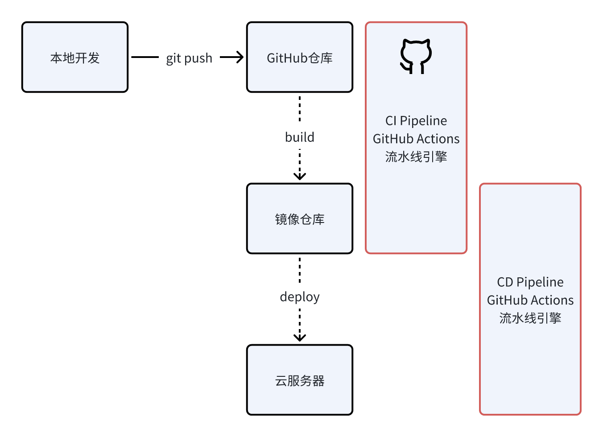
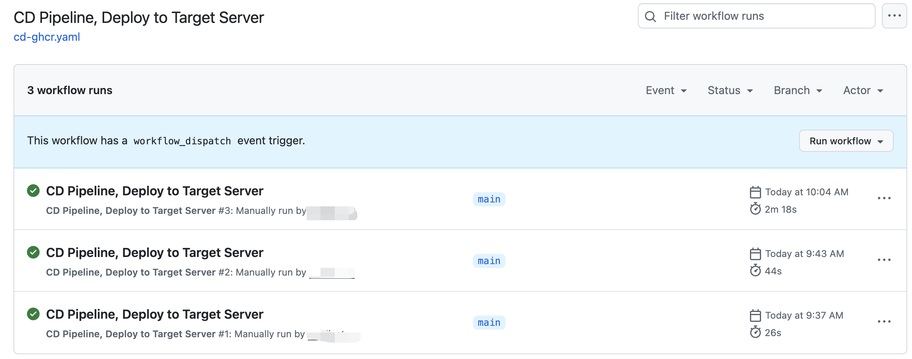

# 持续发布 CD，从容器镜像到生产环境

> 本文完成 CD 流水线，从源代码到制品库/镜像仓库的流程。

[CI Pipeline](./ci-pipeline.md) 从源代码到镜像仓库，CD Pipeline 从镜像仓库到生产环境，流水线在项目建设初期定义，可重复执行。



## 配置即代码，Docker Compose 生命式部署

**声明式 API 是云原生技术的核心理念之一，它将系统的期望状态描述为一个配置文件，而不是一系列的命令式操作。**

实施系统发布的过程是标准化的、可重复的，因此可编排为 CD Pipeline 以实现自动化执行。在编排 CD Pipeline 流水线时有两种策略：

- 命令式 shell 脚本（半自动化）：将传统的运维操作使用 shell 脚本实现，一次性顺序地执行多个 shell 命令
- 声明式配置文件：将发布过程定义为一个配置文件，自动化工具根据配置文件执行发布过程

中小 IT 系统的发布场景较简单，通常是单机发布，无需引入复杂的分布式集群调度（Kubernetes），因此 Docker Compose 是一个非常好的选择。

对比使用 shell 脚本和 Docker Compose 的发布流水线，B 容器依赖 A 容器，C 容器依赖 B 容器。

**shell 脚本发布**

```shell
#!/bin/bash

# 从镜像仓库拉取最新镜像
docker pull A-image:latest
docker pull B-image:latest
docker pull C-image:latest

# 停止并删除旧容器
docker stop A-container
docker rm A-container
docker stop B-container
docker rm B-container
docker stop C-container
docker rm C-container

# 依次容器
docker run -d --name A-container -p 80:80 A-image:latest

sleep 5 # 等待 A容器启动
docker run -d --name B-container -p 8080:8080 B-image:latest

sleep 5 # 等待 B容器启动
docker run -d --name C-container -p 8081:8081 C-image:latest
```

**Docker Compose 发布**

`docker-compose.yaml`作为配置文件随代码提交到版本控制仓库，与源代码并行管理。

```yaml
services:
  A-container:
    image: A-image:latest
    ports:
      - 80:80
  B-container:
    image: B-image:latest
    ports:
      - 8080:8080
    depends_on:
      - A-container
  C-container:
    image: C-image:latest
    ports:
      - 8081:8081
    depends_on:
      - B-container
```

流水线配置文件中，命令式语句只包含必要的业务无关指令，执行发布：

```shell
docker compose down # 容器卸载
docker-compose up -d # 容器启动
# docker-compose up -d --build # 容器启动并构建
```

对比两种发布方式的差异：

- shell 脚本发布：模拟手动执行多个 shell 命令，需要自行管理容器依赖关系
- Docker Compose 发布：配置文件定义发布过程，配置与执行分离，声明容器依赖关系即可

项目迭代只需要更新 `docker-compose.yaml` 文件，无需关心流水线编排文件。还有一个关键点，shell指令多个指令顺序执行，一旦某条指令执行失败，排查问题、修复问题、重新执行是一场运维灾难。相反，Docker Compose 将部署动作原子化，要么全部执行成功，要么全部执行失败。

总的来说，Docker Compose 这种声明式 API 的优势：配置文件定义发布过程，配置与执行分离；声明容器依赖关系即可，无需手动管理容器依赖关系。

更多关于声明式API的理解，将在后续文章中详细探讨。

---

在服务部署的实践中，我经历的三个阶段：

阶段一：使用 VMware 虚拟机来直接安装服务，如 MySQL 和 Nginx，这简直是一个灾难。VMware 虚拟机是一个重量级程序，耗费宿主机资源，启停是分钟级别，这只是缺点之一。直接在操作系统中安装 MySQL 或 Nginx 程序，面临版本管理与安装卸载难的问题，频繁执行各种`apt install`和`apt uninstall`指令，却需要处理和修复各种失败问题。

阶段二：开始 Docker 实现容器化部署。部署 Nginx、MySQL 简单到只需要一行指令，轻松实现启停、版本控制和卸载，极大地简化了部署中所需要的依赖工具。

阶段三：基于 Docker Compose 声明式编排容器。接触 SpringCloud 微服务后，面临容器编排灾难，因为要同时启动多个微服务，且微服务之间具有复杂依赖关系，需要按顺序在终端中依次启动或停止。另外，网络端口、目录挂载也需要特别维护。Docker Compose 使用 YAML 配置来声明式描述容器间关系，不再需要维护文档，启动和卸载简化到一行指令，Docker Compose 引擎实现容器启动管理。配置文件可以随源代码一样提交进行版本管理，具有良好的可迁移性。

在 GitHub 的代码仓库中，优秀的项目均支持了 Docker Compose，演示 Demo 变得非常便捷。不过，Docker Compose 是在单机上执行的，如果需要实现分布式集群部署，则需要引入 Kubernetes 技术。

## CD Pipeline：在 GitHub Actions中实践

在开发环境，我们期望在每次代码提交后，自动触发 CI 与 CD 流水线，将最新的代码部署到开发环境。

在生产环境，CI 与 CD 应该相分离，CI 流水线负责构建镜像，CD 流水线负责部署镜像到生产环境，需要进行手动确认后触发。

上篇文章 [CI Pipeline](./ci-pipeline.md) 完成了从源代码到镜像仓库的流程，现将镜像部署到生产环境，包含两个步骤：

1. 在目标服务器上执行 `docker compose`，最简化启停服务
2. 发送部署成功邮件通知

```yaml
# cd-ghcr.yaml
name: CD Pipeline, Deploy to Target Server

on:
  # CD 流水线触发方式：手动点击、CI 工作流完成后
  workflow_dispatch: # 手动点击触发
  workflow_run:
    # 当 CI 流水线成功完成后自动触发
    workflows: ["CI Pipeline, Create and Publish a Docker Image"]
    types:
      - completed

# 定义环境变量
env:
  REGISTRY: ghcr.io # GitHub Container Registry
  IMAGE_NAME: ${{ github.repository }} # 系统环境变量，所在 GitHub 仓库名
  SERVER_DIR: ~/WebstormProjects/xx-web # 用户自定义，目标服务器上的项目目录

jobs:
  deploy-to-server:
    # 仅在 CI 成功完成时运行
    if: ${{ github.event.workflow_run.conclusion == 'success' || github.event_name == 'workflow_dispatch' }}
    runs-on: ubuntu-latest

    steps:
      - name: Deploy to target server via SSH
        uses: appleboy/ssh-action@v1.0.0
        with:
          host: ${{ secrets.SERVER_HOST }}
          username: ${{ secrets.SERVER_USER }}
          password: ${{ secrets.SERVER_PASSWORD }}
          script: |
            # 停止并移除旧的容器
            cd ${{ env.SERVER_DIR }}
      
            git pull # 拉取最新代码，确保是最新版本的docker-compose.yaml
      
            docker compose down || true
      
            # 启动新的容器
            docker compose up -d
      
            # 清理未使用的镜像
            docker image prune -f
      
            echo "Deployment completed successfully!"

      # 发送部署成功邮件通知，可选的
      - name: Send deployment success email
        uses: dawidd6/action-send-mail@v3
        with:
          server_address: smtp.qq.com
          server_port: 465
          secure: true
          username: ${{ secrets.MAIL_USERNAME }}
          password: ${{ secrets.MAIL_PASSWORD }}
          subject: "🚀 应用部署完成 - ${{ github.repository }}"
          to: xing.xiaolin@foxmail.com
          from: GitHub Actions
          html_body: |
            <h2>应用已成功部署到目标服务器</h2>
            <p><strong>仓库：</strong>${{ github.repository }}</p>
            <p><strong>分支：</strong>${{ github.ref_name }}</p>
            <p><strong>提交：</strong>${{ github.sha }}</p>
            <p><strong>镜像：</strong>${{ env.REGISTRY }}/${{ env.IMAGE_NAME }}</p>
            <p><strong>时间：</strong>$(date)</p>
            <hr>
            <p><small>此邮件由 GitHub Actions 自动发送</small></p>
```

appleboy/ssh-action@v1.0.0 是 GitHub Actions Workflow 插件，用于在 GitHub Actions 中执行远程 SSH 命令。

上述配置文件中，需要用户自定义的参数：

- `SERVER_HOST`：目标服务器的 IP 地址或域名
- `SERVER_USER`：目标服务器的 SSH 用户名
- `SERVER_PASSWORD`：目标服务器的 SSH 密码
- `SERVER_DIR`：目标服务器上的项目目录

假如你所购买的云服务器账户信息为 tencent@111.222.333.444，设置的密码为 123456abc，则需要在 GitHub 项目仓库中添加以下 Secrets：

- `SERVER_HOST`：111.222.333.444
- `SERVER_USER`：tencent
- `SERVER_PASSWORD`：123456abc

> 云服务器支持**密码**和**密钥**认证，两种认证方式互相冲突，为了灵活性，推荐使用**密码**认证。

为了平衡流水线配置与可迁移性，**第一次部署为手动执行**，`SERVER_DIR` 则是用户自定义的项目目录，根据实际情况填写，如 `~/WebstormProjects/xx-web`。

在流水线配置文件中，`git pull`的目的是拉取最新的代码，其目标为更新`docker-compose.yaml`文件。

其他参数，已在 CI Pipeline 中配置：

- `MAIL_USERNAME`：发送邮件的邮箱用户名
- `MAIL_PASSWORD`：发送邮件的邮箱密码



## 总结

本文是 CD Pipeline 的最小可行方案实践，使用 YAML 配置文件声明式定义 CD Pipeline，流水线代码与业务代码实现了分离，开发人员仅需关注`docker-compose.yaml`文件即可。第一次部署是用户手动执行的，平衡了可迁移性和配置复杂度。如果需要频繁地更换服务器，可将项目创建添加到流水线到 step 中。

CI 和 CD 的最小可行方案实现已完成，后续将实现前后端分离项目的 CI/CD 最佳实践，并介绍最常用的 GitHub Acitons Workflow 模板：

- 前端项目：React、Vue
- 服务端项目：Flask、SpringBoot

另外，还有一个比较有意思的话题，CD 有两个词的缩写：
- Continues Deploy：持续部署
- Continuous Delivery：持续交付

本文中虽然使用了持续发布这一名词，但实际上并未对交付进行定义，模糊了 CD 的含义。持续交付和持续部署的理解在业界也存在歧义，后续也将对这两个概念进行更详细的探讨。


## 参考

1. appleboy/ssh-action@v1.0.0, 执行远程 SSH 命令，https://github.com/appleboy/ssh-action
2. Accelerating new GitHub Actions workflows，https://github.com/actions/starter-workflows
