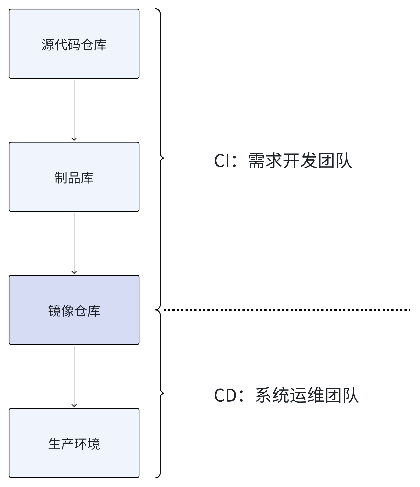

# CI 与 CD 分离：权责边界

> 从代码提交到生产发布的权责边界设计

为什么中大型组织坚持"构建归开发、发布归运维"，职责分界线在哪里？

## 一、背景：从"提交即发布"到"构建-发布"分离

在理想状态下，CI 与 CD 可以串成一条完全自动化的流水线：代码 Push -> 构建 -> 测试 -> 部署，实现**提交即发布**。

然而在中大型组织的工程现场，CI（持续集成）与 CD（持续交付/部署）通常被**拆成两段独立的流程**：

- CI：把源代码编译、打包成**不可变制品**（Jar、dist、Helm Chart、镜像仓库等），推入**制品库/镜像仓库**
- CD：凭**变更单**把指定版本的制品从仓库取出，经过灰度、审批、审计，最终发布到生产环境

本文尝试用**管理、技术**两大视角，思考和回答一个看似反直觉的问题：

**"既然技术上可以一步到位，为什么我们还要人为拆成两步？"**

## 二、管理视角：组织、权责与变更管控

### 2.1 组织架构天然分治

需求开发、系统运维在组织架构上分属为**两个部门**，甚至两家法人主体。

"开发-运维"双边协作下，各自背负的 KPI 不同：

- 开发：需求承接、功能交付、敏捷发布
- 运维：稳定性、回滚时长、MTBF（平均可用时间）、MTTR（平均故障时间）

部分文章将组织责任分为“开发-测试-运维”三角关系，但以作者个人实践经验，测试往往没有独立部门。在职责承担上，测试不与开发、运维并列，以可追溯到测试方案、测试报告来定责。

CI 与 CD 分离后，**责任边界**一目了然：

- CI 失败：开发团队全责；
- 生产故障：按"变更记录"快速定位到**发布人、发布版本、灰度策略**，运维兜底。

在具体的管理实践中，当生产环境出现故障时根据故障根因分析和处置逆向追溯：

- 制品库/镜像库 -> 生产环境阶段：运维团队全责
- 源代码 -> 制品库/镜像库 -> 生产环境阶段：开发团队主要责任，运维团队次责

PS：任何生产环境故障，运维团队均需承担责任。

### 2.2 发布变更管控

生产环境与软件服务直接相关，人和生产事故都会直接影响到终端用户。因此，生产环境任何变动都应严格受控，需**电子审批**，并与外部 SLA、合规条款对齐。

分离后的 CD 流程可单独嵌入**变更管理系统（CMS）**，生成可追溯的变更单，避免"开发顺手点了个发布"导致系统故障和**审计不过**。

从管理上的“不允许做非授权发布变更，违规考核”做到技术上的“生产环境安全堡垒，非授权不能变更”。

### 2.3 事故追溯与三年合规存档

监管行业（金融、医疗、政务）普遍要求：

- 保存"谁、何时、把哪个版本、发到了哪组环境"完整链路3年以上
- 支持**秒级回滚**与**数据补偿**脚本备案

CI 与 CD 不分离时，这些记录散落在 Jenkins/GitLab/Ansible 日志中，很难统一归档；分离后，**制品仓库 + 变更系统**天然成为合规证据链。

## 三、技术视角：场景差异与架构分层

### 3.1 同步 VS 异步执行模型

CI 过程要依赖大量的第三方组件、环境依赖，且该过程是资源密集型的，**对硬件要求较高**。

CD 过程直接面向分布式服务集群生产环境，云原生时代下依赖容器技术最小化部署，最大化资源利用率。

| 阶段 | 执行特征   | 失败成本           | 典型耗时                |
| ---- | ---------- | ------------------ | ----------------------- |
| CI   | 同步、顺序 | 低（未流入生产）   | 3~15 min                |
| CD   | 异步、并发 | 高（直接影响用户） | 10 min ~ 数小时（灰度） |

CI 失败可立即阻断 Merge Request；CD 失败则需要**灰度暂停 + 版本回滚**，两者对**失败容忍度**完全不同。

### 3.2 架构分层，制品仓库/镜像仓库——技术与治理的分界线

**不可变基础设施**理念：CD 只认"制品指纹"（镜像 SHA、MD5），不认源代码。任何重新构建都会导致指纹变化，从而天然阻断"偷偷热修"的行为。

制品库/镜像仓库成为**最薄但最清晰**的契约层：上游（CI）交付标准格式，下游（CD）按指纹消费，**双向不穿透**。

另外，CI 与 CD 各自包含大量可插拔步骤 Steps：

- CI：静态扫描、单元测试、SBOM 生成、签名、镜像分层缓存
- CD：环境差异、蓝绿/金丝雀、流量调权、数据库 DDL、配置中心刷新、Feature Flag

CI 和 CD 流程中可根据需要插入任意步骤，且自行定制技术选型，两个过程可独立演化：

- 开发团队升级编译插件，无需运维同意；
- 运维团队切换灰度引擎（Argo Rollouts → Flagger），不会污染构建逻辑。

## 四、总结：分离不是妥协，而是可控的演进

CI 与 CD 流程分离，表面看是多了一个"人工卡点"，实则是在速度与安全之间搭建一道可控的闸门。它让开发团队保持**迭代自由**，让运维团队拥有**治理抓手**，让审计部门拿到**合规证据**。

随着平台工程（Platform Engineering）的兴起，这道闸门正在**产品化、自助化、代码化**。未来的演进目标是开发者只需关心业务代码与单元测试；而发布准备、审批、灰度发布、全量发布、回滚、审计等全生命周期，将由发布变更平台自动完成，最终实现**自动化、无人化**。
