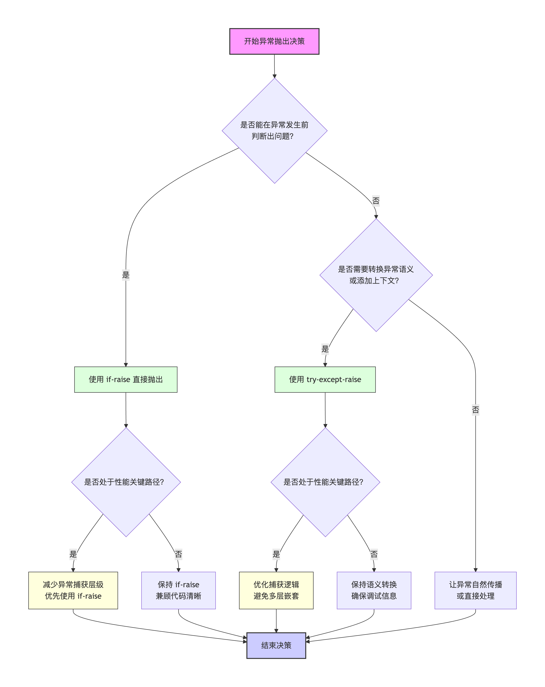

# Exception异常架构设计：异常抛出（03）

什么时候抛出异常？什么时候是`if-raise`，什么时候是`try-except-raise`？

在软件开发中，异常不应被视为"失败"，而应视为一种**结构化的契约通信**。有效的异常抛出策略能让代码在崩溃前"优雅地拒绝"，并在发生不可控错误时"清晰地解释"。

**异常抛出策略的设计应遵循递进原则**：首先关注业务逻辑语义，确保调试和问题修复的便利性；在此基础上，进一步考虑性能优化、高并发设计和性能开销，以保证系统更健壮。本文将从基础理念和进阶理念两个维度，全面解析异常抛出的架构设计。

## 基础理念：异常发生的预期管理

异常并非随机产生的。根据**防御性编程**的原则，将异常分为两类预期：

- **可预见的违反约束，LBYL**：客户端输入了非法参数，或业务逻辑不满足前提条件。
- **不可控的环境失败，EAFP**：数据库连接断开、第三方接口超时或系统资源枯竭。

### 询问许可 (LBYL) 与 `if-raise`

该模式遵循"先检查，后执行"的原则，当明确知道哪些条件会导致程序进入非法状态时，应**主动预防**，异常是可预期、可枚举的。

#### 接口层的客户端校验 (`ClientException`)

在接口入口处，即使已经和前端约定了参数，但仍需要做防御，**不信任任何外部输入**。使用 `if-raise` 可以在错误逻辑进入核心业务层之前将其拦截。

```python
def create_user(username, age):
    # LBYL: 主动预防非法输入
    if not username:
        raise ClientException("用户名不能为空", code=400)
    if age < 18:
        raise ClientException("未成年人禁止注册", code=403)
    
    # 执行业务逻辑...
```

#### 防御性业务逻辑 (`BizException`)

在业务深层，当某些业务前提不满足（例如余额不足、库存告急）时，主动抛出业务异常。这比返回 `False` 或 `None` 更具语义化，且能强制调用方处理。

```python
def withdraw_money(account_id, amount):
    account = db.get_account(account_id)
    # 防御性编程：如果不满足业务前提，主动拒绝
    if account.balance < amount:
        raise BizException("账户余额不足")
    
    account.balance -= amount
    account.save()
```

### 异常转换与 `try-except-raise`

当调用底层库、数据库或第三方 API 时，无法预测所有失败场景。此时需要捕获底层异常，并将其**包装（Wrap）**为面向用户的抽象异常。特别需要注意的是，在进行异常转换时需保留原始堆栈信息（异常链），便于进行异常诊断，不能直接丢弃。

#### 异常转换策略 (`ServerException`)

直接将 `OperationalError` 或 `ConnectionError` 抛给上一层是非常危险且不友好的，需通过 `try-except-raise` 进行异常转换（翻译）。此外，除了已知的可能会发生的异常，可使用父类`Exception`进行兜底，对所有其他不可预期的异常进行转换。

```python
def get_user_profile(user_id):
    try:
        return remote_api.fetch_user(user_id)
    except RemoteTimeoutError as e:
        # 将底层超时转换为可理解的服务端异常
        # 使用 'from e' 保留原始堆栈信息（异常链）
        raise ServerException("用户服务暂时不可用，请稍后再试") from e
    except Exception as e:
        # 兜底捕获，防止信息泄露
        logger.error(f"Unknown error: {e}")
        raise ServerException("内部系统错误") from e
```

### 铁律：严禁静默失败

无论选择哪种方式，**严禁使用空的 `except: pass`**。 静默失败（Silent Failure）是调试的噩梦。如果异常被捕获，它必须被：

- **处理**（如重试、回滚、记录日志）
- **转换**（重新抛出更高级别的异常）

```python
# 静默失败
def save_order(order):
    try:
        db.insert(order)
    except Exception:
        # 错误在这里消失了！
        # 既没有日志，也没有通知调用方，更没有回滚
        pass 
        # print("数据库异常") # 简单在中断打印错误信息，也应杜绝
    
    print("订单处理完成") # 哪怕数据库挂了，这里依然会打印成功
```

## 进阶思考：异常性能开销

在架构设计层面，我们不仅要考虑异常的语义价值，还需要关注其性能影响。特别是抛出异常的方式选择——直接抛出(`if-raise`)还是先捕获再转抛(`try-except-raise`)——对系统性能有着显著差异。



### 异常处理的性能本质

异常机制虽然提供了优雅的错误处理方式，但其背后隐藏着不可忽视的性能开销：

- 异常对象创建：每次抛出异常都需要构建完整的异常对象
- 堆栈追踪生成：异常会捕获完整的调用堆栈信息，涉及内存分配和时间消耗
- 控制流中断：异常导致正常的程序流程中断，可能影响CPU流水线效率

### 核心原则：直达而非绕行

在异常抛出策略上，一个关键的性能准则是：如果能直接判断并抛出异常，就不要先执行可能失败的操作，再捕获并转抛。**就像提前预知风暴的船长，与其冒险航行后再紧急转向，不如直接避开危险海域。**

```python
# ❌ 低效：先执行再捕获转抛
def process_value(value):
    try:
        result = risky_operation(value)  # 可能抛出ValueError
        return result
    except ValueError as e:
        # 额外捕获后再抛出相同类型异常
        raise CustomException("参数无效") from e

# ✅ 高效：直接判断并抛出
def process_value_optimized(value):
    # 前置条件检查，避免不必要的执行和异常捕获
    if not is_valid(value):
        raise CustomException("参数无效")
    
    # 确保安全后再执行
    return safe_operation(value)
```

### 性能对比

让我们通过一个具体场景来理解两种方式的性能差异：

```python
import time

class ValidationException(Exception):
    pass

def validate_by_then_raise(data):
    """先执行再捕获转抛"""
    try:
        # 模拟可能失败的操作
        if data["value"] > 100:
            raise ValueError("值过大")
    except ValueError as e:
        # 捕获后再转抛
        raise ValidationException("验证失败") from e

def validate_by_if_raise(data):
    """直接判断并抛出"""
    # 先检查条件，避免进入异常流程
    if data["value"] > 100:
        raise ValidationException("值过大")

# 性能测试
test_data = {"value": 150}
iterations = 100000

# 方式1：捕获转抛
start = time.time()
for _ in range(iterations):
    try:
        validate_by_then_raise(test_data)
    except ValidationException:
        pass
time1 = time.time() - start

# 方式2：直接抛出
start = time.time()
for _ in range(iterations):
    try:
        validate_by_if_raise(test_data)
    except ValidationException:
        pass
time2 = time.time() - start

print(f"捕获转抛耗时: {time1:.4f}s")
print(f"直接抛出耗时: {time2:.4f}s")
print(f"性能提升: {(time1-time2)/time1*100:.1f}%")
```

运行上述代码，测试结果（使用豆包在线运行）:

```
捕获转抛耗时: 0.0849s
直接抛出耗时: 0.0344s
性能提升: 59.5%
```

主要原因在于：

- 避免了原生异常的创建开销
- 跳过了不必要的异常捕获和处理流程
- 减少了控制流跳转次数

### 架构设计建议

#### 优先使用预防性检查

在业务逻辑入口和高频调用路径中，优先使用条件判断进行防御性检查，直接抛出业务异常：

```python
class OrderProcessor:
    def process_order(self, order):
        # 前置条件检查：直接抛出
        if not order.is_valid():
            raise OrderException("订单格式无效")
        
        if order.amount <= 0:
            raise OrderException("订单金额必须大于0")
        
        # 检查通过后执行业务逻辑
        return self._process_valid_order(order)
```

#### 避免不必要的异常捕获层

不要为了"统一异常处理"而添加不必要的异常捕获层。只有在真正需要转换异常语义或添加上下文时，才使用捕获转抛模式：

```python
# ❌ 不必要：没有添加价值的异常捕获
def save_to_database(data):
    try:
        db.save(data)
    except DatabaseError as e:
        # 没有添加额外信息，直接重新抛出
        raise DatabaseError(str(e))

# ✅ 有价值：添加了业务上下文
def save_to_database_with_context(user_id, data):
    try:
        db.save(data)
    except DatabaseError as e:
        # 添加上下文信息，提升调试价值
        logger.error(f"用户{user_id}数据保存失败")
        raise StorageException("用户数据保存失败") from e
```

#### 性能敏感场景的特别优化

对于数据库连接池、缓存系统、网络框架等高频调用组件，异常抛出策略应更加谨慎：

```python
class ConnectionPool:
    def get_connection(self):
        # 高频方法：优先使用返回值而非异常
        if self.available_count == 0:
            # 直接返回None比抛出异常更快
            return None
        
        # 只有在真正异常情况下才使用异常
        if self.pool_closed:
            raise PoolException("连接池已关闭")
        
        return self._acquire_connection()
```

### 平衡的艺术

虽然性能是重要考量，但不应以牺牲代码清晰度为代价。架构设计的智慧在于找到平衡点：

- 高频核心路径：优先考虑性能，使用直接抛出模式
- 低频边缘路径：可接受一定性能损失，选择更清晰的代码结构
- 关键业务逻辑：确保异常信息完整，便于调试和维护

记住这个简单的决策流程：

1. 是否能在异常发生前判断出问题？→ 能，则使用`if-raise`
2. 是否需要转换异常语义或添加上下文？→ 需要，则使用`try-except-raise`
3. 是否处于性能关键路径？→ 是，则尽可能减少异常捕获层级


## 总结

异常抛出策略的选择是一门艺术，需要在性能、可读性和可维护性之间找到**黄金平衡点**：

1. **语义清晰性**：`if-raise` 适用于预防性检查，`try-except-raise` 适用于不可精确预防的异常转换
2. **性能影响**：在高频路径中谨慎使用异常，优先使用预防性检查
3. **可维护性**：选择能让代码意图更清晰的方式
4. **异常本质**：区分真正的异常情况和常见的业务逻辑分支，异常应处理异常情况

正确的异常抛出策略不仅能让代码更加健壮，还能在不影响性能的前提下提供清晰的错误信息。记住：**异常是用来处理异常的，不是用来处理常见的**。这是优秀异常架构设计的重要组成部分。