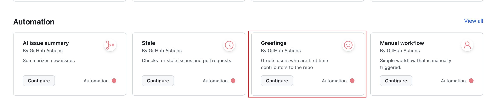
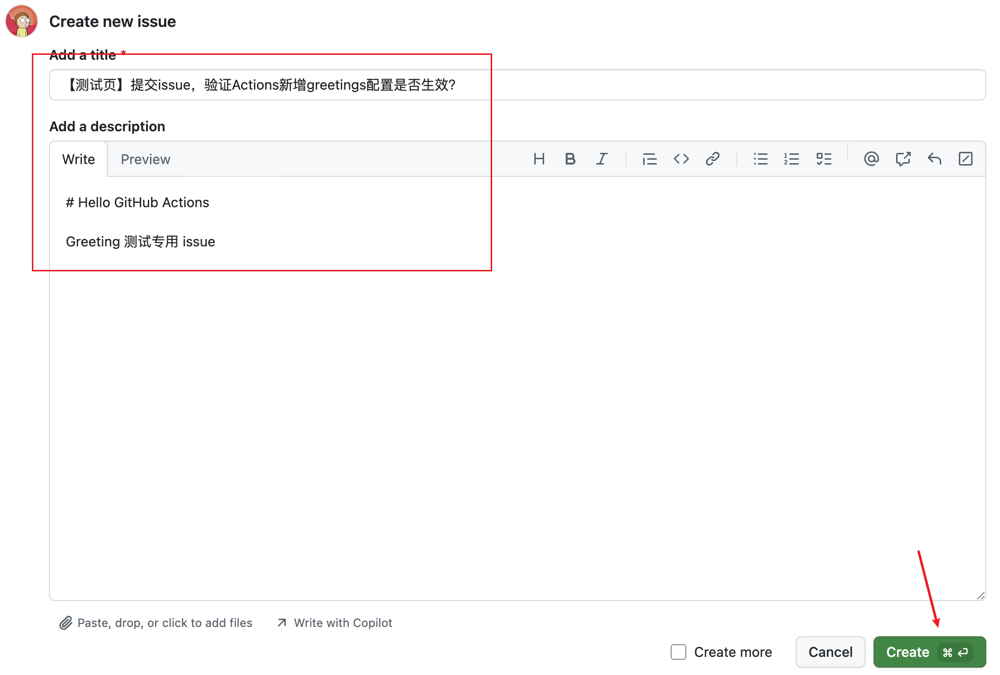
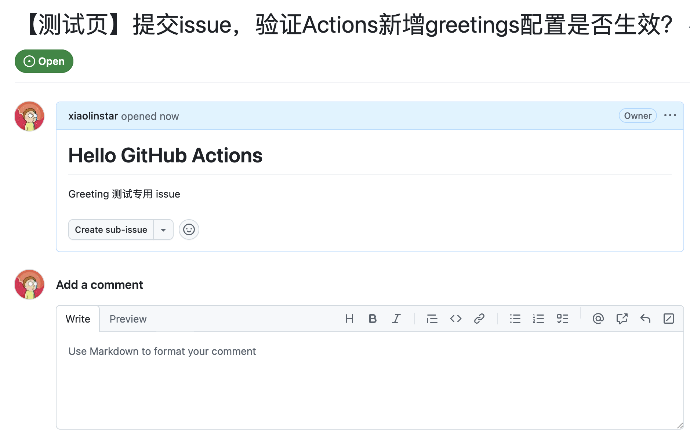
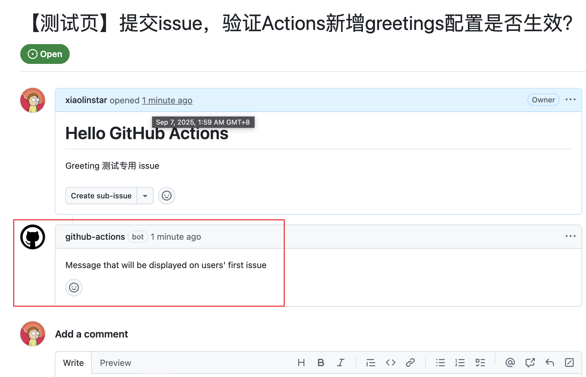
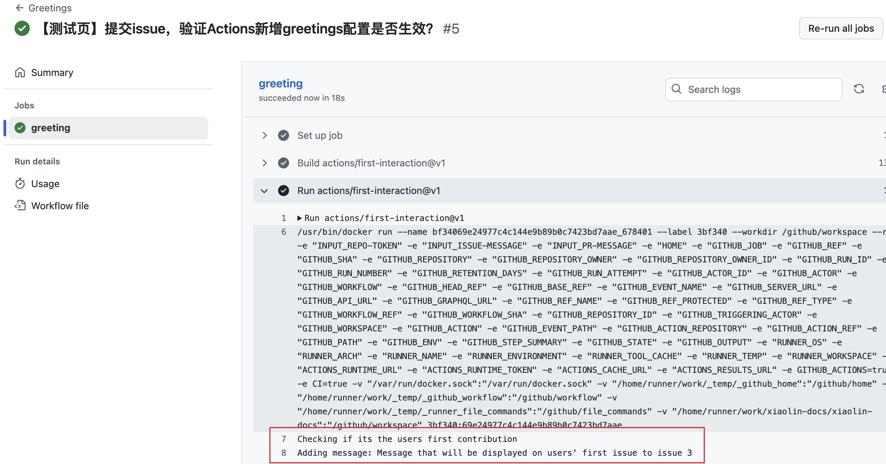
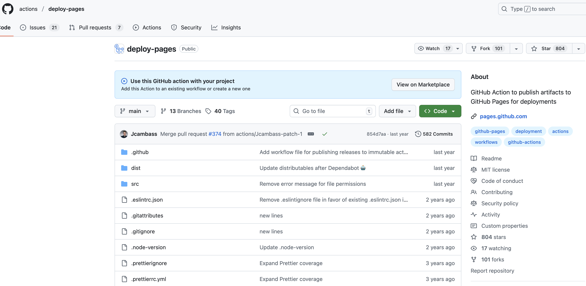
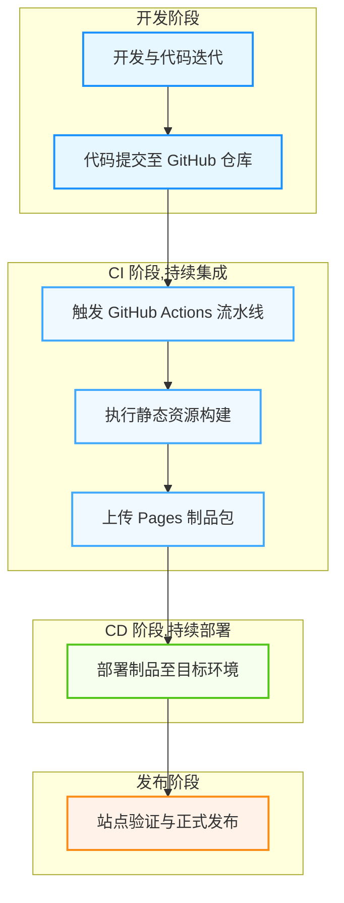
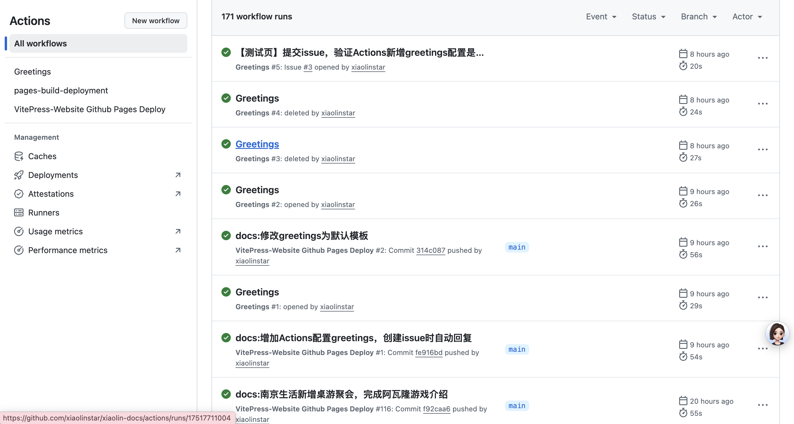

# GitHub Actions 工作流

本文介绍2个工作流实用的案例小试牛刀，从实践中学习、理解 GitHub Actions。

## Greetings!

在 GitHub 的官方 Workflows 模板中，查看到 Greetings 工作流模板，它的作用是当新用户打开仓库的 issue 或 pull request 时，自动发送欢迎消息。



代码模板如下，代码注释查看配置功能：

```yaml
name: Greetings # 工作流标题

on: [pull_request_target, issues] # 触发事件，当有 pull request 或 issue 时触发

jobs:
  greeting: # job 工作流名称
    runs-on: ubuntu-latest
    permissions:
      issues: write # 授权 issue 写操作
      pull-requests: write # 授权 pull request 写操作
    steps:
    - uses: actions/first-interaction@v1 # GitHub 官方交互 action 模板
      with:
        repo-token: ${{ secrets.GITHUB_TOKEN }} # GitHub 密钥 Token，面向开发者与自动化工具
        issue-message: "Message that will be displayed on users' first issue" # 欢迎 issue 消息
        pr-message: "Message that will be displayed on users' first pull request" # 欢迎 pull request 消息
```


其中，`secrets.GITHUB_TOKEN`  是 GitHub 提供的默认密钥，不需要额外配置。

在项目中创建`./github/workflows/greetings.yml`，并粘贴上述模板代码，然后推送变更到 GitHub 仓库。

执行下列操作验证该 greetings 是否生效。

**创建 issue**



**创建后 issue 效果**



**工作流执行需要时间，等待片刻后，即可在 issue 中看到欢迎消息**

> 使用 `secrets.DOCS_SECRET` 执行的用户身份是`github-actions[bot]`。



在 `Actions` 中查看工作流执行详情



---

根据需要自定义 `greetings.yml`，例如删除 pull request 消息，创建 open-issue 事件时触发。此外，还可以修改 `secrets.DOCS_SECRET`  为自定义 Token，可以是自己或其他用户创建的 Token。

```shell
name: Greetings

on:
  issues:
    types:
      - opened

jobs:
  greeting:
    runs-on: ubuntu-latest
    permissions:
      issues: write
      pull-requests: write
    steps:
      - uses: actions/first-interaction@v1
        with:
          repo-token: ${{ secrets.GITHUB_TOKEN }}
          issue-message: "欢迎提交 issue，我们会尽快回复您"
```

## 阶段六：基于 Github Actions 自动化集成与部署

在阶段五，已经学习了使用 Docker-Compose 在云服务器上部署静态站点，本文使用 GitHub Actions 和 Github Pages 自动化部署并托管。

GitHub Pages 是通过 GitHub 托管和发布的公共网页，静态站点托管级别的 Serverless 架构，用户无需关注 IaaS 资源维护。

回顾 [VitePress 静态站点](./front-dist.md)，已经学习了如何使用 VitePress 构建静态站点，从[起步：阶段一](./start.md)跳跃到**阶段六：基于 Github Actions 自动化集成与部署**。

### 修改 URL 配置

使用 GitHub Pages 默认域名时，是带有仓库前缀的，如 `https://<username>.github.io/<repository-name>/`。

在 `/docs/.vitepress/config.ts` 中修改 `base` 配置为：

```typescript
// @ts-ignore 网站基础路径，区分GitHub部署和常规部署
const basePath = process.env.GITHUB_ACTIONS === 'true' ? '/xiaolin-docs/' : '/'
```

其中，`process.env.GITHUB_ACTIONS` 是 GitHub Actions 提供的环境变量，当在 GitHub Actions 中运行时，该变量的值为 `true`。`/xiaolin-docs/` 是本仓库名，可自行修改。


### 基础设施即代码 IaC

> 配置即代码（Configuration as Code，CaC）是基础设施即代码（Infrastructure as Code，IaC）的子集

更准确地说，本项目采用**配置即代码**，即所有的配置都在代码中，免除了在 GUI 中的手动交互。

达到完全自动化流水线 Pipeline 配置文件 `page.yml` 定义如下，所有配置是项目无关的，意味着可迁移性极好，复制到其他 VitePress 项目中无需任何修改：

```yaml
name: VitePress-Website Github Pages Deploy
on:
  push: # 方式一：push 到 main 分支
    branches:
      - main
  workflow_dispatch: # 方式二：手动按钮
    inputs:
      logLevel:
        description: 'Log level'
        required: true
        default: 'warning'
      tags:
        description: 'Test scenario tags'

env:
  TZ: Asia/Shanghai # 上海时区，系统时间和自适应主题

jobs:
  build: # 构建
    runs-on: ubuntu-latest
    steps:
      - name: Checkout # 代码检出
        uses: actions/checkout@v4

      - name: Setup Pages # 配置 Pages
        uses: actions/configure-pages@v5

      - uses: pnpm/action-setup@v4 # 安装 pnpm
        name: Install pnpm
        with:
          version: 9
          run_install: false

      - name: Setup Node # 配置 Node
        uses: actions/setup-node@v4
        with:
          node-version: 20
          cache: 'pnpm'

      - name: Install dependencies # 安装项目包依赖
        run: pnpm install

      - name: Build documentation # 构建静态资源包
        run: pnpm run docs:build

      - name: Upload pages artifact # 上传 pages 制品
        uses: actions/upload-pages-artifact@v3
        with:
          name: 'github-pages' # default
          path: docs/.vitepress/dist

  deploy: # 部署
    needs: build # 部署依赖于构建

    permissions:
      pages: write
      id-token: write

    environment:
      name: github-pages
      url: ${{ steps.deployment.outputs.page_url }}

    runs-on: ubuntu-latest
    steps:
      - name: Deploy to GitHub Pages # 部署名为 github-pages 的制品
        id: deployment
        uses: actions/deploy-pages@v4
```

不同于互联网上大多数博文教程，本文实现了**完全自动化**，无需任何手动操作，将配置文件 `page.yml` 推送到 GitHub 仓库即可完成静态站点部署，无需创建和配置 GitHub Token，也无需在仓库 Web UI 中开启 GitHub Pages。

上述配置的优势在于使用了 `actions/upload-pages-artifact@v3` 和 `actions/deploy-pages@v4` 这两个 GitHub 官方推出 Actions，而不是第三方 Actions。

可阅读文档了解更多内容...



### 自动化与免运维发布

使用GitHub Actions 维护项目，变更迭代过程可概括为：



开发人员只需要专注于**开发阶段**，对项目做的任何变更，推送到 GitHub 仓库，就会自动触发流水线先后执行 CI 和 CD 阶段。

本站点项目已经运行了 171 次流水线：



另一方面 GitHub Pages 是 **Serverless 架构**，无需关注 IaaS 资源维护，无需购买域名，无需配置 DNS，无需配置 HTTPS，无需配置 CDN，无需配置负载均衡，无需配置监控告警，无需配置备份恢复，无需配置高可用，无需配置成本优化。

至此，依赖于 GitHub 仓库、GitHub Actions 实现了**自动化与免运维发布**的目标。

本项目是对**声明式 API**、**Serverless架构**云原生理念的实践。

## 总结

使用 GitHub 托管项目源代码，GitHub Actions 实现自动化运维，同时 GitHub Pages 是 Serverless 架构，无需关注 IaaS 资源维护。

除了在首次构建流水线时需要创建和定义配置 `page.yml`，变更工作已经简单到只需要一次 `git push`，这是一次里程碑式的飞跃。


## 参考

1. GitHub Pages 快速入门，[https://docs.github.com/zh/pages/quickstart](https://docs.github.com/zh/pages/quickstart)
2. 2023年最新 Github Pages 使用手册，[https://juejin.cn/post/7270532002733293604](https://juejin.cn/post/7270532002733293604)
3. GitHub Actions 官方仓库，[https://github.com/actions](https://github.com/actions)
4. Actions/upload-pages-artifact 上传 pages 制品，[https://github.com/actions/upload-pages-artifact](https://github.com/actions/upload-pages-artifact)
5. Actions/deploy-pages 部署 pages 制品，[https://github.com/actions/deploy-pages](https://github.com/actions/deploy-pages)
