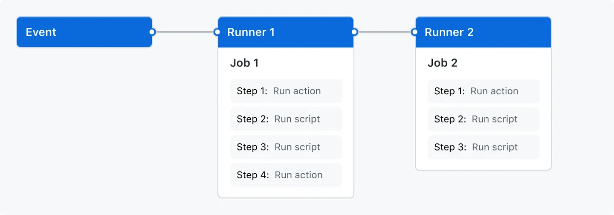

# GitHub Actions 核心概念与快速体验

> 学习 GitHub Actions 中的核心概念基础知识以及基本术语。
> 内容主要摘自 GitHub Actions 文档，外加作者的见解。

## 核心概念

### 概述

GitHub Actions 是一个持续集成和持续交付 (CI/CD) 平台，可自动化**构建**、**测试**和**部署**流水线。可以创建工作流程来构建和测试每个拉取请求仓库，或将合并的拉取请求部署到生产环境。

GitHub Actions 不仅支持 DevOps，还能让仓库中发生其他事件时运行工作流程。例如，可运行工作流程，以便有人在仓库中创建新问题时自动添加相应的标签。

GitHub 提供 Linux、Windows 和 macOS 虚拟机来运行工作流程，或者可在自己的数据中心或云基础架构中自托管。

### GitHub Actions 组件

可以配置一个 GitHub Actions 工作流程，当仓库中发生事件（例如打开拉取请求或创建问题）时触发，其中包含一个或多个可以按顺序或并行运行的作业。每个作业将独立的虚拟机运行器中或容器内运行，并且包含一个或多个步骤，这些步骤可以运行定义的脚本或运行操作（操作是一个可重复使用的扩展，可以简化您的工作流程）。

### 工作流程 Workflows

工作流是一个可配置的自动化流程，用于运行一个或多个作业。工作流由签入到仓库的 YAML 文件定义，并在仓库中的事件触发时运行，也可以手动触发或按照定义的计划触发。

工作流在存储库的目录中定义`.github/workflows`。一个存储库可以有多个工作流，每个工作流可以执行一组不同的任务，例如：

- 构建和测试拉取请求
- 每次发布时部署应用程序
- 每当有新问题出现时添加标签

可在某个工作流中引用另一个工作流。

这意味着可扩展、可插拔，GitHub Actions 官方提供了 Workflows 模板，可以根据需要引用其他工作流。

### 事件 Events

事件是仓库中触发工作流程运行的特定活动。例如，创建拉取请求、打开问题或将提交推送到仓库时，活动可能源自 GitHub。可通过发布到 REST API 或手动触发工作流程按计划运行。

可用于触发工作流的主要事件：

【push到main分支时】【手动】【定时】

### 作业 Jobs

作业是工作流中在同一个运行器上执行的一组步骤。每个步骤要么是将要执行的 Shell 脚本，要么是将要运行的操作。步骤按顺序执行，并且相互依赖。由于每个步骤都在同一个运行器上执行，因此您可以将数据从一个步骤共享到另一个步骤。例如，您可以先执行一个构建应用程序的步骤，然后再执行一个测试已构建应用程序的步骤。

您可以配置一个作业与其他作业的依赖关系；默认情况下，作业之间没有依赖关系，并且并行运行。当一个作业依赖于另一个作业时，它会等待依赖该作业完成后再运行。

您还可以使用矩阵多次运行同一项作业，每次运行都有不同的变量组合 - 例如操作系统或语言版本。

例如，您可以为不同的架构配置多个彼此互不依赖的构建作业，以及一个依赖于这些构建作业的打包作业。这些构建作业并行运行，一旦它们成功完成，打包作业就会运行。

有关详细信息，请参阅选择工作流程的功能。

### 行动

操作是一组预定义的、可重复使用的作业或代码，用于执行工作流程中的特定任务，从而减少您在工作流程文件中编写的重复代码量。操作可以执行以下任务：

从 GitHub 拉取你的 Git 仓库
为您的构建环境设置正确的工具链
设置云提供商的身份验证
您可以编写自己的操作，也可以在 GitHub Marketplace 中找到要在工作流程中使用的操作。

有关操作的更多信息，请参阅重复使用自动化。

### 跑步者

运行器是一种服务器，用于在触发工作流程时运行它们。每个运行器一次可以运行一个作业。GitHub 提供 Ubuntu Linux、Microsoft Windows 和 macOS 运行器来运行您的工作流程。每个工作流程运行都在一个全新、新配置的虚拟机中执行。

GitHub 还提供更大的运行器，可用于更大的配置。有关更多信息，请参阅使用更大的运行器。

如果您需要不同的操作系统或需要特定的硬件配置，您可以托管自己的运行器。

有关自托管运行器的更多信息，请参阅管理自托管运行器。

## 快速教程，快速体验

是的

## 部署静态资源站点

使用 GitHub Actions 部署静态站点项目。

## 参考

1. 了解GitHub Actions，[https://docs.github.com/zh/actions/get-started/understand-github-actions](https://docs.github.com/zh/actions/get-started/understand-github-actions)
