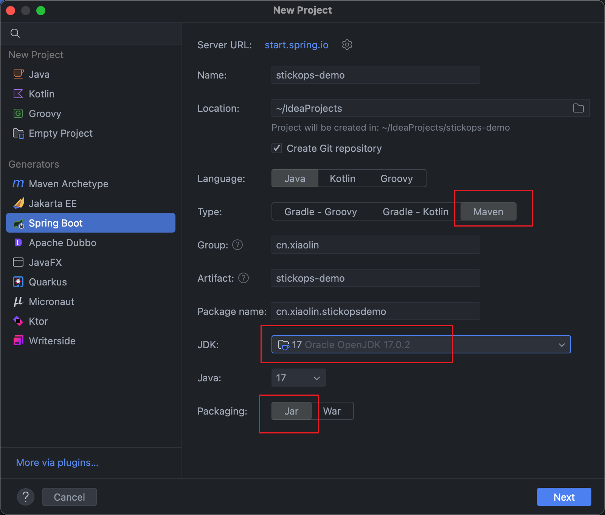
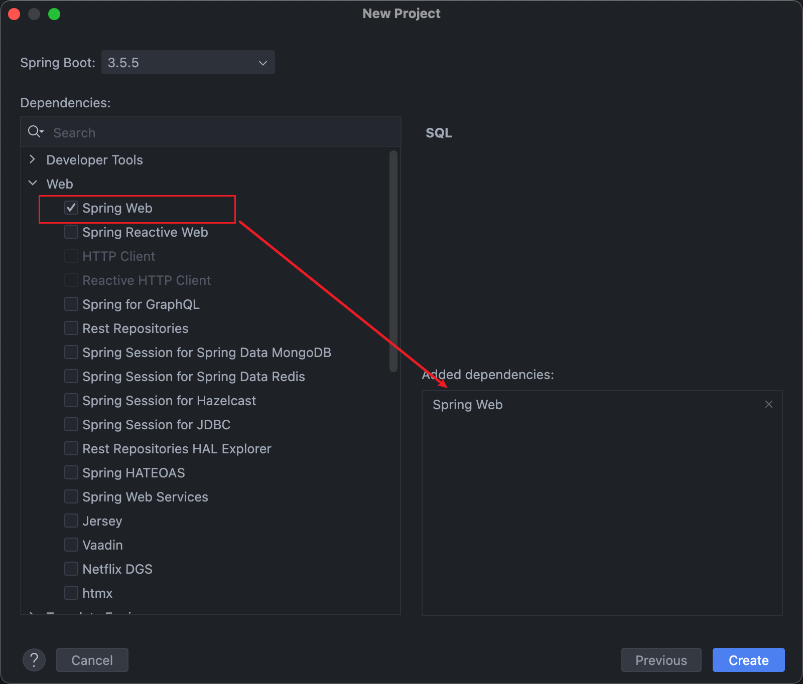
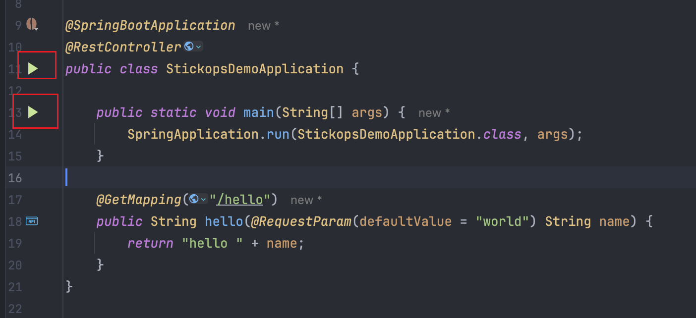
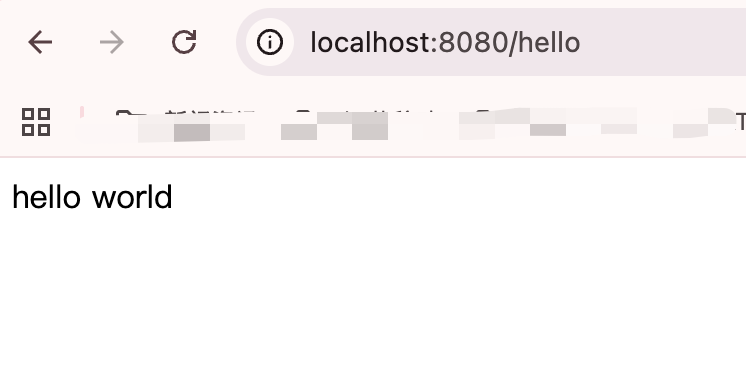
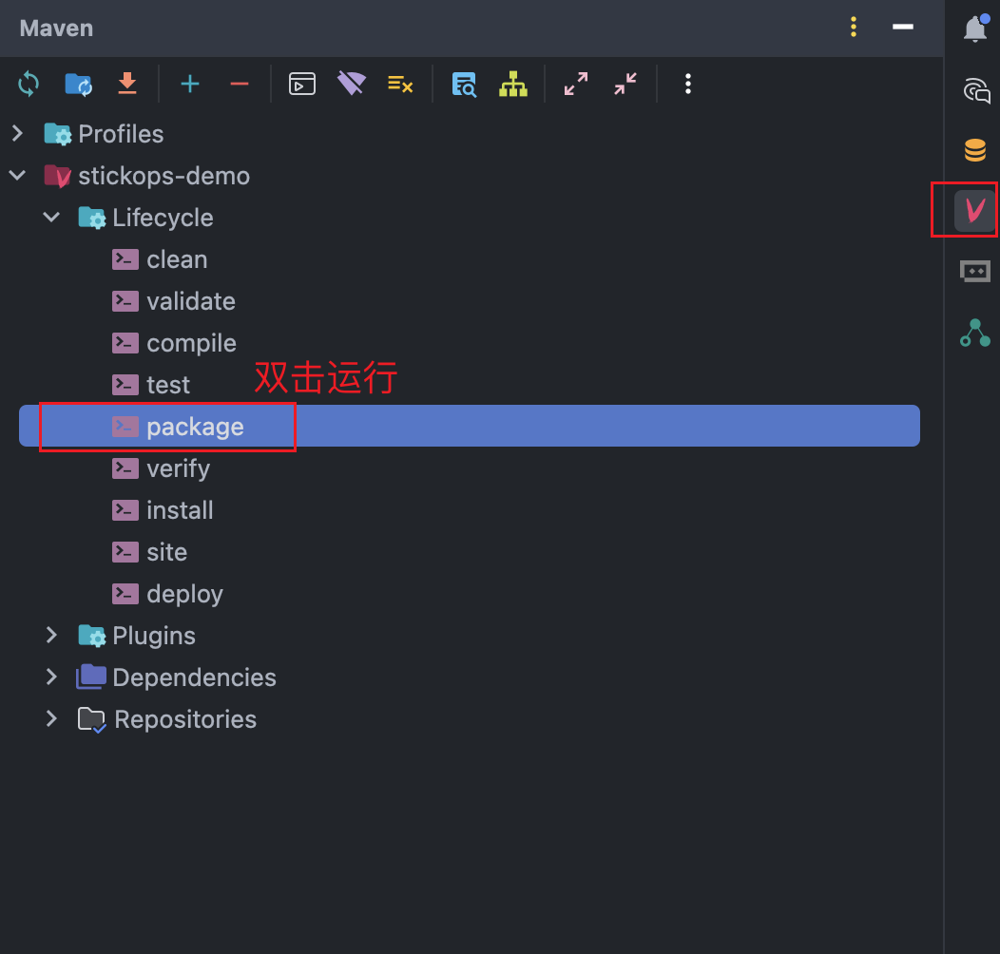
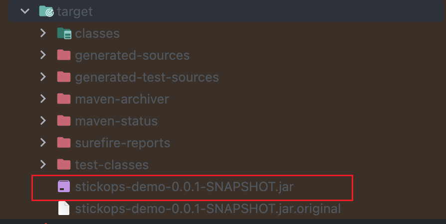

# 服务端开发，SpringBoot 快速开始

> 基于 SpringBoot 3.x 快速启动服务端 Demo 项目

## 前置依赖要求

> Jetbrains IDEA 会默认自动安装项目级 Maven，JDK 也支持快速下载

开发环境：Jetbrains IDEA

*开发依赖：

- Maven 3.6+
- Jdk 17

## Spring Initializr 脚手架启动

> 参考：[Spring Initializr](https://start.spring.io/)
>
> Spring Quickstart Guide: [https://spring.io/quickstart](https://spring.io/quickstart)

Jetbrains IDEA 创建 SpringBoot 3.x 项目，选择 Jdk 17，并选择 Maven 构建项目。



仅选择 spring-web 依赖模块



创建完成后，进入项目，编写 Spring 项目的 HelloWorld

```java
@SpringBootApplication
@RestController # 声明为 RESTful 控制器
public class StickopsDemoApplication {

    public static void main(String[] args) {
        SpringApplication.run(StickopsDemoApplication.class, args);
    }

    @GetMapping("/hello")
    public String hello(@RequestParam(defaultValue = "world") String name) {
        return "hello " + name;
    }
}
```

## 开发环境

在 IDEA 中点击 `Run` 按钮，任选其一均可



在浏览器中访问 [http://localhost:8080/hello](http://localhost:8080/hello)，即可看到输出 "hello world"



## 生产环境

在 IDEA 中开发，直接点击运行即可，当在生产环境，则需要项目构建。

### 构建项目

#### 方式一：在 IDEA 中使用 Maven Helper 插件

> 如果插件没有显示，可在 Settings -> Plugins 的 Marketplace 中安装



#### 方式二：命令式 Maven 中构建

> 生产环境 Linux 服务器中不会有 IDEA 等可视化开发工具，需使用 Maven 指令构建。

在项目路径下，执行 Maven 指令构建，注：需要在宿主机中安装 Maven，并配置环境变量

```shell
mvn clean package
```

---

完成后，可在项目中生成 `target` 目录，其中包含了构建好的 jar 包



### 启动项目 java -jar

构建阶段生成的可执行程序 jar 包，仅需要依赖 Java 即可运行

```shell
java -jar xx-demo-0.0.1-SNAPSHOT.jar
```

在后台运行，可执行

```shell
nohup java -jar xx-demo-0.0.1-SNAPSHOT.jar &
```

项目启动后，可在终端中查看到运行日志，并使用 `curl` 命令测试

```shell
curl http://localhost:8080/hello
```

## 知识延伸：为什么 SpringBoot Jar 包可以直接运行？

SpringBoot Jar 包可以直接运行是因为它使用了 Fat Jar（胖 Jar）的打包方式，将应用程序代码、所有依赖的库以及一个内嵌的 Servlet 容器（如 Tomcat）打包到一个可执行的 Jar 文件中。此外，Spring Boot 还通过其特殊的启动器和自定义类加载器机制，使得应用程序能够通过 java -jar 命令直接启动，无需在外部配置类路径或独立的 Web 服务器。

简单理解：SpringBoot Jar 包即 Tomcat Web 服务器，约等于静态资源部署中的 Nginx + dist

## 参考

1. SpringBoot 快速开始导航，[https://spring.io/quickstart](https://spring.io/quickstart)
2. Jetbrains IDEA，[https://www.jetbrains.com/idea/](https://www.jetbrains.com/idea/)
