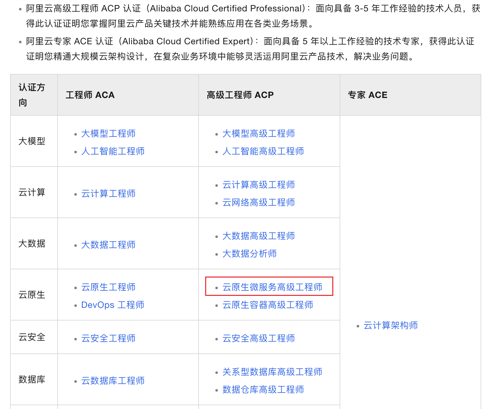
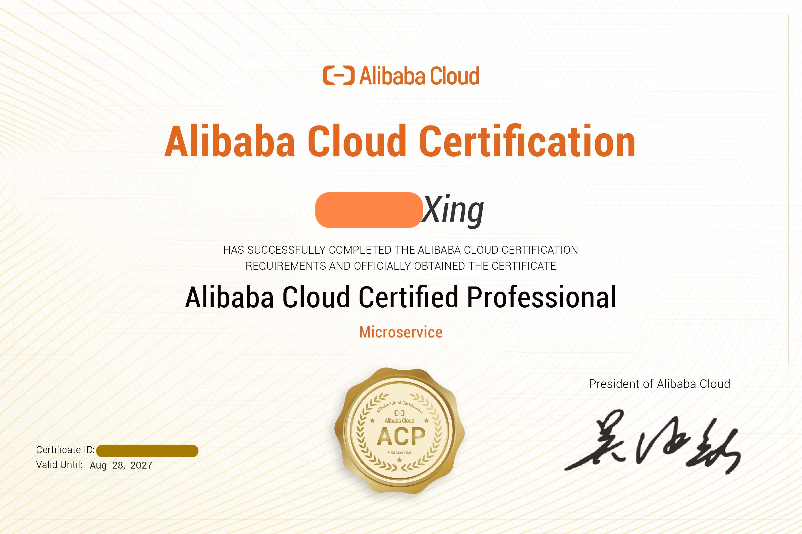
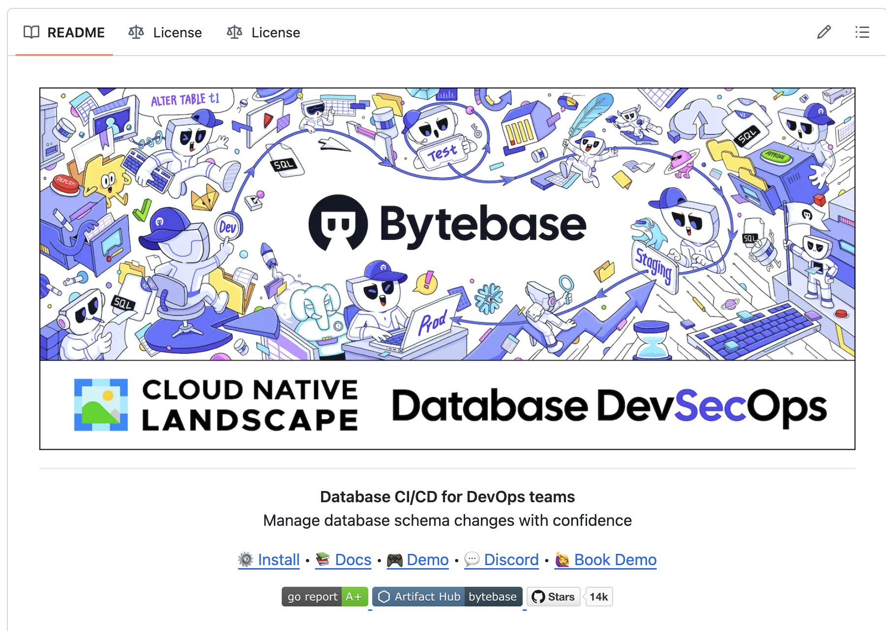

# 从阿里云ACP云原生微服务认证，浅谈云原生核心技术理念

> 计算机科学发展日新月异，当下云计算与云原生的话题度有所下降，AI原生正蓬勃兴起。

因工作需要，我希望系统地学习云原生（Cloud Native）相关理论知识，对云原生架构有一个宏观认识，因此报名参加了考试，选择了阿里云 ACP 云原生微服务认证。

我是阿里云的用户，并且企业内可以申请认证报销，因此就选择了**阿里云 ACP 云原生微服务认证高级工程师**。

我获得的证书：

阿里云将云原生的核心技术理念概括为：**微服务、容器、服务网格、不可变基础设施与声明式API**。这一提炼与行业共识（如 CNCF 的定义）一致，但更侧重于基础设施自动化与治理能力的强化。

以下从阿里云认证学习和考试内容出发，先简单介绍每个技术内涵，然后根据我的理解，并着重介绍**声明式API**。

## 云原生核心技术理念

**微服务（Microservices）**

核心职责：将单体应用拆分为独立部署、松耦合的小型服务，每个服务专注特定业务能力（如订单管理、用户认证）。 

与阿里云生态的关联：通过阿里云微服务引擎（MSE）或Service Mesh实现服务治理，解决分布式场景下的通信、容错和监控问题。

选型理由：提升开发敏捷性，支持团队独立迭代；结合云原生基础设施，实现弹性伸缩和故障隔离。

**容器（Containers）**

核心职责：以Docker为代表，将应用及其依赖封装为轻量级、可移植的镜像，确保环境一致性。

与阿里云生态的关联：阿里云容器服务ACK（Kubernetes）托管容器生命周期，提供自动化部署、资源调度和隔离。

选型理由：解除应用与底层硬件的耦合，是实现不可变基础设施和快速扩缩容的基础。

**服务网格（Service Mesh）**

核心职责：通过Sidecar代理（如Istio）解耦服务间的通信逻辑，统一处理流量管理、安全策略和可观测性。

与阿里云生态的关联：阿里云服务网格ASM提供全托管Mesh能力，减少微服务架构中的治理复杂度。

选型理由：将非业务功能（如熔断、链路追踪）下沉至基础设施层，使开发者专注于业务逻辑。

**不可变基础设施（Immutable Infrastructure）**

核心职责：基础设施（如虚拟机、容器镜像）一旦部署即不可修改，变更时替换而非原地更新实现。

与阿里云生态的关联：结合容器镜像和ACK的滚动更新策略，确保部署的一致性和可追溯性。

选型理由：避免配置漂移，提升系统稳定性；与CI/CD流水线集成，实现可靠的回滚机制。

**声明式API（Declarative APIs）**

核心职责：用户通过YAML/JSON声明期望的系统状态（如“需运行3个副本”），由平台自动收敛至目标状态。

与阿里云生态的关联：Kubernetes核心设计哲学，ACK、ASM等服务均基于声明式API操作。

选型理由：简化运维复杂度，支持GitOps等自动化流程，确保环境的一致性。

---

五个理念并非孤立，而是形成闭环：
- 微服务与容器构成应用架构基础，服务网格增强其治理能力；
- 不可变基础设施与声明式API共同保障运维自动化与可靠性。

## 声明式 API

声明式API是一种描述期望目标状态而非具体执行步骤的编程范式和API设计，开发者只管“我要什么”，系统负责“怎么做”，与强调过程的命令式API相反，它简化了管理，提高了自动化和系统稳定性，通过例如 `kubectl apply` 操作，系统会自动调谐实际状态与期望状态的差异。 

对于当前开发运维场景，最常见的声明式API技术：

- Docker Compose
- Kubernetes API

最常见的命令式API技术：

- Docker CLI 命令
- Shell 脚本

在使用上，声明式API更符合DevOps的自动化运维理念，一般使用YAML配置文件来描述期望状态，这也践行了GitOps、IaC（基础设施即代码）理念，极大地简化了运维操作。简单总结声明式API带来的优势：

- 简化运维操作，减少手动错误
- 支持版本控制，方便回滚和审计
- 与CI/CD流水线集成，实现自动化部署

支持版本控制不只是简单的代码管理，更重要的是整个操作"原子化"，不必担心操作过程中出现错误导致未知系统状态。

例如，版本A滚动到版本B，在实施的过程中因为不可控因素突然中断，此时系统处于尴尬的中间状态，如果是命令式API，回滚则需要执行已做操作的逆操作，而声明式API直接面向期望状态，可以根据配置文件选择回滚到版本A。

使用CD流水线部署Kubernetes无状态应用已经成为常见实践，而对于数据库等有状态服务的版本发布，多数运维工程师仍然手动执行 SQL 脚本，或者编写shell脚本或Python脚本，半自动化地扫描所有SQL脚本并执行。最近，我在研究数据库版本发布的自动化工具时，了解到 ByteBase 工具，它专为数据库CI/CD项目设计，被 CNCF 收录。

它使用一个非常形象的大鱼吃小鱼的图来表示各数据库工具工作场景：

这张图不仅直观展示了 ByteBase 与其他工具的适配场景和优势，也生动地诠释了命令式API和声明式API的典型使用场景：

- 命令式API：随机、不可预期操作，每一步执行后需要查看系统状态。典型场景是**故障处置**。
- 声明式API：提前编排的、可预期操作，在执行前需要声明期望状态，往往只关注最终状态。典型场景是**版本发布**。

## 总结

云原生的技术理念是将应用与基础设施解耦，实现高度可扩展、弹性和可靠的系统。类似于数据库设计三范式，如果违背云原生的设计理念来实现云原生、应用云计算，将不可避免地带来适配问题和副作用。微服务、容器、服务网格、不可变基础设施与声明式API是云原生的代表技术，但并不是全部，还有Serverless无状态服务等。

