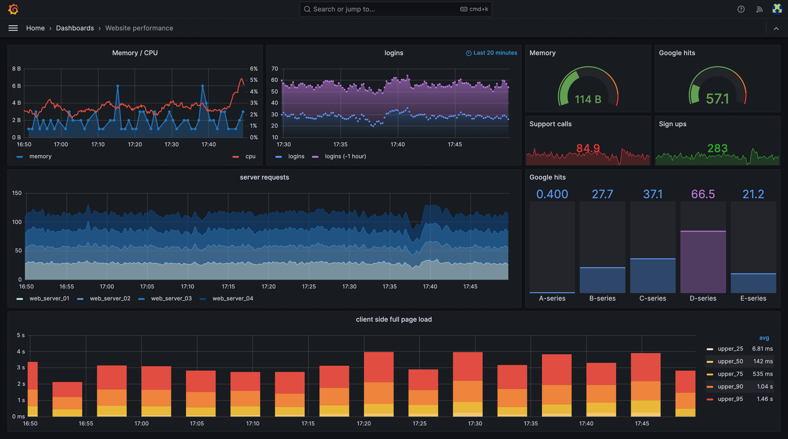
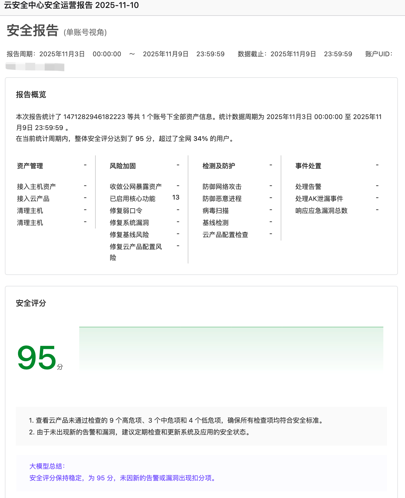

# 系统可用性健康感知三剑客：监控、拨测与巡检

## 摘要

本文系统阐述了系统可用性的核心概念，引出健康感知三剑客：监控、拨测与巡检。监控通过实时指标采集自动化发现已知问题；拨测模拟用户行为黑盒检测业务可用性；巡检则半自动化排查系统潜在风险，发掘未知问题。三者协同构建完整的健康感知体系，有效降低 MTTR。文章强调巡检的独特价值在于处理难以自动化的场景，或发掘未知问题。

## 质量属性，可用性

可用性是系统或组件正常运行且可执行其功能的时间（即正常运行时间）百分比，通常用X个9指标量化。

$$
Availability = \frac{MTBF}{MTBF+MTTR}
$$

其中 $MTBF$ 为平均故障间隔时间，$MTTR$ 为平均修复时间。

在基于场景的系统架构评估方法中，架构权衡评估方法（Architecture tradeoff Analysis Method，ATAM）关注四个质量属性：可用性、性能、安全性和可修改性，其中**可用性**和性能往往是权衡点中优先级较高的。

云原生时代，（分布式架构）高可用设计是每一个组件和应用在设计之初就应该原生支持的能力。保障系统高可用性的方法包括：冗余、负载均衡、故障转移、监控告警和容错等。以作者的观点，保证系统高可用主要关注两个方面：

- 架构设计高可用：架构具有容错性，允许组件或应用发生网络中断、服务宕机等不可预知故障但可用性不受影响，例如 Redis、Zookeeper、Nacos 等集群部署
- 健康感知（Health Check）：系统的某个组件或应用出现异常，触发告警，可以第一时间感知到并及时介入

架构设计高可用保证系统的业务连续性，即使出现单节点故障，业务不受影响，系统一直健康运行；健康感知则是快速故障事件介入，与时间赛跑，降低 $MTTR$ 。架构设计高可用是核心手段，健康感知则是打辅助。

例如，Zookeeper 集群为3个节点则可容错1个节点，5个节点则可容错2个节点。即使单节点故障不影响业务，但也需要及时感知并处置，修复系统的容错性。

本文将目光聚焦在**健康感知**上，并介绍三种技术方案监控、拨测和巡检，协同守卫系统可用性。

## 监控、拨测与巡检

监控、拨测和巡检是 IT 运维中三种不同的**主动性**检测方法，共同用于保障系统可用性和业务连续性。

监控通常是基于代理（agent）和时序数据进行实时、连续的性能和状态检测，完全自动化实时执行，系统运维工作的基石。拨测是模拟用户行为，从外部访问系统来检测其功能和可用性（黑盒测试），自动化定期执行，比如检测用户从某个地理位置是否能正常访问服务。巡检是一种主动式的检查，关注系统整体配置、状态和潜在风险，半自动化或人工定期执行，侧重于检查点是否通过与发现未知问题。

> 笔者认为的三剑客之间的联系和区别，部分来源于豆包

| 对比维度        | 监控（Monitoring）                                    | 拨测（Probing）                                               | 巡检（Inspection）                                                    |
| --------------- | ----------------------------------------------------- | ------------------------------------------------------------- | --------------------------------------------------------------------- |
| 核心目标        | 实时监测系统 / 组件状态，及时发现**已知指标异常**     | 模拟用户行为验证**业务全链路可用性**，发现访问异常            | 主动排查系统隐性风险，发现**未知 / 潜在问题**                         |
| 问题识别范围    | 已知问题（基于预设指标 / 规则，如 CPU>90%、内存不足） | 已知场景下的问题（含已知问题 + 场景内未知异常，如某链路卡顿） | 未知问题（如配置冲突、硬件隐性损耗）、潜在风险（如磁盘即将满额）      |
| 技术视角        | 白盒 + 黑盒结合（如日志报错→白盒，CPU 使用率→黑盒） | 纯黑盒（不依赖系统内部逻辑，仅模拟用户 / 外部访问）           | 白盒为主（需了解系统配置、架构，排查内部隐患）                        |
| 执行方式        | 全自动化（工具 / 脚本实时采集指标，触发告警）         | 全自动化（定时 / 触发式模拟访问，按规则告警）                 | 半自动化 + 手动（工具排查基础指标 + 人工核查配置 / 硬件）             |
| 典型应用场景    | 服务器 CPU / 内存监控、数据库连接数监控、日志错误监控 | APP 首页加载时长拨测、支付流程可用性拨测、跨地区访问延迟拨测  | 系统配置合规性检查、硬件（硬盘 / 电源）健康度排查、冗余架构有效性验证 |
| 告警 / 结果产出 | 实时告警（如短信、邮件），指标异常明细                | 场景化告警（如 “支付链路超时”），访问路径异常日志           | 风险报告（如 “硬盘坏道风险”“配置冲突建议”），需人工处置跟进       |

应正确理解巡检、监控、拨测三者的职责。

监控是比较容易理解和接受的，因为几乎所有的系统均具备基础设施的监控，如CPU利用率、内存利用率，Prometheus 和 Grafana 则是常见的监控开源组件。

拨测是成本较低的探测服务是否健康的方式，最简单的业务无关性拨测：Ping/Pong、心跳机制，业务相关性拨测的过程则类似于“网络爬虫”，使用自动化工具模拟用户行为，往往需要串联多个链路，例如登陆-点击首页-点击热榜，依次检查系统的 Response 是否符合预定的规则（已知场景）。因此，拨测是黑盒的，可直接发现系统的业务异常。

每小时拨测一次网站首页，发现返回的 Response 不符合预设规则，这已经直接影响到一线用户，是很严重的系统故障。拨测可以有效发现网络断连、认证失效、访问延迟高等问题。

注：下图中，拨测某网站首页显示黑屏。

bilibili 某网页失效 404

巡检是半自动化的或手动的，如何理解？

如果巡检的内容是已知问题，SRE 工程师的职责是尽可能使其完全自动化执行，如果可以则转化为监控或拨测；否则可采用半自动化方式或手动执行，举个生活场景的例子，电脑送到维修店维修，师傅不是完全人工检查的，也借助一些（自动化）检测工具，称之为半自动化。作者可以想到的无法达到完全自动化的原因：

- 非常复杂难以实现
- 成本很高
- 对系统有侵入式影响

如果巡检的内容是未知问题，那显然只能基于专家经验发掘，自动化工具不适合这类问题。不过大模型时代的今天，**自动化地发现未知问题**或许是一个广阔的蓝海。

---

阿里云向用户发送的《云安全中心安全运营报告》，可能会被认定为「巡检报告」，然而称为「系统快照报告」更为合适，这是完全自动化自行的，在系统上做截图，并基于规则进行总结。该报告的目的，是因为用户几乎不关心系统指标健康，没有登录系统查看的习惯，定期发送的报告是类似于「纸条便签」的提醒阅知，发送频次为周。

## 总结

本文首先阐述了**可用性**的数学定义，强调在云原生时代高可用设计需要从**架构高可用**和**健康感知**两个维度入手。接着引入本文讨论的内容———健康感知三剑客：监控、拨测与巡检。

监控通过实时采集指标数据，自动化发现已知问题；拨测模拟用户行为，黑盒检测业务链路可用性；巡检则主动排查系统潜在风险，发现未知问题。三者各有侧重：监控重实时性，拨测重场景化，巡检重异常发掘。巡检是半自动化或手动执行的，妥协于难以自动化的现实困难，其更大的价值在于发掘未知问题。通过合理运用这三剑客，可以构建完整的系统健康感知体系，有效降低MTTR，保障业务连续性。

最后，引入 AI 能力，使用自动化的方式发掘未知问题，或许是运维领域的蓝海。

接下来思考的方向：

1. 在**流程管理**上，如何将三剑客落实到具体工作中，实现运营闭环。
2. 云原生时代，可观测性是一个 SRE 运维的核心能力域，如何理解监控和可观测性。
