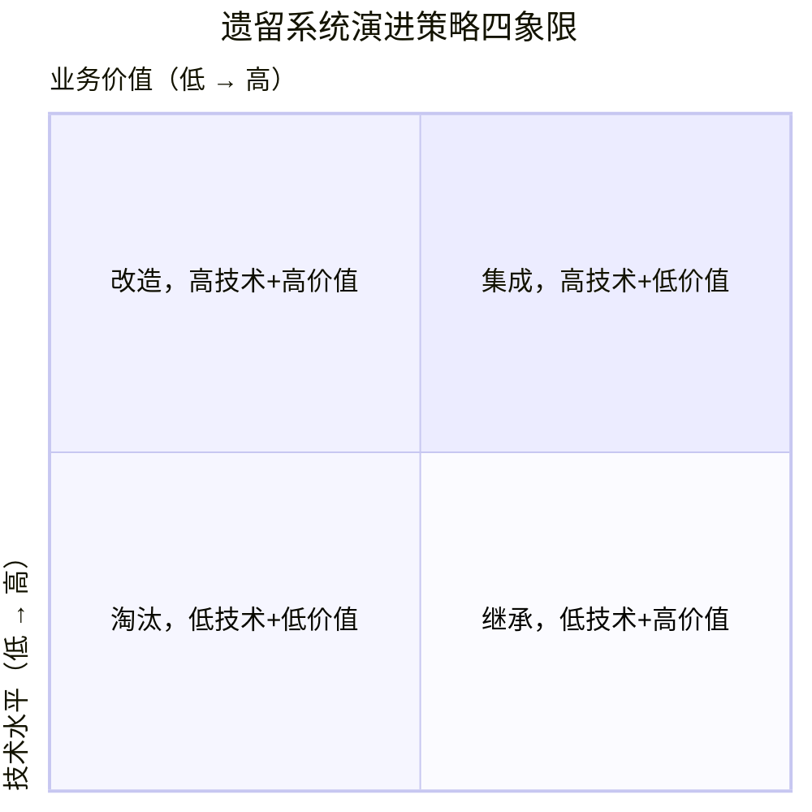

# 遗留系统的演进策略

香港位于铜锣湾或旺角的旧楼，虽然墙皮剥落、电线老化，但楼下的商铺日进斗金，楼上住满了人，商业价值巨大。直接推倒重建成本太高且风险极大，存在各类安全风险隐患，可能会对人身和财产安全带来沉重的伤害。

作为 IT 行业从业者，每当看到城市中的老破小、商业筒子楼等建筑物时，不难联想到一行行正在运行的“屎山代码”，看起来杂乱无章但运转正常。软件系统与城市建设具有相似性：基础设施，一旦用户入住（业务上线），再想伤筋动骨地改造，往往比新建一个系统难上百倍。

老旧城区会面临火灾的风险隐患，那老旧 IT 软件也会面临相似的风险。

## 一、 遗留系统的演进策略

城市的老旧城区演进策略，可以想到三种方式：第一，定期进行维护，修缮、棚改，给墙体加固、装电梯、增加安全通道。第二，安排大规模拆迁，成本非常高。第三，城市区域转移，在新的低价值的空地上规划新城区，城市中心转移，老城区的商业价值逐渐降低，然后居民自发离开，或者此时再进行一次整体的搬迁。

在软件系统架构中，也存在类似的问题，软考系统架构设计师中有一个知识点：遗留系统的演进策略，根据**业务价值**和**技术质量**将系统分为四个象限。

最让人头疼的是高业务价值、低技术质量这一类。公司的核心系统，前前后后两到三代程序员编写，缺乏文档，逻辑耦合极深（Spaghetti Code），技术栈过时（如古老的Java版本、甚至COBOL），每次修改都像是在排雷。“做好了不会有明显的成绩，做得不好会背锅”，没有人愿意碰，只有出现重大系统事故才会引起管理层的注意。

## 二、低成本演进策略

遗留系统的架构演进策略，更大的困难在于如何实施业务价值评估、技术质量评估？业务价值多高算高，技术质量多差算差？现在 Java 服务端生产环境中仍然是 JDK8 的天下，虽然已经演进到 JDK24 了。如何进行业务价值和技术价值评估，我将在后续的工作经验中在进行总结分享，目前没有足够多的经验。可以明确一点的是，一定要具有经济思维，使用客观数据、成本收益等客观数据来支撑。

不同于城市中心迁移策略，当一个系统技术债繁重时，“另起炉灶”的成本和代价低一些。成立一个小型团队，将老业务系统的模块一步一步迁移到新系统上，阿里巴巴的全面微服务化战略就是这样实现的。在管理上有非常高的优势，因为成本是逐渐累积的，不是一下子就要花费很多钱，这也更容易被领导接受：先看到一部分效果，再追加投资。

## 结语

新建一个系统比新规划一个城市中心的可接受程度要高很多，两套系统互为主备，也是保障系统可用性的一种手段。腾讯公司的策略是内部竞争，在已经有 QQ 的基础上，开发微信，并大获成功。
