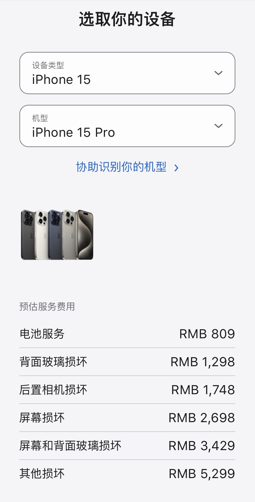
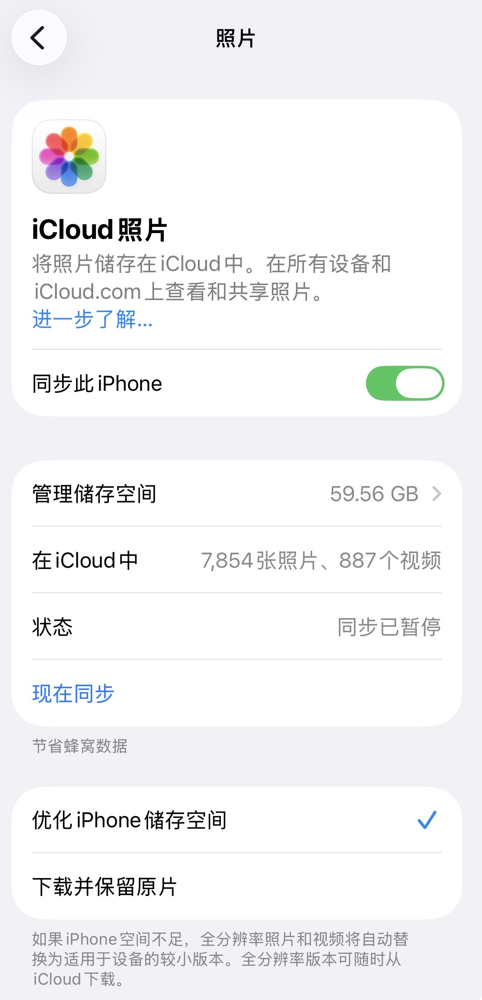
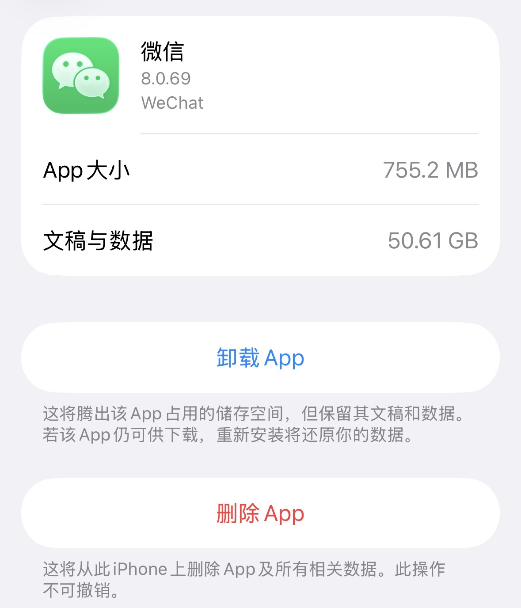
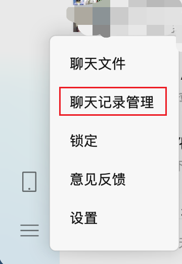
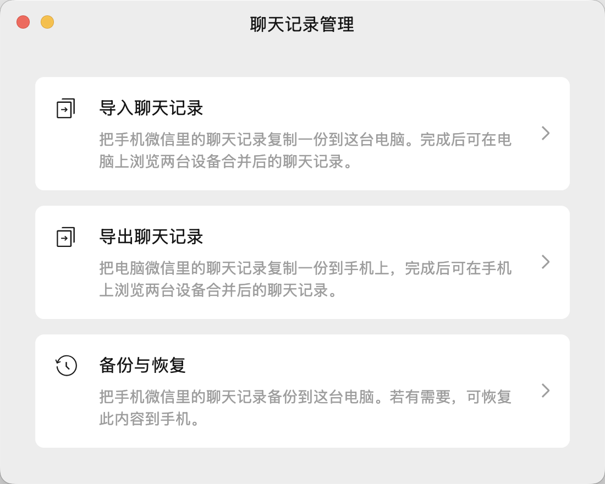
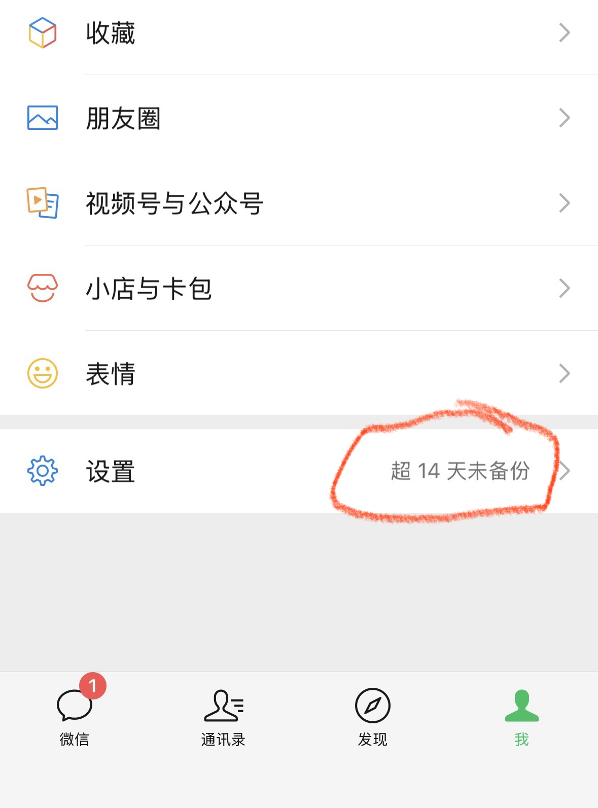
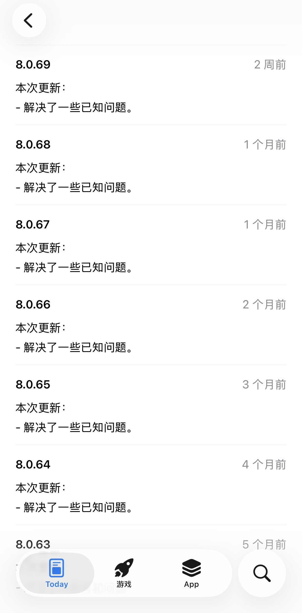
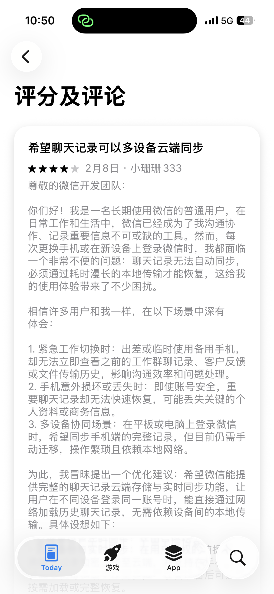
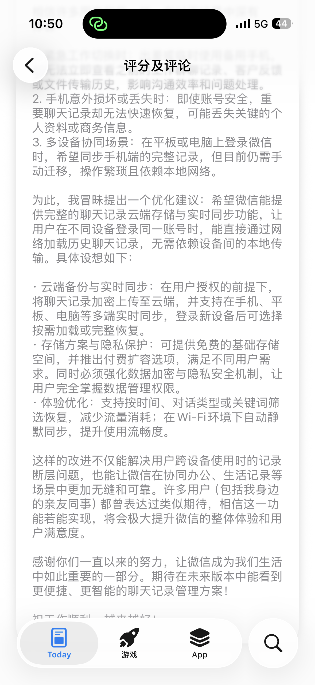

# 手机存储不够用，微信占用超50GB？微信已悄悄上线了自动备份

换手机的理由列了一长串，真正站得住脚的没几个。本文跟大家一起探讨避免为新手机“剁手”的解决方案，其中着重描述手机存储问题。

## 换机理由

你是否有过正在录制照片时，存储不足提醒，微信阻止你使用，直到你又释放了一些存储空间。通常，我们想换手机的理由逃不出这三条，但拆解开看，前两条往往是“伪需求”，最后一条才是真真相。

**理由一：卡顿**

手机处理器早已迈入“性能过剩”时代。哪怕是5年前的A14、骁龙888，应付日常扫码、刷视频、回消息，依然是游刃有余。感到的卡顿，往往不是芯片不够强，而是闪存被塞满后导致的 I/O 读写瓶颈，或者是电池发热导致处理器降频。

**理由二：电池健康度低**

电池是消耗品，换块电池即使是iPhone，均价在800元。因为电池不行换手机，就像“因为笔没墨了就要换支钢笔”。

苹果官方针对iPhone13，推出换电池半价活动，活动时间为2026年1月7日至2026年4月30日，半价后的换电池费用为399元。

安卓手机以及第三方电池，更换成品会更低。

**理由三：存储空间不足**

这是最难轻描淡写的痛，当存储条飘红，手机会进入“保护模式”：APP 闪退、微信打不开、系统无法升级。这才是压死旧手机的最后一根稻草。

---

另外一种情况，想要使用最新的**拍照**能力来拍美照和录制视频，那换手机还是很有必要的。

## 谁偷走了存储空间

打开手机存储详情，“照片”和“微信”常年霸榜。

照片存储空间占用60GB：

微信存储空间占用50GB：

这些数据不该被删除，因为它们是数字化的“人生痕迹”——工作记录、情感凭证、生活的底片。核心原则应该是：数据不应被抹除，而应被“重排”。

那么问题来了：**不删，怎么腾空间？**

答案是——**备份，然后优雅地清空本地。**

## 照片：云存储

作为iPhone用户，**iCloud+** 是目前体验最丝滑的解法。

iCloud照片不只是一块云盘，更像一个**照片版的虚拟内存**，开启“优化iPhone存储空间”后，系统会自动将原始照片上传到云端，本地只保留“缩略图”。当点开某张老照片，它才会自动从云端拉回原图。像极了电脑里的**Cache**：高频使用才驻留本地，低频占用则交给远方。

平衡价格与用户体验，可供选择：

**手机厂商自营**

小米云盘、OPPO云盘、iCloud+以及华为云盘等。对于iPhone用户，推荐购买iCloud+家庭版，多个人拼一拼，200GB的存储空间一年只需要60元，共享总的存储空间但每个人的数据存储互相隔离，性价比非常高，强烈推荐。

**通用云盘**

最出名的当属百度网盘，最早做的产品，流行度最高但也诟病最多，不充会员就龟速。首推夸克网盘，因为淘宝88SVIP，赠送一年夸克会员，享受6TB的存储空间，不受限制的上传和下载速度。另外比较知名的网盘有阿里云盘、移动云盘、Google云盘、OneDrive等。

## 微信：备份到电脑

如果说照片是散落的记忆碎片，**微信聊天记录就是一部完整的时间史书**。有入职第一天老板发的“欢迎”，有父母逢年过节的语音，有爱人那句“睡了吗”，有朋友从远方寄来的原图。

微信很早就支持将手机中的聊天记录备份到电脑，操作并不复杂：

**电脑版微信 → 设置 → 聊天记录管理 → 备份与恢复**

支持的功能：

最近，我发现微信悄悄上线了自动备份的功能，只要与电脑端同时登录，且在同一个局域网中，那么手机微信中的聊天记录会自动备份到电脑上。

有点类似于Mac上的时间机器（Time Machine）了，会提醒用户备份。

我去翻阅微信的更新日志，看不到任何有价值的信息，全部都是“修复了一些已知问题”。

然而有一条微信评论让我眼前一亮，完全就是该功能的说明书，大胆猜测这个给微信开发者提意见的用户是一名专业优秀的产品经理，向她学习。

---

将手机微信上的聊天记录全量备份到电脑端，然后选择仅保留最近半年的聊天记录（热数据），释放存储空间。

或许因为用户对手机存储的需求越来越大，手机存储也越来越大，安卓手机最畅销的是512GB和1TB存储，因为价格只差数百元。

iPhone支持最高2TB存储空间，但因存储价格太贵，标准版仍是最畅销的。

巧妙运用iCloud+和微信备份，非常有必要，精打细算过日子。

## 总结

说白了，手机存储不够用这事，就像家里的衣柜满了——不是衣服太多，而是收纳方式不对。微信占50GB、照片塞60GB，这些都不是垃圾，而是我们数字化生活的"底片"，删了怪可惜的。

靠谱的解决方案其实就两招：照片往云上搬，聊天记录往电脑里存。iCloud+就像给手机装了个"虚拟扩容卡"，热照片留本地，冷照片放云端，用的时候秒加载；微信自动备份更是贴心，像时间机器一样默默守护着我们的聊天记忆。

这波操作下来，既保住了珍贵数据，又给手机松了绑，简直是存储焦虑患者的福音。与其为了几十GB空间就换新手机当"冤大头"，不如学会这招"空间魔术"——数据不丢，手机不卡，钱包还不疼，这买卖怎么算都值！

精打细算过日子，技术就是生产力，让每一分存储都发挥最大价值。

---

本篇内容就到这里，欢迎在评论区友好交流：

1. 你的手机存储够用吗？
2. 你的换机理由与频率是什么？

---

感谢你能看到这里，如果喜欢我的文章请关注我，让我们一起进步。

---

感谢大家一直以来的阅读、在看和转发，为了回馈粉丝朋友，在微信后台留言可参与抽奖活动。

每周六上午8点开奖，本周回复暗号【马到成功】点击链接即可参与。

---

手机存储又红了？别急着换新机！微信50GB、照片60GB不是负担，而是数字化生活的"底片"。学会iCloud+和微信自动备份这招"空间魔术"，数据不丢、手机不卡、钱包不疼，精打细算过日子，技术就是生产力！