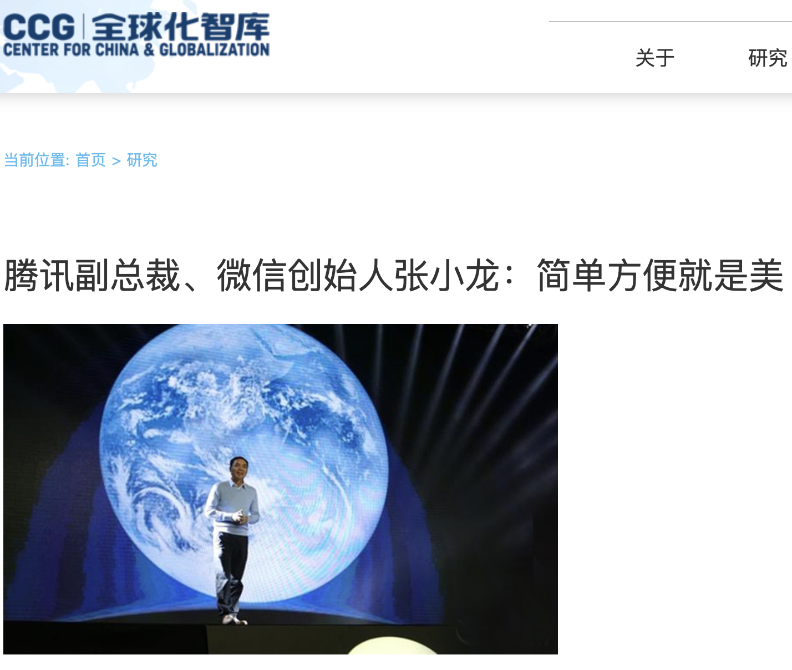
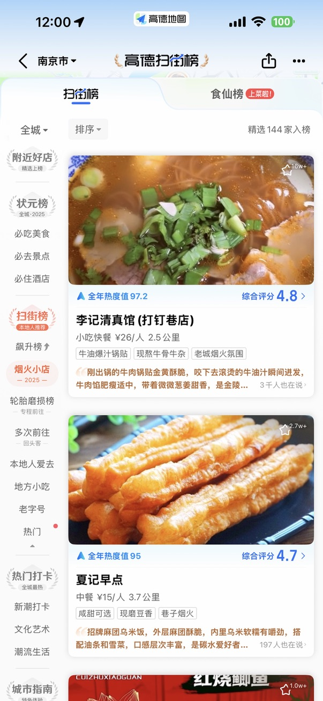
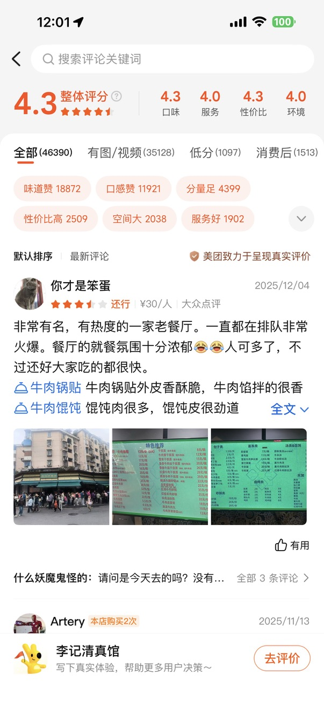

# 项目管理思考：业务价值、用户故事、度量内建

近一年或多或少参与了项目规划和管理，阅读了项目管理类的书籍，基于现有工作经验分享近期对项目管理的思考。

## 业务价值交付

对于商业公司来说，为客户提供业务价值并获取经济利益是核心目标，任何商品或服务都应满足客户一定的需求。

在2025年这样的时代背景下，企业内的2个热点词汇：**降本、AI+**。

从企业经营的角度考虑，增收与降本（类似的词汇：开源与节流）是最上层关注的两个方面，比如董事会内。在经济快速发展的时代，经营扩张增收；在经济疲软的时代，经营收缩降本。这是企业为了维持自身发展，对时代变化而作出的常规性响应。因此，在2025年公司项目的规划中，降本为核心诉求，因此项目的出发点也应满足企业的诉求。

山西刀削面馆中刀削面一般是人工师傅制作，此时作为自动削面机的供应商，在推销产品的时候，减少人力成本是赢得客户买单的方向：减少厨师工资，雇佣2名厨师减少为1名，预计一年回本（停业也可以获得转让费）。

另外的一个推销方向是：机器削面种类多、下面的量控制精准、占用空间小、省电，这些难以打动老板付费买单。

AI+ 是时代热点，政府以及社会上各行各业都看好 AI+ 的巨大潜力，都不甘落后想要从 AI+ 中分得一杯羹，无数 AI+ 项目纷纷被列入项目规划清单。一些 AI+ 项目在业务价值角度思考，是欠考虑或站不住脚的。比如，将用户表单式交互修改为 AI+ 自然语言交互。

- AI+之前：用户点击「账单」、「余额」按钮来完成用户需求
- AI+之后：使用一个交互式的对话框，用户在对话框中输入「查询余额」、「请帮我查询一下12月份的账单」

首先，AI+之前用户需求简单明确，拥有系统指引提示，在预期内进行交互式操作；而 AI+ 之后，没有了交互式表单，用户不知道它能进行哪些操作，AI+ 返回的结果不优于AI+之前：

1. AI+ 响应内容与表单交互内容一致
2. AI+ 响应内容存在幻觉，输出不符合用户预期
3. AI+ 因为没有用户约束而报错，例如「请查询最近2年内的铁路行程」，「对不起，不支持查询2年内的行程，最多只运行查询1年以内」，这显然增加了用户负担。

再从业务价值角度考虑，将表单式交互改为AI+自然语言交互带来的价值：

1. 降本：不敢奢望，做项目倒是增加了不少投资。
2. 增效：上述已论证用户体验变差了，并且切入点也不是用户低效的地方（并非用户痛点）。

另外，「增效」一词我也认为是内化目标，因为「增效」本身无法度量，可会演变为更具体的目标：

1. 增效->降本：原来5个人工作的内容，提效后3个人即可保质保量完成，减少了2个人员成本。
2. 增效->增收：原本每个客户经理每天可拜访5名客户，提效后可拜访10位，客单量增加20%。

这样来说，降本和增收之间也可以互相转化，因为在「提效」的前提下，公司可以选择「降低成本」或「扩大生产规模」，但总的来说，业务价值应该更为具体，「增效」是一个比较务虚的名词。

## 用户故事驱动

大自然的规律，万物皆有生命周期，从新生命的诞生到死亡，是一个循环过程。一座大厦会经历规划建设、运行维护，再到爆破拆迁。同样地，软件系统也具有生命周期，在运行维护阶段，有新需求增加，也有老需求下线，最终整个软件系统下线。

在大多数软件设计中，往往会忽视「消亡」这个阶段，根据自身的工作需求，在系统中增加和迭代新模块、新功能，而当不再承担此项工作后，或该需求模块被弃用后，形成软件垃圾，对系统稳定性和用户体验均产生不好的影响。因此作为软件系统的项目经理，要对需求进行全生命周期管理，对软件的健壮性、易用性负责。

然而，软件开发团队作为「支撑团队」或者「乙方」，往往没有权力对抗业务部门的「不合理需求」：该需求是紧急需求，必须上线并务必尽快执行。度量业务需求的合理性较为困难，不过，从用户故事角度来分析，是一个良好的切入点。

**奥卡姆剃刀：如无必要，勿增实体。**

一个好的产品不是功能丰富，而是最简单地满足用户需求，在需求膨胀上表现出克制。

QQ 和微信均为腾讯出品，腾讯以其简单、易用的设计，赢得了用户的喜爱。社会上的无数用户隔空对微信提出了很多需求（吐槽），例如聊天记录云存储、丰富群管理等。然而，微信团队始终保持克制和理性，微信这款全民用户产品，不应该为了部分个体需求而增加其他用户使用负担。

**如无必要**，如何来判断，可以扔出三连问：角色、职责、规模。

1. 影响角色：需求模块中影响了哪些用户（或角色）？
2. 影响职责：需承担什么职责？
3. 影响规模：涉及到的用户量有多大？

任何需求提出方至少应从用户故事角度来回答上述问题，如果不清楚，那么增加的需求就是不必要的。

进一步，口说无凭，在上线需求时尽可能拿出客观数据，同时做好需求的跟踪。

例如，计划上线的需求模块影响角色为 VIP 用户，提供业务咨询服务，涉及用户10万人，点击量为 3000人次/天。

需求退役条件：VIP 用户少于2000人，或点击量低于100人次/天。

## 度量内建

上述两章节中描述的业务价值和用户故事中，均需要使用度量指标来评估：

1. 降本20%，20%是怎么统计和计算出来的？
2. 影响用户10万人，10万人是如何评估出来的？

如果说影响用户付款是「定性」，影响10万用户付款是「定量」，那么影响129323人则是「客观定量」。在企业中，数据驱动会议已经成为共识，但是在数据的诞生和客观性上却缺乏「列文虎克」精神。

董事会领导要求统计A数据，秘书部将任务分派到10个相关部门，每个部门再传达到10个负责人，数据如何填写不同人有不同的想法？有的人会适度美化数据，有的人不清楚数据包含范围而漏报或多报，数据只能粗略估算并上报。这将会导致：

1. 从上级领导层面：数据失真，与客观数据形成较大的偏差，对全局误判。
2. 从下级员工层面：疲于奔命，每一次收集数据都绞尽脑汁，并且还会反反复复，每天三分之一的时间都在填表中。

「度量内建」可以很好解决上述问题，将可度量指标在系统中承载，而不应有人来干预和控制。只设计数据收集规则，没有权力和权限修改数据。

例如，某项目价值目标是在审批流程中为员工**减负**，年度总结需要反馈项目的效果。

做法一：每个月给用户发放调查问卷，给审批流减负效果打分，最终得到了90%的用户反馈减负20%的结果。

做法二：使用A/B测试，在流程中埋点，统计每张工单停留时间（从开始处理到处理完成），比较A/B流程使用量，工单停留时间均值。

第一种做法，且不说准确不准确的问题，发放调查文件如果是匿名的，会有多数人因被打扰而拒绝填写；如果是实名的，有点类似于“服从性测试”。第二种做法对用户是**透明**的，不受运营部门的打扰，且数据是客观真实的。

[透明，看得见还是看不见？](transparency.md)

另外一个比较明显的例子就是，高德扫街榜和美团/大众点评。

高德扫街榜 No.1

美团/大众点评网友评价

一家餐厅是否受欢迎的两个度量角度：

1. 用户主动评价：5星评分，带图评价，评价字数，由用户主动反馈的内容加权计算。
2. 用户行为评价：一年内去过多次、消费额、定位目的地专程前往，用户透明。

> 我去过若干次，黄色的灌汤牛肉锅贴是招牌经典，牛肉汤/牛杂汤竟然是甜口的，怪怪的。推荐可以去尝一尝，如果需要排长队不是很有必要，可以换一家，南京卖牛肉锅贴的地方挺多的。

因此，数据驱动是第一步，应再向前迈一步：度量内建。

1. 数据客观准确
2. 对用户透明，无感知

*大爱无言，不要听TA为你说了什么，要看TA为你做了什么。*

## 总结

项目规划应从用户的切实需求出发，从业务价值的角度「画饼」。

在项目管理过程中，遵循「奥卡姆剃刀」，即如无必要，勿增实体。从用户故事切入进行三连问：影响角色、影响职责、影响规模，回答不上来则勿增实体。

最后，不仅要有可度量的运营指标，应做到度量内建，在系统内自动化统计。
