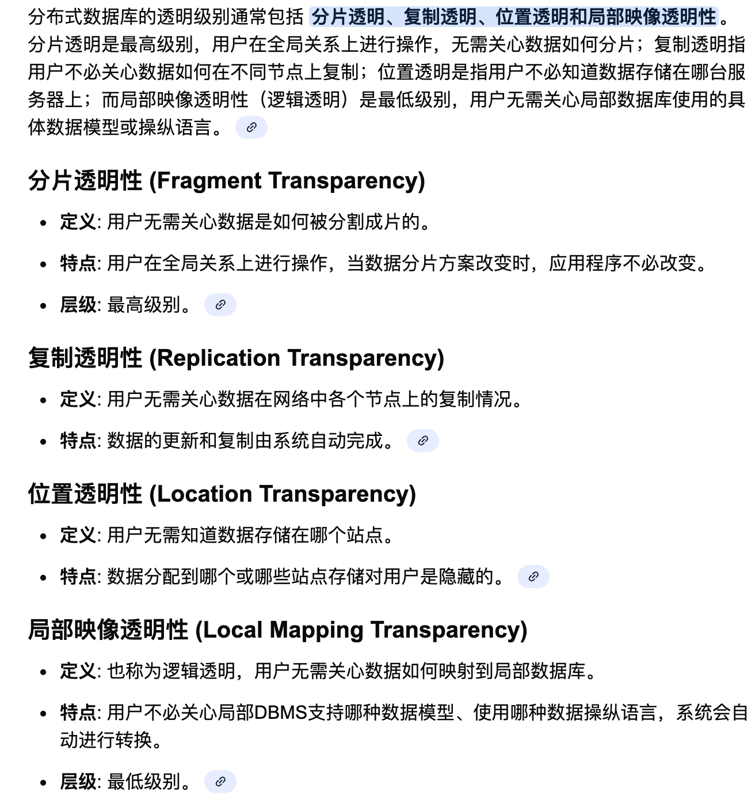
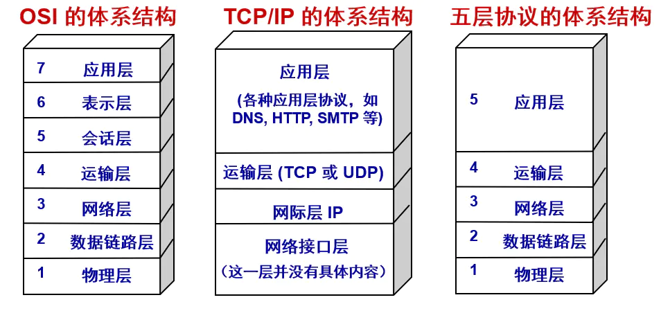
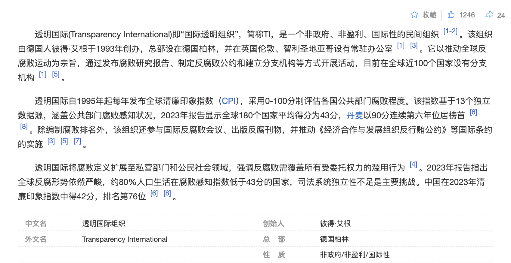
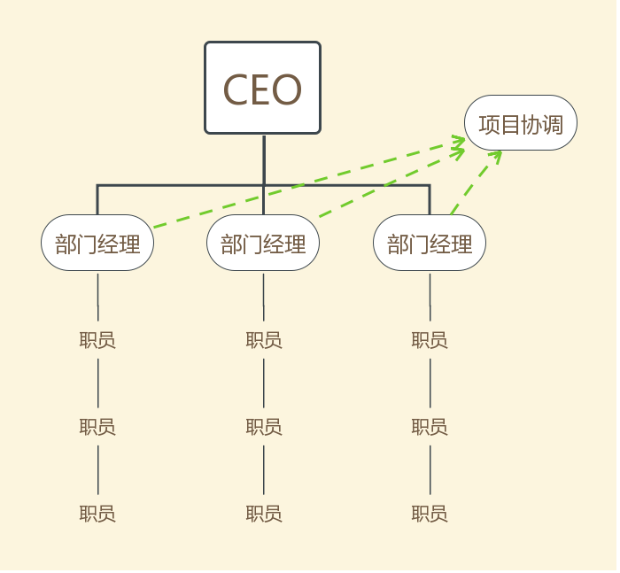
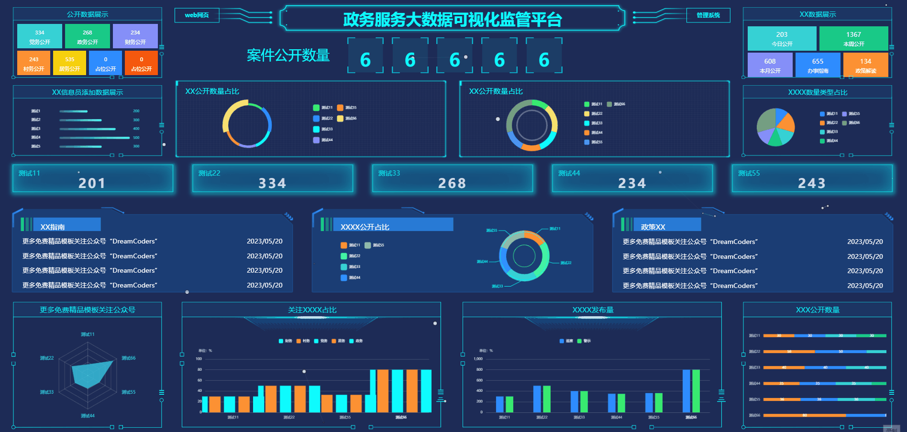

# 透明，看得见还是看不见？

「透明」一词在计算机领域中被广泛使用，主要指对用户或程序员来说是隐藏的，无需关心内部实现细节。换种说法，「透明」就是一个黑盒，只需要应用它给出的接口，而不需要了解其内在机理。例如计算机网络分层架构中，下层为上层提供服务，下层实现细节对上层透明；程序员在编程时 Cache、数据总线是透明的，无需关心。手机App 所用的软件架构、编程语言对用户是透明的。

然而在另外一些场景，「透明」却有着完全相反的含义，例如

- 透明政府：社会科学术语，是指通过法律政策公开、行政程序透明等方式实现政府信息开放的治理形态，旨在减少政府与公众的信息不对称，降低权力滥用风险。
- 透明化管理：经济术语，一种通过公开企业经营信息、制度及决策过程降低内部信息不对称的经济管理方式，其核心在于以信息共享优化资源配置，增强监督效能与组织协作。

如果2个次元壁互相隔绝，对「透明」的理解或许没有歧义与困惑，然而一旦进行跨领域交流，就容易产生理解歧义，因为透明有「看得见」和「看不见」两个完全相反的语义。

直属领导在会议上强调要做到「对客户透明服务」，这究竟是让顾客看得见还是看不见呢？

程序员把「透明」这一含义不经意应用到了其他领域，如「餐厅制作餐食对顾客是透明的」本义想要表达，顾客无需关心餐食的物料准备、烹饪过程等，但听者可能会误会为全过程要让顾客看得见。

因此，「透明」到底是看得见还是看不见，我们应该如何判断和理解？

## 透明的物理学本义

「透明」是光学概念，指允许光线穿透的属性，如水、玻璃、氧气均具有不同程度的透明属性。

从物体学的光学本义角度理解

- 当描述物体本身时，透明是「看不见的」，如有毒气体一氧化碳
- 当描述物体作为容器而观察容器内部的物体时，透明的目的是「看得见的」，如透明杯子、透明笔袋。

透明的光学概念很容易理解，并无歧义，然而「透明」的这一属性延伸到其他领域时，却分别赋予不同的含义。

在一些领域，虽然「看不见」或「看得见」可以准确描述和表达，但是说法不够专业。或许是为了显得更专业、简洁、文雅，「透明」被赋予新的表达概念，以一种领域黑话的方式而存在。

## 计算机术语：看不见

> 黑盒和白盒也是计算机测试领域的概念，白盒测试和黑盒测试

**黑盒**，无需关心的、不需要了解内部细节，直接面向服务的，计算机领域中这一概念被广泛使用。

分布式数据库的透明性：分片透明、复制透明、位置透明和逻辑透明

计算机网络中下层对上层是透明的

> 计算机科学中，最早接触透明的概念是：函数调用中调用者只关心输入参数和返回结果，不关心实现。

在计算机科学理论课程中，老师会用生活中的例子来使学生理解「透明」。例如，我下单了一个炸鸡外卖，鸡肉的品质、制作过程以及是哪个金牌小哥配送的，对我这个顾客来说是透明的。计算机网络老师举的这个例子，潜在地把「透明」概念引申到了生活场景，这可能也是歧义的开始。

## 公共管理学术语：看得见

**白盒**，一般用来描述本不需要关心的场景，但有意将其公开化，反常识模式。

例如政府的行政运作、财政支出去向对公众透明。

餐厅对顾客开放厨房，称为透明化厨房。

「透明」指的是看得见过程，无论是政府还是厨房，如何运作的信息尽可能公开，让外边看得见。

## 透明的双重语义

一个玻璃杯泡了红茶，一个陶瓷杯泡了绿茶，都可以使用「透明」来描述。

- 玻璃杯里的红茶：茶对客户透明，看得见泡的是红茶，且对茶叶数量、浓度有所评估。
- 陶瓷杯里的绿茶：茶对客户透明，顾客的需求是喝茶，但是对什么茶等不关心。

在当今的公司管理架构中，是树形分层架构，如科室领导对部门领导负责，部门领导对公司总经理负责，总经理对CEO或董事会负责，跨层级别间工作互相隔离和不可见，可以称之为计算机术语中的「透明」（看不见）。

分层次管理虽令各守其位、对上负责、对下行权，却暗藏“信息只经直接下级”之软肋，上级易被架空，故领导不仅索结果，亦苛求过程透明；主动频报仅为一策，更须以软件基础设施托底，让统计数据与图表把每一环量化、可视化，使全程实时“可见”，既防堵欺瞒，又兑现**治理能力现代化**的硬核诉求。

## 一点小Tips

在计算机领域中，「透明」指看不见，这个广泛使用，避免不了；在公共管理中，「透明」指的是看得见，有意“使看见”原本看不到的。

作为下级，领导说的「透明」一般指的是**看得见**，根据情景斟酌理解。

作为上级，减少或避免使用这一可能引起歧义的词汇：

- 使用「可视化」、「可观测」等词汇来替代「透明」，表达「看得见」语义；
- 使用「隐藏」、「不可见」来替代「透明」，表达「看不见」的语义。
