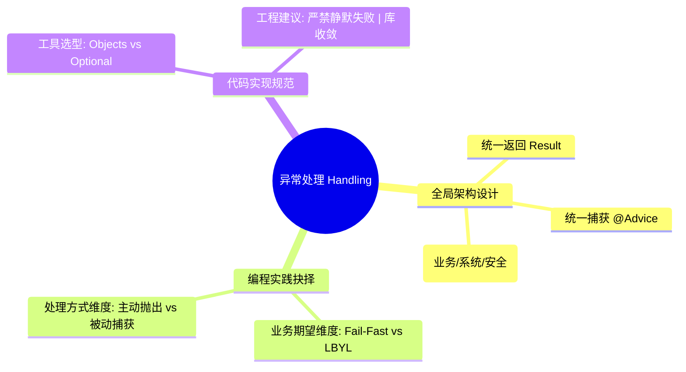

# 从空指针异常NPE剖析异常处理的架构设计

作为系统架构设计师，在进行服务端项目规约时，异常处理（Exception Handling）的设计往往能体现一个系统的健壮性与团队的编码质量。

当面对一个可能为 null 的字段时，我们究竟是该优雅地使用 `Objects.isNull()` 进行常规前置判断，还是果断地抛出一个异常？这背后隐藏着对架构设计与编程规范深层次的考量。

本文从 NPE 异常处理角度，分享关于 Exception 处理的架构设计思路。

## 异常与空指针异常

在异常处理的架构世界里，异常（Exception）是系统应对非预期事件的保底机制。一个设计良好的异常处理体系，是系统健壮性的最后一道防线。

### 异常对系统的影响

失控的异常处理会对系统产生多维度的负面影响：
*   **服务可用性**：未捕获的运行时异常（Runtime Exception）可能导致单次请求中断，甚至在极端情况下导致线程池枯竭。
*   **资源损耗**：异常的抛出涉及堆栈跟踪（Stack Trace）的生成，这在 CPU 和内存上都有明显的开销。在并发高发期，海量异常会引发“异常风暴”，极大损害系统吞吐量。
*   **用户体验与安全**：直接将原始堆栈信息返回给调用方，不仅用户体验糟糕，更可能泄露数据表名、内部路径等敏感信息，造成安全隐患。

### 聚焦 NPE：最常见的“老朋友”

在所有异常中，`NullPointerException` (NPE) 无疑是 Java 开发者最熟悉的“常客”。著名的程序员问答网站 StackOverflow 和国内的 SegmentFault，在某些语境下都被戏称为“报错驱动开发”的产物，而其中最常出现的那个“主角”正是 NPE。


### NPE 的本质

NPE 的本质是**对编程契约的违背**。在 Java 中，`null` 是表示“没有对象”或“不存在”的特殊占位符。当开发者尝试访问一个并不存在的对象属性或方法时，NPE 就会产生。这种异常的频繁出现，往往意味着程序在某个环节失去了对“数据存在性”的掌控。

### 为什么 NPE 如此普遍？

*   **契约意识缺失**：调用方假设接口不会返回 null，而被调用方假设输入永远有效，这种“模糊的信任”是 NPE 的温床。
*   **防御性编程的悖论**：要么代码中充斥着琐碎的非空判断导致业务逻辑支离破碎，要么因为偷懒而完全不做检查。
*   **隐蔽的操作路径**：在 Map 取值、嵌套对象访问或 Java 8+ 的流式处理（Stream）中，null 值往往隐藏在深层链式调用中，难以在代码走查时被一眼识破。

## 异常处理：全局视野与编程规范

作为系统架构师，设计异常处理机制时，核心目标是：**语义清晰、链路可追溯、对内严谨、对外友好。**



### 全局异常处理 (Global Exception Handling)

在微服务架构下，我们强烈建议利用 `@RestControllerAdvice` 构建统一捕获中心。这种设计实现了业务逻辑与异常处理系统的完全解耦：

*   **统一返回格式**：确保对内严谨、对外友好。
*   **核心分层设计**：通过对异常进行科学分层，实现差异化的响应与治理策略。

    - **业务异常 (BusinessException)**
      **定义**：属于业务流程的一部分，是系统运行时“预料中”的限制（如：余额不足）。
      **处理**：返回面向用户的**友好提示**，引导用户完成正确操作。

    - **服务端系统异常 (SystemException)**
      **定义**：指基础设施故障（如 DB 宕机）或未捕获的代码 Bug。
      **处理**：屏蔽底层堆栈，统一返回“系统繁忙”，并由开发人员通过**监控与日志**重点关注并排查。

    - **外部/前端接口异常 (InterfaceException)**
      **定义**：由于非法入参、URL 拼接错误或绕过前端校验导致的契约违背。
      **处理**：明确反馈错误至调用方（如 400 Bad Request），并在后台记录安全审计日志，防御性地阻断海量非法请求。


### 异常处理编程实践

在服务端开发中，处理 NPE 不仅仅是写一个 `if (obj == null)`，而是一场关于**意图**与**确定性**的博弈。我们需要从两个核心维度来审视异常处理：

### 维度一：基于业务逻辑期望（抛出异常 vs. 前置判断）

这一维度的核心在于：**该 null 值是否在你的“预期”之内？**

#### 策略 A：抛出异常 (Fail-Fast) —— 捕获“期望外”的错误
*   **适用场景**：如果 `null` 的出现意味着系统由于某种非法状态、接口滥用或严重的协议违背而无法继续运行。
*   **意图**：引起开发人员的关注。这种异常在监控系统中通常会触发告警，提示“有人用错了接口”或“数据一致性遭到了破坏”。
*   **举例**：在订单发货流程中，订单对象必须存在。
    ```java
    public void shipOrder(String orderId) {
        // 业务逻辑：进入发货环节，订单必须已经持久化
        Order order = orderRepository.findById(orderId);
        
        // 判定：若订单为 null，属于违反系统契约的“期望外”错误
        if (Objects.isNull(order)) {
            log.error("Critical Error: Order {} not found during shipping process", orderId);
            throw new OrderNotFoundException("发货失败：订单 [ " + orderId + " ] 不存在");
        }
        
        order.executeShipping();
    }
    ```

#### 策略 B：前置判断 (LBYL) —— 容纳“期望内”的可能
*   **适用场景**：如果 `null` 是业务逻辑中允许存在的正常分支 or “可能状态”。
*   **意图**：业务闭环且无痛运行。系统不需要因为这类 `null` 产生任何告警，它只是逻辑中的一个 `else`。
*   **举例**：多条件搜索接口，用户可以不传筛选条件。
    ```java
    public List<Order> searchOrders(String userId, Integer status, LocalDate date) {
        QueryWrapper<Order> query = new QueryWrapper<Order>().eq("user_id", userId);
        
        // 业务逻辑：status 和 date 是可选的筛选条件
        // 判定：参数为 null 是“期望内”的正常状态，代表用户不打算按该维度筛选
        if (Objects.nonNull(status)) {
            query.eq("status", status);
        }
        
        if (Objects.nonNull(date)) {
            query.ge("create_time", date);
        }

        // 逻辑闭环：即便可选参数全为 null，查询依然能产生有效结果（返回该用户所有订单）
        return orderRepository.selectList(query);
    }
    ```

### 维度二：处理方式选择（主动抛出 vs. 被动捕获）

面对期望外的异常，选择`try-catch`直接捕获并处理，还是`if-raise`主动抛出异常并交给全局异常处理器处理？本文推荐后者。

#### 路径 A：声明式主动抛出（强烈推荐）
通过显式地校验（如 `Objects.isNull`）并主动抛出具名异常：
*   **确定性**：异常信息能精确指向是哪个变量缺失，减少 Debug 的广度。
*   **性能**：仅是一个简单的指针比较，没有异常堆栈生成的巨大开销。
*   **防御性**：在入口处就“大声报错”，防止错误渗透进核心业务逻辑。
*   **安全性**：不规范的 URL 或恶意拼接可能引发海量非法的 `null` 请求。显式校验能低功耗地阻断此类恶意行为，避免拖垮 CPU 性能。

#### 路径 B：被动捕获 (Try-Catch NPE)（反模式）
通过 `try-catch NullPointerException` 来兜底：
*   **语义模糊**：NPE 可能由当前对象为空引起，也可能由方法内部嵌套的深层变量为空引起，很难分辨真正的根源。
*   **掩盖 Bug**：NPE 通常被视为**编程错误**，应当在开发期修复，而不是在运行期靠 `catch` 来“屏蔽”。
*   **雪崩风险**：生成堆栈轨迹极度耗时。在极高并发下，大量非法的 `null` 请求若依赖 `try-catch` 捕获，会迅速耗尽 CPU。

#### 警惕：严禁“静默失败” (Silent Failure)

最危险的行为是判断了 `Objects.nonNull`，却对 `null` 的分支不作任何处理。这会导致“逻辑黑洞”，系统没有任何异常记录，开发人员必须通过断点调试才能发现问题。准则：如果你判断了非空，那么**空的场景必须有交代**。要么是预期内的逻辑跳过（需注释说明），要么是预期外的异常拦截（抛出异常或记录 Warn 级别日志）。

### 抉择矩阵

| 维度 | 主动抛出 (Fail-Fast) | 前置判断 (LBYL) |
| :--- | :--- | :--- |
| **业务逻辑** | 期望外（不可容忍） | 期望内（允许存在） |
| **语义含义** | “出事了，快来人处理” | “哦，这里没给值，我不做这个动作” |
| **系统反馈** | 精准堆栈、监控告警、开发介入 | 正常的逻辑分支（if/else）、静默处理 |

### 如何优雅地解决 NPE？

在具体的编码实践中，我们应当根据**“场景语义”**来选择最合适的工具。

#### Optional vs. Objects：流式与命令式的博弈

*   **Optional：面向“返回契约”的流式编程**
    *   **适用场景**：作为方法的返回值。它强制提醒调用者：“这个结果可能为空，请处理它。”
    *   **优势**：支持函数式编程（`map`, `flatMap`, `filter`），可以将复杂的嵌套判断连成一条优雅的流水线。
    *   **抉择**：如果你追求代码的**链式美感**和**逻辑连续性**，且 null 是业务逻辑中的一个正常分支（期望内），Optional 是不二之选。
    *   **示例**：
        ```java
        String city = Optional.ofNullable(user)
                .map(User::getAddress)
                .map(Address::getCity)
                .orElse("Unknown");
        ```

*   **Objects.isNull：面向“流程控制”的命令式编程**
    *   **适用场景**：方法起始处的入参校验，或传统 `if-else` 逻辑分支。
    *   **优势**：性能极高，语义直白。
    *   **抉择**：如果你需要执行**复杂的副作用操作**（如特定异常抛出、多行日志记录）或是在**循环/性能敏感区**，显式的 `if (Objects.isNull(...))` 更加稳健。

> **架构师提醒：警惕 Optional 的“过度工程”**
>
> 很多开发者为了追求所谓的“流式美感”，喜欢用 `Optional.ofNullable(obj).ifPresentOrElse(...)` 来完全替代 `if (Objects.isNull(obj))`。**这通常是不被推荐的。**
> 
> *   **性能损耗**：`Optional` 包装会额外产生一个对象分配开销。在高性能场景下，这种为了“好看”而产生的碎片对象积少成多会增加 GC 压力。
> *   **可读性陷阱**：简单的 `if-else` 是程序员的肌肉记忆，而复杂的 `ifPresentOrElse` lambda 嵌套反而会增加代码解析的认知负担。
> *   **判定公理**：如果你没有使用 `map` / `filter` / `flatMap` 等变换操作，而仅仅是做一次判空，请回归最纯粹的 `if (Objects.isNull(...))`。

#### 其它辅助手段
*   **Fail-Fast 实践**：`Objects.requireNonNull(obj, "message")`。
*   **Lombok @NonNull**：在入参端自动生成校验逻辑，减少样板代码。
*   **代码静态分析**：善用 P3C 或 SonarQube，在编译期消灭潜在的 NPE。

### 工具类的抉择：JDK vs. 第三方库

在 Java 项目中，我们经常看到 `Objects.isNull`, `StringUtils.isBlank`, `ObjectUtil.isEmpty` 混用的乱象。这种混乱往往源于对不同库定位的模糊。

#### 为什么有了 JDK，还需要第三方库？
1.  **历史原因**：在 Java 7 引入 `java.util.Objects` 之前，Apache Commons 和 Guava 早已填补了这一空白。
2.  **能力的扩展**：JDK 的 `Objects` 只查指针。而第三方库通常提供**“深度查空”**。
    *   **Strings**：`StringUtils.isBlank` 会同时检查 `null`, `""` 和 `"  "`。
    *   **Collections**：`CollectionUtils.isEmpty` 会同时检查 `null` 和 `size == 0`。

#### 抉择与最佳实践
为了避免代码混乱，建议遵循以下**收敛原则**：

| 库 / 工具 | 适用对象 | 逻辑权重 | 推荐级别 |
| :--- | :--- | :--- | :--- |
| **JDK (Objects)** | 所有 Object | 仅指针检查 | **首选 (Standard)** |
| **Spring/Apache (StringUtils)** | String 专门处理 | 长度与空白符检查 | **次选 (Domain Wise)** |
| **Hutool/Guava (CollUtil)** | 集合类 | 指针与容器大小检查 | **按需 (Specialist)** |

**架构建议：**
1.  **简单判空选 JDK**：如果是单纯的 `null` 判断，**强制使用 JDK 原生 `Objects`**。它不但减少了依赖，还是所有 Java 工程师的通用语言。
2.  **业务语义选专门库**：如果你需要判断字符串是否为空白，使用 `StringUtils`。因为这时候你的语义是“内容是否有效”，而不仅仅是“指针是否为 null”。
3.  **禁止重叠混用**：在同一个类中，不要一会儿用原生 `== null`，一会儿用 `Objects.isNull`。**在一个团队/项目中，应当统一到 JDK 原生 Objects 上。**

## 异常治理：从捕捉到复盘

在架构设计中，**异常不应仅仅被“处理”，更应被“审计”**。这不仅关乎代码的稳定性，更涉及**日志、监控与告警**的闭环：

*   **统一日志打印**：通过全局异常处理器捕获异常堆栈，结合 TraceId 实现链路可追溯。业务代码应避免零散的日志打印，保持逻辑纯粹。
*   **多维监控**：将分层异常（如系统异常、协议异常）接入 Prometheus 等监控指标。异常频率的突增往往是系统风险的早期指标。
*   **精准告警**：建立分级的告警机制。业务异常通常仅做统计，而系统异常和高频安全异常则必须实时告警到开发/项目组。 
*   **定期分析**：考虑到开发人员的时间成本，建议采用**定期复盘**的方式。例如：**每周 2 次关注并分析所有非业务类异常日志**，将异常转化为优化系统健壮性的路标。

异常治理涉及到日志打印、监控、告警、复盘等多方面内容，需要综合考虑，是一个庞大的课题，后续将从治理角度进行深入探讨。


## 总结

通过本文的论述，我们可以将服务端关于异常的思考浓缩为**“处理”**与**“治理”**两大核心模块：

```mermaid
mindmap
  root((异常架构设计))
    异常处理 (Handling)
      决策逻辑: 期望内判断 LBYL | 期望外抛出 Fail-Fast
      编程实践: Optional (变换) | Objects (控制)
      全局体系: 统一返回 Result | 分层解耦 Advice
    异常治理 (Governance)
      闭环规范: 统一日志 | 多维监控 | 精准告警
      持续演进: 定期日志复盘 | 识别性能风暴
      健壮性保证: 拒绝静默失败 | 审计安全风险
```

**核心要点回顾：**

**1. 异常处理：追求编码的确定性**
*   **期望决策**：该不该抛异常，取决于该 `null` 是否在你的业务预期路径范围内。
*   **工具收敛**：简单判空首选 JDK `Objects`，复杂链式变换选 `Optional`。尽量减少第三方工具类的混用，维持代码纯度。
*   **主动抛出**：面对期望外错误，坚持主动校验并抛出具名异常，而非依赖模糊且昂贵的 `try-catch`。

**2. 异常治理：追求系统的生命力**
*   **治理重于处理**：异常不仅是错误流，更是系统运行的脉搏。通过全局捕获中心实现日志、监控与告警的闭环。
*   **复盘驱动优化**：通过每周定期的异常日志分析，将细小的逻辑黑洞捕捉在“异常风暴”形成之前。
*   **严禁静默失败**：确保每一个 `null` 的分支都有交代，拒绝让系统陷入不可调试、不可追溯的状态。

**结论：** 在业务代码和服务入口，请坚持**显式前置校验**；在底层对性能追求到极致且能百分百信任调用方的封闭环境（如高性能驱动层），才考虑依赖 implicit null check。

## 参考

1.  *Effective Java Third Edition* - Joshua Bloch (Chapter 10: Exceptions)
2.  *Clean Code* - Robert C. Martin (Chapter 7: Error Handling)
3.  **阿里巴巴 Java 开发手册（嵩山版）** - 异常处理、MySQL 规约（强制要求 NPE 检查）
4.  Tony Hoare's "Null Pointers: The Billion Dollar Mistake" presentation at QCon London.
5.  Oracle Official Doc: *Zero-Cost Exception Handling* - 深入理解异常处理的底层成本模型。
6.  Spring Framework Documentation - Exception Handling in Web MVC & @RestControllerAdvice.
