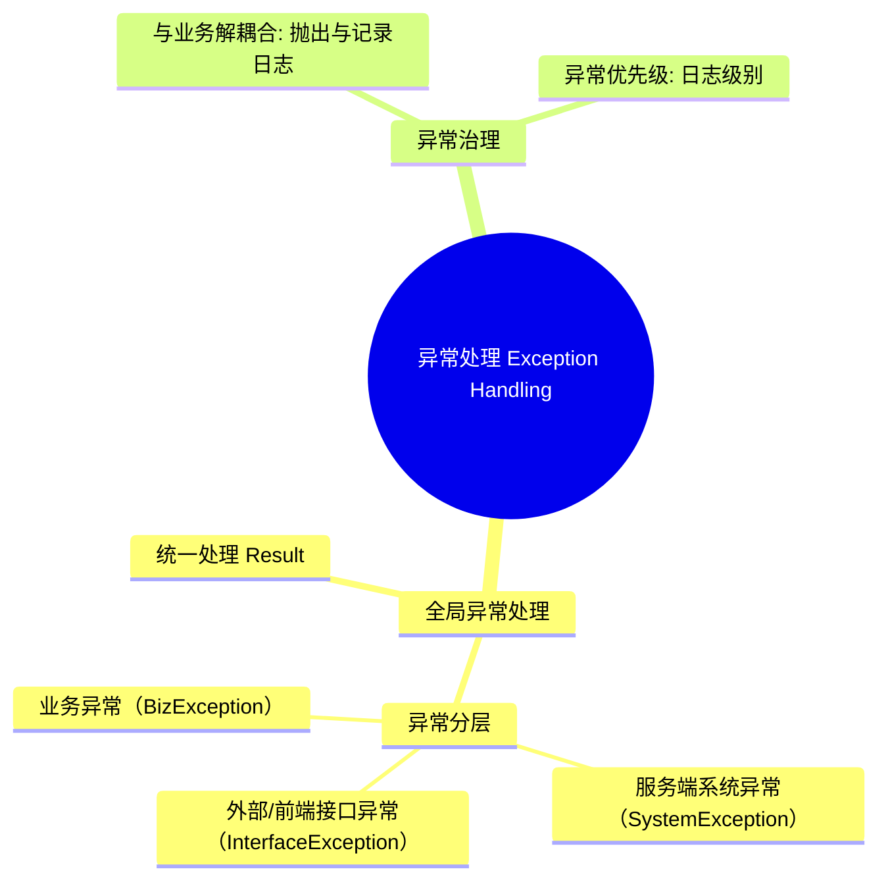

# Exception 异常处理架构设计思考

作为系统架构设计师，在进行系统架构设计时，异常处理（Exception Handling）的设计往往能体现一个团队编码规范质量，直接对性能分析、故障发现、故障诊断等起到重要作用。

异常处理中架构设计思考：业务逻辑异常是否应该当做Exception？异常分为几类？异常的编码范式是什么？当面对一个可能为`null`的字段时，究竟是该优雅地使用 `Objects.isNull()` 进行常规前置判断，还是果断地抛出一个异常？这背后隐藏着对架构设计与编程规范深层次的考量。

本文分享关于 Exception 处理的架构设计思考。

注：本文不描述Java基础知识，如Error和Exception的区别，受检异常和非受检异常等。

## 异常 Exception

在软件系统架构中，异常（Exception）是系统应对非预期事件的保底机制。一个设计良好的异常处理体系，是系统健壮性的最后一道防线。

### 异常对系统的影响

失控的异常处理会对系统产生多维度的负面影响：

* **服务可用性**：未捕获的运行时异常（RuntimeException）可能导致单次请求中断，甚至在极端情况下导致线程池枯竭。
* **资源损耗**：异常的抛出涉及堆栈跟踪（Stack Trace）的生成，这在 CPU 和内存上都有明显的开销。在并发高发期，海量异常会引发“异常风暴”，极大损害系统吞吐量。
* **用户体验与安全**：直接将原始堆栈信息返回给调用方，不仅用户体验糟糕，更可能泄露数据表名、内部路径等敏感信息，造成安全隐患。

## 异常处理：全局视野与编程规范

作为系统架构师，设计异常处理机制时，核心目标是：**语义清晰、链路可追溯、对内严谨、对外友好。**

> 全局异常处理，与异常大类

## 全局异常处理 (Global Exception Handling)

在微服务架构中，强烈建议利用 `@RestControllerAdvice` 实现统一异常捕获（以 Spring 框架为例）。这种设计实现了业务逻辑与异常处理系统的完全解耦：

* **统一返回格式**：确保对内严谨、对外友好。
* **核心分层设计**：通过对异常进行科学分层，实现差异化的响应与治理策略。

下面探讨异常的分类。

### 服务端系统异常（SystemException）

最常见的异常，空指针、栈溢出、请求拒绝、网络中断、服务器宕机等。屏蔽底层堆栈，统一返回“系统繁忙”，并由开发人员通过**监控与日志**重点关注并排查。

当发生服务端系统异常时，服务往往会降级，严重时会引发系统崩溃，导致整个服务不可用。因此，服务端系统异常应当作为异常处理的**最高优先级**。

### 外部/前端接口异常（InterfaceException）

由于非法入参、URL 拼接错误、绕过前端校验等导致的契约违背，也可能是用户偶然进入错误逻辑。明确反馈错误至调用方（如 400 Bad Request），并在后台记录安全审计日志，防御性地阻断海量非法请求。

出现此类错误，意味着：

- 调用方违反了接口调用契约，没有进行完备的前置校验
- 用户偶然触发，代码逻辑存在漏洞，导致用户陷入逻辑黑洞（有点类似于电子游戏中，玩家卡到空气墙外了）
- 黑客攻击，拼接请求，绕过前端校验，可能存在DDos攻击

这类异常虽然不会导致系统崩溃，但会给系统带来安全隐患，或会给用户带来不好的体验。因此，这类异常应作为**次优先级**。

### 业务异常（BizException）

属于业务流程的一部分，是系统运行时“预料中”的限制（如：余额不足、账户密码错误），应当返回面向用户的**友好提示**，引导用户完成正确操作。

**业务异常**是具有争议的，用户账户密码错误、余额不足等是否应该当做异常，有以下两种观点：

观点一：业务异常（失败）属于代码逻辑中期望发生的，属于`if-else`范畴，不应当作为异常抛出，而应使用如`Result.success()`或`Result.fail()`，在业务逻辑上进行区分，工程师无需关注。

观点二：业务异常（失败）应当作为Exception抛出，因为虽然失败是预料中允许发生的，但失败是小概率事件，作为异常处理，利于快速发现和定位问题。

举一个例子，比如用户登录时发生账户密码错误。在观点一中这属于期望发生的，是正常的业务逻辑，无需关注。在观点二中，登录失败是小概率事件，应当抛出`UsernamePasswordException`异常，比如短时间内出现了大量的登录失败，工程师应有所察觉，需要关注代码实现上是否出现了bug。

这两种思想都有一定道理，观点一关注系统稳定性，观点二关注业务逻辑正确性。

因此，业务异常是可选的，优先级是最低的，但也值得关注。

【用户登录账户密码连续错误5次，可能马上投诉电话就来了】

【用户充值多次失败，营收可能就流失了】

因此，对于敏感类业务，应当将业务逻辑失败视为异常抛出。另一方面，如果非敏感业务的业务逻辑失败都视为异常，会造成**异常淹没**，造成**异常噪声**，最终导致工程师注意力分散。

😄逻辑相对论：都重要 = 都不重要，全部都是异常 = 没有异常，哈哈！

## 异常治理与日志

既然出现了异常，那么必然要对异常进行响应、处置和修复，称之为异常治理。

业务功能代码实现与异常治理解耦合是推荐的处理方式。程序员只负责抛出异常，异常处理交给其他进程，既减轻了代码的复杂度，也可以避免异常处理可能导致主进程阻塞甚至崩溃，因小失大。

最佳实践：将异常抛出并记录到日志中，再由日志服务异步地进行收集、分析、告警。

### 异常级别与日志级别

异常是有优先级的，可以与日志级别对应起来：

| 异常类型          | 日志级别 | 描述                                             | 告警权重 |
| ----------------- | -------- | ------------------------------------------------ | -------- |
| 业务异常          | WARN     | 允许发生的业务失败（如余额不足、账户密码错误）   | 20 WARN  |
| 外部/前端接口异常 | ERROR    | 非法入参、URL拼接错误、绕过前端校验等契约违背    | 5 ERROR  |
| 服务端系统异常    | FATAL    | 空指针、栈溢出、请求拒绝、网络中断、服务器宕机等 | 1 FATAL  |

异常日志汇聚成为指标，进行告警，告警规则基于上述告警权重关系，仅供参考。

## 总结

本文从系统架构设计的角度，探讨了异常处理的架构设计思路。 核心要点回顾：

1. **全局异常处理机制**：通过统一异常捕获中心实现业务逻辑与异常处理的解耦，确保对内严谨、对外友好。
2. **异常分层设计**：将异常科学地分为三个层次：

   - **服务端系统异常（SystemException）**：最高优先级，需立即响应
   - **外部/前端接口异常（InterfaceException）**：次优先级，关注安全与契约
   - **业务异常（BizException）**：可选处理，根据业务敏感性决定
3. **异常治理策略**：采用异步日志记录与告警机制，避免异常处理阻塞主业务流程，同时建立基于权重的告警规则。

异常处理不仅是技术问题，更是架构思维的体现，需要平衡系统稳定性与业务正确性，避免"异常淹没"现象。在下一篇文章中，我们将深入探讨异常处理的**编码实践**，包括具体的代码实现模式、最佳实践案例，以及如何在日常开发中落地这些架构设计理念。
